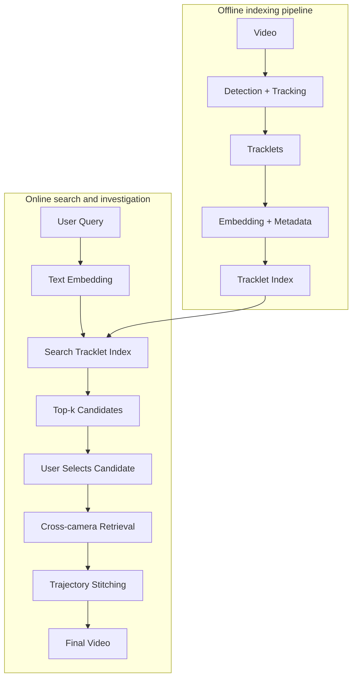

# Architecture

Tài liệu này mô tả pipeline đầy đủ dự tính của hệ thống `CCTV Person Search Engine` trong bối cảnh bệnh viện có khoảng `50 camera`.

Mục tiêu của kiến trúc là hỗ trợ người vận hành tìm một người trong nhiều camera bằng mô tả tự nhiên, xác nhận candidate đúng, sau đó truy hồi các lần xuất hiện liên quan và dựng lại hành trình.

---

## 1. Bối cảnh hệ thống

Bệnh viện là môi trường có mật độ người cao, nhiều khu vực liên thông và nhiều camera hoạt động song song:

- khoảng `50 camera`
- nhiều khu vực: sảnh chính, hành lang, thang máy, khu khám bệnh, cấp cứu, bãi xe, cổng ra vào
- video có thể đến từ NVR export, local storage hoặc hệ thống lưu trữ nội bộ
- người vận hành cần tìm người nhanh trong nhiều camera thay vì xem lại từng video thủ công

Với bối cảnh này, hệ thống cần được thiết kế theo hướng:

- xử lý nặng ở bước offline indexing
- search theo tracklet thay vì raw frame
- hỗ trợ multi-camera retrieval
- có bước xác nhận của người dùng trước khi truy hồi sâu
- lưu metadata có cấu trúc để filter theo camera, thời gian và khu vực
- ưu tiên triển khai trong mạng nội bộ bệnh viện để bảo vệ dữ liệu nhạy cảm

---

## 2. Pipeline đầy đủ dự tính



---

## 3. Offline Indexing Pipeline

### 3.1 Video

Video đầu vào đến từ hệ thống camera bệnh viện. Mỗi video cần có metadata tối thiểu:

- `video_id`
- `camera_id`
- `camera_location`
- `start_time`
- `end_time`
- `fps`
- `source_path`

Ở quy mô khoảng `50 camera`, dữ liệu nên được xử lý theo batch hoặc job queue để tránh phải infer đồng thời toàn bộ camera.

### 3.2 Detection + Tracking

Mục tiêu của bước này là phát hiện người và nối các detection theo thời gian để tạo track.

Detection:

- phát hiện class `person`
- lọc theo confidence threshold
- lọc bbox quá nhỏ hoặc nhiễu

Tracking:

- nối detection qua nhiều frame
- giảm ID switch trong khu vực đông người
- loại bỏ track quá ngắn
- giữ bbox theo từng frame để phục vụ crop và clip preview

### 3.3 Tracklets

Tracklet là đơn vị trung tâm của hệ thống. Một tracklet đại diện cho một người được theo dõi liên tục trong một đoạn video từ một camera.

Một tracklet nên gồm:

- `tracklet_id`
- `video_id`
- `camera_id`
- `local_track_id`
- `start_frame`
- `end_frame`
- `start_second`
- `end_second`
- danh sách bbox theo thời gian
- các frame/crop đại diện

### 3.4 Embedding + Metadata

Với mỗi tracklet, hệ thống sinh embedding và metadata để phục vụ search.

Embedding:

- visual embedding từ crop người
- ReID embedding để so sánh identity
- embedding trung bình hoặc embedding đại diện theo thời gian

Metadata:

- camera, vị trí camera, ngày giờ
- khoảng thời gian xuất hiện
- bbox và frame đại diện
- caption / appearance summary
- đường dẫn crop, thumbnail hoặc clip preview

VLM/captioning nên nhận **tracklet crops** thay vì video gốc. Cách này giúp mô tả tập trung vào ngoại hình người trong tracklet.

### 3.5 Tracklet Index

Tracklet index lưu các vector và metadata đã chuẩn hóa để phục vụ truy vấn.

Index nên hỗ trợ:

- vector search theo embedding
- filter theo camera/khu vực/thời gian
- lookup metadata theo `tracklet_id`
- update theo batch khi có video mới
- partition theo ngày hoặc camera để giảm phạm vi search

Ở quy mô bệnh viện, metadata nên đi vào database có cấu trúc như `PostgreSQL`, còn vector có thể lưu bằng `FAISS` hoặc vector database tương đương.

---

## 4. Online Search Pipeline

### 4.1 User Query

Người vận hành nhập mô tả tự nhiên, ví dụ:

- `người mặc áo xanh đi qua khu cấp cứu`
- `người đeo ba lô xuất hiện ở sảnh chính`
- `người đội mũ đi từ thang máy sang hành lang tầng 2`

Query có thể kèm filter:

- thời gian
- camera
- khu vực
- tầng / khoa / cổng

### 4.2 Text Embedding

Query được encode thành text embedding để so sánh với tracklet index.

Ngoài embedding, hệ thống có thể tách các điều kiện có cấu trúc:

- thời gian
- camera/khu vực
- thuộc tính ngoại hình đơn giản

### 4.3 Search Tracklet Index

Backend dùng text embedding và metadata filters để tìm tracklet phù hợp.

Kết quả search là danh sách `top-k candidates`, mỗi candidate có:

- crop hoặc thumbnail đại diện
- camera/khu vực
- thời gian xuất hiện
- caption / appearance summary
- similarity score
- clip preview ngắn nếu có

### 4.4 User Selects Candidate

Người dùng chọn candidate đúng nhất trong `top-k`. Bước này rất quan trọng vì mô tả tự nhiên có thể mơ hồ và nhiều người trong bệnh viện có ngoại hình tương tự.

Candidate được chọn trở thành anchor cho bước truy hồi sâu hơn.

### 4.5 Cross-camera Retrieval

Hệ thống dùng anchor candidate để tìm cùng một người trong các camera/video khác.

Logic truy hồi nên kết hợp:

- ReID/visual embedding similarity
- ràng buộc thời gian
- vị trí camera và hướng di chuyển có thể xảy ra
- ngưỡng similarity
- loại bỏ kết quả trùng hoặc mâu thuẫn thời gian

Output của bước này là tập tracklets có khả năng thuộc cùng một người.

### 4.6 Trajectory Stitching

Các tracklet match được sắp xếp và nối lại thành trajectory.

Trajectory nên gồm:

- thứ tự xuất hiện theo thời gian
- camera/khu vực tương ứng
- start/end time của từng segment
- crop/thumbnail/clip preview
- score hoặc mức tin cậy của từng đoạn

### 4.7 Final Video

Final output có thể là:

- timeline các lần xuất hiện
- danh sách clip preview theo thứ tự thời gian
- evidence video ghép từ các segment liên quan
- metadata để người vận hành kiểm tra lại

---

## 5. Data Model Dự Tính

### Tracklet Candidate

```json
{
  "tracklet_id": "cam01_20260419_000001",
  "video_id": "cam01_20260419_080000.hevc",
  "camera_id": "cam01",
  "camera_location": "ER corridor",
  "local_track_id": "1",
  "global_person_id": null,
  "start_time": "2026-04-19T08:03:20",
  "end_time": "2026-04-19T08:03:52",
  "start_frame": 120,
  "end_frame": 248,
  "representative_bbox": [100, 80, 64, 180],
  "content_frames": [
    {
      "frame_idx": 120,
      "second": 30.0,
      "bbox": [100, 80, 64, 180]
    }
  ],
  "embedding_vector": [0.01, 0.02],
  "person_caption": "a person wearing dark pants",
  "appearance_summary": "a person wearing dark pants"
}
```

### Search Candidate

```json
{
  "tracklet_id": "cam01_20260419_000001",
  "score": 0.78,
  "camera_id": "cam01",
  "camera_location": "ER corridor",
  "start_time": "2026-04-19T08:03:20",
  "end_time": "2026-04-19T08:03:52",
  "thumbnail_path": "outputs/thumbs/cam01_20260419_000001.jpg",
  "clip_path": "outputs/clips/cam01_20260419_000001.mp4",
  "appearance_summary": "a person wearing dark pants"
}
```

### Global Trajectory

```json
{
  "global_person_id": "person_0001",
  "anchor_tracklet_id": "cam01_20260419_000001",
  "segments": [
    {
      "tracklet_id": "cam01_20260419_000001",
      "camera_id": "cam01",
      "camera_location": "ER corridor",
      "start_time": "2026-04-19T08:03:20",
      "end_time": "2026-04-19T08:03:52",
      "similarity": 1.0
    },
    {
      "tracklet_id": "cam07_20260419_000421",
      "camera_id": "cam07",
      "camera_location": "Main lobby",
      "start_time": "2026-04-19T08:05:10",
      "end_time": "2026-04-19T08:05:38",
      "similarity": 0.82
    }
  ]
}
```

---

## 6. Backend Services Dự Tính

### Ingestion Service

- nhận video mới
- tạo job xử lý video
- quản lý trạng thái ingest/index

### Detection / Tracking Service

- detect person
- track theo từng camera/video
- xuất tracklets

### Metadata / Embedding Service

- sinh visual embedding
- sinh caption từ tracklet crop
- chuẩn hóa metadata
- ghi DB và vector index

### Search Service

- encode user query
- áp dụng metadata filter
- search tracklet index
- trả `top-k candidates`

### ReID / Cross-camera Service

- nhận anchor candidate
- tìm cùng người qua camera khác
- gán global ID tạm thời hoặc lâu dài

### Trajectory Service

- sắp xếp tracklets theo thời gian
- stitch thành trajectory
- xuất final timeline hoặc final video

---

## 7. Storage Dự Tính

### Metadata Database

Nên dùng database có cấu trúc cho quy mô bệnh viện:

- `PostgreSQL` cho metadata chính
- index theo `camera_id`, `camera_location`, `start_time`, `end_time`
- partition theo ngày hoặc camera nếu dữ liệu lớn

### Vector Index

- `FAISS` hoặc vector database tương đương
- index visual/text-compatible embedding
- hỗ trợ rebuild theo batch
- có mapping từ vector row sang `tracklet_id`

### File Storage

- raw video hoặc đường dẫn tới video gốc
- representative crops
- thumbnails
- short clips
- final evidence video

---

## 8. Scalability Considerations

Với khoảng `50 camera`, hệ thống không nên xử lý tất cả camera theo thời gian thực trong MVP. Hướng phù hợp hơn là:

- xử lý theo batch/offline trước
- chia job theo video hoặc camera
- ưu tiên camera/khoảng thời gian do người dùng chọn
- partition metadata theo ngày/camera
- cache thumbnail và clip preview
- chỉ tạo final video khi người dùng xác nhận candidate

Nếu cần mở rộng về sau:

- thêm job queue cho ingestion
- tách ingestion service và search service
- dùng PostgreSQL thay SQLite
- dùng vector database chuyên dụng nếu FAISS local không đủ
- thêm monitoring cho thời gian xử lý từng camera

---

## 9. Security và Privacy

Dữ liệu bệnh viện có độ nhạy cảm cao, nên kiến trúc cần coi privacy là yêu cầu chính.

- Không hardcode API key ở frontend.
- Video và evidence nên nằm trong mạng nội bộ hoặc storage được kiểm soát.
- Backend phải kiểm soát quyền truy cập theo user/role.
- Logs nên tránh ghi mô tả cá nhân hoặc frame/crop không cần thiết.
- Final evidence chỉ nên export đúng segment liên quan.
- Cần có audit trail cho thao tác search/export nếu triển khai thực tế.

---

## 10. Phạm vi Pipeline Dự Tính

Pipeline đầy đủ dự tính bao gồm:

- ingest video từ khoảng `50 camera`
- detection và tracking để tạo tracklet
- embedding và metadata cho tracklet
- tracklet index có thể search
- text query embedding
- top-k candidate retrieval
- user confirmation
- cross-camera retrieval
- trajectory stitching
- final video / evidence timeline

Các phần realtime streaming, nhận dạng danh tính tuyệt đối và huấn luyện model lớn từ đầu không phải trọng tâm của pipeline dự tính giai đoạn này.
