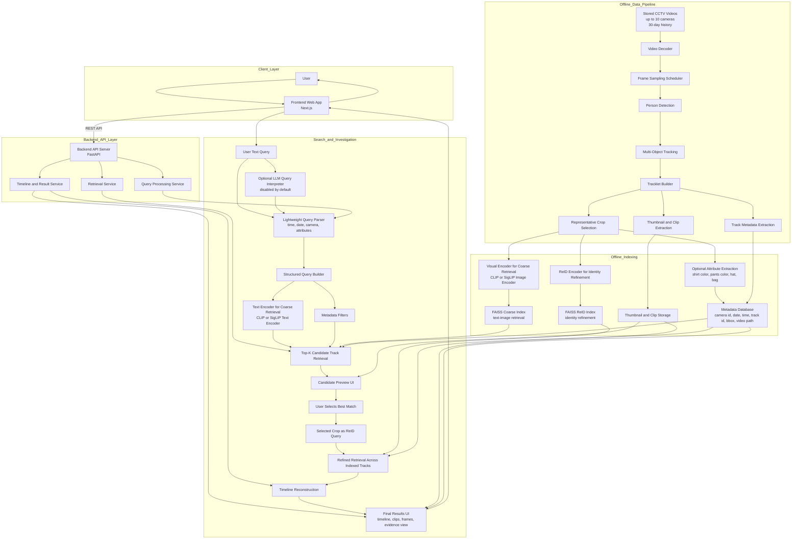

# Architecture

Tài liệu này mô tả chi tiết kiến trúc kỹ thuật của hệ thống `CCTV Person Search Engine`.

## 1. Tổng quan hệ thống

Hệ thống được thiết kế cho các cửa hàng nhỏ và các đơn vị vận hành camera giám sát với đặc điểm phổ biến:

- tối đa khoảng `10` camera
- lưu trữ video theo kiểu thẻ nhớ, NVR export hoặc copy file thủ công
- một máy tính để bàn cơ bản để tra cứu video lịch sử

Sản phẩm được thiết kế theo hướng `offline-first`. Phần xử lý nặng được thực hiện ở bước ingestion và indexing. Phần truy vấn lúc người dùng sử dụng được giữ nhẹ để chạy được trên phần cứng phổ thông.

## 2. Sơ đồ kiến trúc chi tiết

## 3. Vai trò của từng khối

### Frontend

Frontend là giao diện web dành cho người vận hành.

Nhiệm vụ:

- nhận truy vấn bằng ngôn ngữ tự nhiên
- cho phép lọc theo camera, ngày và khoảng thời gian
- hiển thị top-k candidate tracks với thumbnail và metadata
- cho phép người dùng chọn đúng người cần tìm
- hiển thị kết quả refine, timeline và clip preview

### Backend

Backend cung cấp API và điều phối toàn bộ logic truy vấn.

Nhiệm vụ:

- phân tích và chuẩn hóa request từ frontend
- thực hiện coarse retrieval trên text-image index
- thực hiện refined retrieval trên ReID index
- lấy metadata và preview assets
- ghép kết quả cuối cùng trả về frontend

### Offline pipeline

Offline pipeline chuyển video CCTV thô thành các person tracklets có thể tìm kiếm.

Nhiệm vụ:

- decode video
- sample frame
- detect người
- tracking đối tượng qua nhiều frame
- build tracklets
- trích representative crops
- tạo thumbnail và short clips
- sinh embeddings và metadata phục vụ tìm kiếm

## 4. Tech Stack

### Frontend

- `Next.js`
- `React`
- `Tailwind CSS`
- `TypeScript`

### Backend

- `FastAPI`
- `Pydantic`
- `Uvicorn`

### Video và CV Pipeline

- `OpenCV`
- `PyTorch`
- `Ultralytics YOLO` hoặc một person detector tương đương
- `BoxMOT` hoặc một multi-object tracker tương đương

### Retrieval và Indexing

- `CLIP` hoặc `SigLIP` cho coarse text-image retrieval
- `ReID model` cho identity refinement
- `FAISS` cho vector search

### Data Storage

- `SQLite` hoặc `PostgreSQL` cho metadata
- local filesystem cho thumbnails, clips và evidence export

### Optional Components

- `LLM API` như một lớp hỗ trợ phân tích truy vấn, không bắt buộc
- `Redis` nếu sau này cần cache

## 5. Data Flow

### A. Luồng offline ingestion và indexing

1. Video CCTV được copy từ thẻ nhớ, NVR export hoặc local storage vào hệ thống.
2. Video decoder mở từng file và gửi frame sang frame sampling scheduler.
3. Detector tìm người trong các frame đã sample.
4. Tracker nối các detection qua nhiều frame để tạo thành person tracks ổn định.
5. Tracklet builder gom detection thành person-centric tracklets.
6. Representative crops được chọn cho từng tracklet.
7. Metadata được trích xuất, gồm camera id, ngày, khoảng thời gian, bbox, track id và source video path.
8. Thumbnail và short clip được tạo để phục vụ preview.
9. Representative crops được encode bởi:
   - `CLIP/SigLIP image encoder` cho coarse retrieval
   - `ReID encoder` cho refinement sau khi người dùng chọn đúng candidate
10. Optional attribute extraction có thể thêm các mô tả như màu áo, màu quần, mũ hoặc túi.
11. Embeddings được lưu trong FAISS indexes, còn metadata có cấu trúc được lưu trong metadata database.

### B. Luồng truy vấn và điều tra

1. Người dùng nhập truy vấn tự nhiên ở frontend.
2. Frontend gửi truy vấn và các bộ lọc tùy chọn đến backend API.
3. Query parser tách các tín hiệu có cấu trúc như:
   - ngày
   - khoảng thời gian
   - camera id
   - một số thuộc tính đơn giản
4. Nếu bật, optional LLM interpreter có thể hỗ trợ viết lại các truy vấn dài hoặc mơ hồ về dạng có cấu trúc hơn.
5. Phần text query được encode bằng CLIP/SigLIP text encoder.
6. Backend áp dụng metadata filters trước hoặc song song với vector retrieval.
7. Retrieval service trả về `top-k` candidate tracks từ coarse index.
8. Frontend hiển thị representative frames, clips, timestamps và source cameras.
9. Người dùng chọn ứng viên phù hợp nhất.
10. Crop đã chọn được encode bằng ReID encoder.
11. Backend thực hiện refined retrieval trên ReID index.
12. Các matched tracks được ghép lại thành timeline và nối về source clips cùng metadata.
13. Frontend hiển thị investigation view cuối cùng gồm timeline, matched segments, frames và clip previews.

## 6. Vì sao kiến trúc này phù hợp với bài toán

Kiến trúc này bám đúng bối cảnh sử dụng thực tế của cửa hàng nhỏ:

- nhu cầu chính là tra cứu video lịch sử, không phải giám sát realtime liên tục
- người dùng cần xác nhận bằng hình ảnh, không thể tin vào one-shot fully automatic identification
- phần cứng cục bộ hạn chế, nên indexing phải làm offline và query-time phải đủ nhẹ

Do đó, hệ thống được thiết kế theo nguyên tắc:

- `track-centric search`, không tìm trực tiếp trên raw frames
- `coarse retrieval` trước, sau đó mới `human confirmation`
- `ReID refinement` chỉ thực hiện sau khi người dùng đã chọn đúng candidate

## 7. Security Considerations

### API keys

- API keys không được hardcode ở frontend.
- Keys được lưu trong `.env` trên máy backend.
- Nếu dùng optional LLM API, backend sẽ proxy request để key không bao giờ lộ ra trình duyệt.

### Video và evidence access

- Video CCTV và evidence export nên được giữ trên local machine hoặc trusted local network.
- Việc truy cập clips và final results nên đi qua authenticated backend routes.

### PII và privacy

- Hệ thống xử lý dữ liệu giám sát nên chỉ người có quyền mới được truy cập.
- Logs nên tránh lưu raw personal descriptions không cần thiết.
- Khi chia sẻ kết quả ra ngoài, hệ thống nên hỗ trợ export đúng clip segment cần thiết thay vì toàn bộ video.

## 8. Scalability Considerations

### Mục tiêu hiện tại

MVP hiện tại được thiết kế cho:

- tối đa `10` camera
- khoảng `30` ngày dữ liệu lưu trữ
- một máy trạm cục bộ

### Hướng scale thực tế

- xử lý video theo offline batch thay vì ingest realtime mọi camera
- chỉ lưu representative crops và short preview clips để duyệt nhanh
- partition metadata theo `camera_id`, `date` và `time range`
- tách riêng coarse index và ReID index
- áp dụng metadata filtering trước khi chạy retrieval lớn

### Hướng mở rộng sau này

Nếu hệ thống cần hỗ trợ nhiều camera hơn hoặc nhiều user hơn, các bước nâng cấp tiếp theo sẽ là:

- chuyển metadata DB từ SQLite sang PostgreSQL
- thêm cache cho query phổ biến và thumbnails
- chuyển background indexing sang job queue
- tách riêng ingestion service và search service

## 9. Phạm vi MVP

### Bao gồm trong MVP

- nhập và xử lý video giám sát theo lô ngoại tuyến
- phát hiện người và theo dõi đối tượng qua nhiều frame
- xây dựng tracklet cho từng đối tượng
- truy hồi cơ bản từ mô tả văn bản để tìm ra các ứng viên phù hợp
- giao diện xem trước và chọn ứng viên
- truy hồi tinh chỉnh từ crop đã chọn
- hiển thị timeline và clip preview kết quả

### Chưa bao gồm trong MVP

- giám sát realtime đa camera hoàn chỉnh
- huấn luyện model tùy chỉnh nặng
- phụ thuộc cloud liên tục để hệ thống hoạt động
- đảm bảo nhận dạng danh tính tuyệt đối mà không có bước xác nhận của người dùng