# BÁO CÁO AUDIT TOÀN DIỆN: TraceX-AI

**Ngày audit:** 2026-05-10
**Auditor:** Senior Backend + ML Systems Auditor
**Schema version:** v3.3
**Tổng file Python:** 61

---

## MỤC LỤC

1. [Database Overview](#phần-1--database-overview)
2. [ERD Toàn Bộ Database](#phần-2--erd-toàn-bộ-database)
3. [Tracklets Table Chi Tiết](#phần-3--tracklets-table-chi-tiết)
4. [Embedding Tables và Vector Fields](#phần-4--embedding-tables-và-vector-fields)
5. [Action Table](#phần-5--action-table)
6. [Model Inventory và Model → DB Column Mapping](#phần-6--model-inventory-và-model--db-column-mapping)
7. [Import Video Flow End-to-End](#phần-7--import-video-flow-end-to-end)
8. [Video_Process Pipeline Hiện Tại](#phần-8--video_process-pipeline-hiện-tại)
9. [Query / Search / Candidate Merging](#phần-9--query--search--candidate-merging)
10. [Trace Flow](#phần-10--trace-flow)
11. [Hardcode / Bypass / Mock / Silent Failure Report](#phần-11--hardcode--bypass--mock--silent-failure-report)
12. [DB Column Data Lineage](#phần-12--db-column-data-lineage)
13. [Current Runtime Risks](#phần-13--current-runtime-risks)
14. [Verification Commands](#phần-14--verification-commands)
15. [Final Summary](#phần-15--final-summary)

---

## PHẦN 1 — DATABASE OVERVIEW

### Tổng quan kỹ thuật

| Mục | Chi tiết |
|---|---|
| DBMS | PostgreSQL |
| ORM | SQLAlchemy 2.x (Mapped/mapped_column syntax) |
| Vector extension | `pgvector` (optional import, fallback to JSON nếu thiếu) |
| Migration tool | **Không có Alembic** — dùng `SharedBase.metadata.create_all()` tại startup |
| File schema chính | `backend/services/shared/models.py` |
| DB connection | `backend/services/shared/database.py` |

**Bằng chứng pgvector optional (`shared/models.py:49-54`):**

```python
try:
    from pgvector.sqlalchemy import Vector as PgVector
    _PGVECTOR_AVAILABLE = True
except ImportError:
    PgVector = None
    _PGVECTOR_AVAILABLE = False
```

**Bằng chứng không có Alembic (`main.py:44`):**

```python
SharedBase.metadata.create_all(bind=engine)
```

### Danh sách 18 bảng (+ 1 staging)

| # | Bảng | Nhóm | Mục đích |
|---|---|---|---|
| 1 | `users` | Auth | Staff accounts |
| 2 | `cameras` | Topology | Camera registry |
| 3 | `camera_zones` | Topology | Entry/exit polygons |
| 4 | `camera_edges` | Topology | Temporal transitions giữa cameras |
| 5 | `camera_settings` | Topology | Per-camera key-value settings |
| 6 | `videos` | Core AI | Video metadata + status |
| 7 | `tracklets` | Core AI | Detected person per video |
| 8 | `tracklets_embeddings` | Core AI | DINOv2 + SigLIP2 vectors |
| 9 | `tracklets_actions` | Core AI | VideoMAE action labels |
| 10 | `query_history` | Query | User search queries |
| 11 | `query_candidates` | Query | Search results (candidates) |
| 12 | `query_candidate_tracklets` | Query | Junction: candidate ↔ tracklets |
| 13 | `query_jobs` | Query | Async job tracking |
| 14 | `spatiotemporal_groups` | Query | Camera transition clusters |
| 15 | `evidence_videos` | Evidence | Merged trace result video |
| 16 | `evidence_tracklets` | Evidence | Segments trong evidence video |
| 17 | `verified_objects` | Verification | User-confirmed identities |
| 18 | `verified_objects_tracklets` | Verification | Junction: verified ↔ tracklets |
| — | `queue_video_assets` | Staging | Ingest queue |

### Chi tiết từng bảng

#### Bảng `users`

| Column | Type | Nullable | Default | PK | UK | Index | Ý nghĩa |
|---|---|---|---|---|---|---|---|
| `id` | Integer | NO | auto | YES | — | implicit | Surrogate PK |
| `email` | String | NO | — | — | YES | implicit | Login identifier |
| `full_name` | String | YES | NULL | — | — | — | Display name |
| `hashed_password` | String | NO | — | — | — | — | bcrypt hash |
| `role` | String | NO | "viewer" | — | — | — | admin/operator/viewer |
| `is_active` | Boolean | NO | True | — | — | — | Soft delete |
| `last_login` | DateTime | YES | NULL | — | — | — | Last auth time |
| `created_at` | DateTime | NO | now() | — | — | — | |
| `updated_at` | DateTime | NO | now() | — | — | — | |

#### Bảng `cameras`

| Column | Type | Nullable | Default | PK | UK | Index | Ý nghĩa |
|---|---|---|---|---|---|---|---|
| `id` | Integer | NO | auto | YES | — | implicit | Surrogate PK |
| `camera_id` | String(50) | NO | — | — | YES | implicit | Định danh camera |
| `name` | String | YES | NULL | — | — | — | Display name |
| `location` | String | YES | NULL | — | — | — | Physical location |
| `fps` | Float | YES | NULL | — | — | — | Frame rate |
| `resolution_width` | Integer | YES | NULL | — | — | — | |
| `resolution_height` | Integer | YES | NULL | — | — | — | |
| `is_active` | Boolean | NO | True | — | — | — | |
| `created_at` | DateTime | NO | now() | — | — | — | |

#### Bảng `camera_zones`

| Column | Type | Nullable | Default | PK | FK | Index | Ý nghĩa |
|---|---|---|---|---|---|---|---|
| `id` | Integer | NO | auto | YES | — | implicit | Surrogate PK |
| `camera_id` | String(50) | NO | — | — | cameras.camera_id (CASCADE) | `ix_camera_zones_cam` | |
| `zone_type` | String(32) | NO | — | — | — | — | "entry"/"exit"/"roi" |
| `polygon` | JSON | NO | — | — | — | — | List of [x,y] points |
| `created_at` | DateTime | NO | now() | — | — | — | |

#### Bảng `camera_edges`

| Column | Type | Nullable | Default | PK | Index | Ý nghĩa |
|---|---|---|---|---|---|---|
| `id` | Integer | NO | auto | YES | implicit | Surrogate PK |
| `from_camera_id` | String(50) | NO | — | — | `ix_camera_edges_from` | Camera nguồn |
| `to_camera_id` | String(50) | NO | — | — | `ix_camera_edges_to` | Camera đích |
| `min_seconds` | Float | NO | — | — | — | Min transit time |
| `max_seconds` | Float | NO | — | — | — | Max transit time |
| `created_at` | DateTime | NO | now() | — | — | |

#### Bảng `camera_settings`

| Column | Type | Nullable | Default | PK | FK | Index | Ý nghĩa |
|---|---|---|---|---|---|---|---|
| `id` | Integer | NO | auto | YES | — | implicit | |
| `camera_id` | String(50) | NO | — | — | cameras.camera_id (CASCADE) | `ix_camera_settings_cam` | |
| `setting_key` | String(64) | NO | — | — | — | — | Key-value setting |
| `setting_value` | String(512) | YES | NULL | — | — | — | |
| `updated_at` | DateTime | NO | now() | — | — | — | |

#### Bảng `videos`

| Column | Type | Nullable | Default | PK | FK | UK | Index | Ý nghĩa |
|---|---|---|---|---|---|---|---|---|
| `id` | Integer | NO | auto | YES | — | — | implicit | Surrogate PK |
| `video_id` | String(36) | NO | — | — | — | YES | `ix_videos_video_id` | UUID |
| `camera_id` | String(50) | NO | — | — | — | — | `ix_videos_camera_id` | |
| `user_id` | Integer | YES | NULL | — | users.id (SET NULL) | — | — | Owner |
| `title` | String | YES | NULL | — | — | — | — | |
| `description` | Text | YES | NULL | — | — | — | — | |
| `storage_path` | String | YES | NULL | — | — | — | — | Drive path hoặc local path |
| `storage_backend` | String(32) | NO | "gdrive" | — | — | — | — | "gdrive"/"local" |
| `source_filename` | String | YES | NULL | — | — | — | — | |
| `content_type` | String(64) | YES | NULL | — | — | — | — | |
| `duration_seconds` | Float | YES | NULL | — | — | — | — | |
| `fps` | Float | YES | NULL | — | — | — | — | |
| `width` | Integer | YES | NULL | — | — | — | — | |
| `height` | Integer | YES | NULL | — | — | — | — | |
| `processed` | Boolean | NO | False | — | — | — | `ix_videos_processed` | GPU pipeline done? |
| `recorded_at` | DateTime | YES | NULL | — | — | — | `ix_videos_recorded_at` | Thời điểm quay thực tế |
| `created_at` | DateTime | NO | now() | — | — | — | — | Thời điểm ingest |
| `updated_at` | DateTime | NO | now() | — | — | — | — | |

#### Bảng `queue_video_assets`

| Column | Type | Nullable | Default | PK | UK | Ý nghĩa |
|---|---|---|---|---|---|---|
| `id` | Integer | NO | auto | YES | — | Surrogate PK |
| `video_id` | String(36) | NO | — | — | YES | UUID |
| `camera_id` | String(50) | NO | — | — | — | |
| `title` | String | YES | NULL | — | — | |
| `source_filename` | String | YES | NULL | — | — | |
| `source_mode` | String(32) | YES | NULL | — | — | "gdrive"/"local" |
| `queue_position` | Integer | YES | NULL | — | — | |
| `storage_backend` | String(32) | YES | NULL | — | — | |
| `available_link_video` | String | YES | NULL | — | — | Drive webContentLink |
| `available_link_metadata` | String | YES | NULL | — | — | |
| `drive_video_file_id` | String | YES | NULL | — | — | |
| `drive_metadata_file_id` | String | YES | NULL | — | — | |
| `local_video_path` | String | YES | NULL | — | — | |
| `local_metadata_path` | String | YES | NULL | — | — | |
| `raw_video_metadata` | JSON | YES | NULL | — | — | |
| `processed_at` | DateTime | YES | NULL | — | — | |
| `created_at` | DateTime | NO | now() | — | — | |
| `updated_at` | DateTime | NO | now() | — | — | |

---

## PHẦN 2 — ERD TOÀN BỘ DATABASE

```mermaid
erDiagram
    users {
        int id PK
        string email UK
        string full_name
        string hashed_password
        string role
        bool is_active
        datetime last_login
        datetime created_at
    }
    cameras {
        int id PK
        string camera_id UK
        string name
        string location
        float fps
        int resolution_width
        int resolution_height
        bool is_active
        datetime created_at
    }
    camera_zones {
        int id PK
        string camera_id FK
        string zone_type
        json polygon
        datetime created_at
    }
    camera_edges {
        int id PK
        string from_camera_id
        string to_camera_id
        float min_seconds
        float max_seconds
        datetime created_at
    }
    camera_settings {
        int id PK
        string camera_id FK
        string setting_key
        string setting_value
        datetime updated_at
    }
    videos {
        int id PK
        string video_id UK
        string camera_id
        int user_id FK
        string storage_path
        string storage_backend
        float duration_seconds
        float fps
        bool processed
        datetime recorded_at
        datetime created_at
    }
    tracklets {
        int id PK
        string tracklet_id UK
        string video_id FK
        string camera_id
        string track_id
        float start_time
        float end_time
        float quality_score
        float occlusion_score
        string gender
        string age_range
        string top_color
        string bottom_color
        string appearance_summary
        text upper_clothing_desc
        string upper_clothing_color
        string upper_clothing_type
        float upper_clothing_conf
        text lower_clothing_desc
        string lower_clothing_color
        string lower_clothing_type
        float lower_clothing_conf
        text shoes_desc
        string shoes_type
        text bag_desc
        string bag_presence
        float bag_conf
        text hat_desc
        string hat_presence
        string hat_type
        float hat_conf
        float bev_x
        float bev_y
        string crop_url
        json representative_bbox
        json contributing_cameras
        string batch_id
        datetime created_at
    }
    tracklets_embeddings {
        int id PK
        string tracklet_id FK "UK"
        json embedding_vector
        vector_1024 embedding
        vector_1152 siglip_embedding
        string model_version
        datetime created_at
    }
    tracklets_actions {
        int id PK
        string tracklet_id FK
        string action_label
        string kinetics_label
        float confidence
        datetime created_at
    }
    query_history {
        int id PK
        string query_id UK
        int user_id FK
        string video_id FK
        text query_text
        string status
        int result_count
        string selected_candidate_id
        datetime created_at
    }
    query_candidates {
        int id PK
        string candidate_id UK
        string query_id FK
        float fusion_score
        float vector_score
        float text_score
        int rank_position
        bool is_selected
        string preview_url
        text appearance_summary
        datetime created_at
    }
    query_candidate_tracklets {
        int id PK
        string candidate_id FK
        string tracklet_id FK
        float match_score
        string match_type
        datetime created_at
    }
    query_jobs {
        int id PK
        string job_id UK
        string query_id FK
        string status
        datetime started_at
        datetime completed_at
        text error_message
        datetime created_at
    }
    spatiotemporal_groups {
        int id PK
        string group_id UK
        string query_id FK
        string candidate_id FK
        string group_type
        json tracklet_ids
        json camera_path
        float total_duration_s
        datetime created_at
    }
    evidence_videos {
        int id PK
        string query_id FK
        string query_candidate_id FK
        string video_url
        float total_duration
        int segment_count
        datetime time_window_start
        datetime time_window_end
        float trace_confidence
        datetime created_at
    }
    evidence_tracklets {
        int id PK
        int evidence_video_id FK
        string tracklet_id FK
        int segment_order
        string camera_id
        json time_range
        string thumbnail_url
        float confidence
    }
    verified_objects {
        int id PK
        string candidate_id FK
        int verified_by_user_id FK
        bool is_correct
        text notes
        datetime verified_at
    }
    verified_objects_tracklets {
        int id PK
        int verified_object_id FK
        string tracklet_id FK
        int position
        datetime verified_at
    }

    users ||--o{ videos : "owns (SET NULL on user_id)"
    users ||--o{ query_history : "creates (CASCADE)"
    users ||--o{ verified_objects : "verifies (SET NULL)"
    cameras ||--o{ camera_zones : "has (CASCADE)"
    cameras ||--o{ camera_settings : "has (CASCADE)"
    videos ||--o{ tracklets : "has (CASCADE)"
    videos ||--o{ query_history : "referenced (SET NULL)"
    tracklets ||--o| tracklets_embeddings : "has 1:1 (CASCADE)"
    tracklets ||--o{ tracklets_actions : "has (CASCADE)"
    tracklets ||--o{ query_candidate_tracklets : "in (CASCADE)"
    tracklets ||--o{ evidence_tracklets : "in (SET NULL)"
    tracklets ||--o{ verified_objects_tracklets : "in (SET NULL)"
    query_history ||--o{ query_candidates : "has (CASCADE)"
    query_history ||--o{ query_jobs : "has (CASCADE)"
    query_history ||--o{ spatiotemporal_groups : "has (CASCADE)"
    query_candidates ||--o{ query_candidate_tracklets : "has (CASCADE)"
    query_candidates ||--o{ spatiotemporal_groups : "has (CASCADE)"
    query_candidates ||--o{ evidence_videos : "has (CASCADE)"
    query_candidates ||--o| verified_objects : "verified by (CASCADE)"
    evidence_videos ||--o{ evidence_tracklets : "has (CASCADE)"
    verified_objects ||--o{ verified_objects_tracklets : "has (CASCADE)"
```



---

## PHẦN 3 — TRACKLETS TABLE CHI TIẾT

### Nhóm 1: Identity/Linkage

| Column | Type | Nullable | Default | PK | UK | Index | Ý nghĩa |
|---|---|---|---|---|---|---|---|
| `id` | Integer | NO | auto | YES | — | implicit | Surrogate PK |
| `tracklet_id` | String(255) | NO | — | — | YES | ix (implicit) | Format: `{video_id}_{camera_id}_{idx}` |
| `video_id` | String(36) | NO | — | — | — | `ix_tracklets_video_id` | FK → videos.video_id |
| `camera_id` | String(50) | NO | — | — | — | `ix_tracklets_camera_id` | Camera nguồn |
| `track_id` | String(50) | NO | — | — | — | — | ID local trong video |
| `batch_id` | String(255) | YES | NULL | — | — | — | Batch ingest reference |
| `contributing_cameras` | JSON | NO | `[]` | — | — | — | Cross-cam camera list |
| `contributing_video_ids` | JSON | NO | `[]` | — | — | — | Cross-cam video list |

### Nhóm 2: Temporal/Spatial

| Column | Type | Nullable | Default | Source | Index |
|---|---|---|---|---|---|
| `start_time` | Float | NO | 0.0 | tracker `observations[0].timestamp` | — |
| `end_time` | Float | NO | 0.0 | tracker `observations[-1].timestamp` | — |
| `bev_x` | Float | NO | 0.0 | `BEVProjector.bbox_bottom_center_to_bev()` | `ix_tracklets_bev_xy` |
| `bev_y` | Float | NO | 0.0 | same | `ix_tracklets_bev_xy` |
| `representative_bbox` | JSON | NO | `[]` | mid detection bbox [x1,y1,x2,y2] | — |

> **BUG:** `bev_x = bev_y = 0.0` hardcoded trong `video_process.py:1615` khi dùng BodyPartAdaptiveTracker pipeline — BEVProjector không được gọi trong path này.

### Nhóm 3: Quality

| Column | Type | Nullable | Default | Source | Ý nghĩa |
|---|---|---|---|---|---|
| `quality_score` | Float | NO | 0.0 | `TrackletQualityScorer.average_confidence` | Avg detection confidence |
| `occlusion_score` | Float | NO | 0.0 | **Hardcoded 0.0** — không bao giờ được tính | Không có ý nghĩa thực |

### Nhóm 4: Legacy metadata (backward-compat alias cho VLM output)

| Column | Type | Nullable | Default | Index | Source thực | Notes |
|---|---|---|---|---|---|---|
| `gender` | String(32) | NO | "unknown" | — | Qwen2-VL → backward compat | |
| `age_range` | String(32) | NO | "unknown" | — | Qwen2-VL | |
| `top_color` | String(64) | NO | "unknown" | `ix_tracklets_upper_color` | `= upper_clothing_color` | backward compat alias |
| `bottom_color` | String(64) | NO | "unknown" | `ix_tracklets_lower_color` | `= lower_clothing_color` | |
| `shoes_color` | String(64) | NO | "unknown" | — | Qwen2-VL | |
| `hat_color` | String(64) | NO | "unknown" | — | Qwen2-VL | |
| `bag_type` | String(64) | NO | "unknown" | — | Qwen2-VL | |
| `is_wearing_mask` | String(16) | NO | "unknown" | — | Qwen2-VL | "yes"/"no"/"unknown" |
| `hair_style` | String(64) | NO | "unknown" | — | Qwen2-VL | |
| `hair_color` | String(64) | NO | "unknown" | — | Qwen2-VL | |
| `appearance_summary` | Text | NO | "" | — | `_build_appearance_summary()` | Human-readable string |

### Nhóm 5: VLM metadata (Qwen2-VL-7B-Instruct — open-vocabulary)

| Column | Type | Nullable | Index | Source field | Conf column |
|---|---|---|---|---|---|
| `upper_clothing_desc` | Text | YES | — | VLM JSON `upper_clothing_desc` | `upper_clothing_conf` |
| `upper_clothing_color` | String(64) | YES | `ix_tracklets_upper_color` | VLM | `upper_clothing_conf` |
| `upper_clothing_type` | String(128) | YES | `ix_tracklets_upper_type` | VLM | — |
| `upper_clothing_conf` | Float | YES | — | VLM self-reported | — |
| `lower_clothing_desc` | Text | YES | — | VLM | `lower_clothing_conf` |
| `lower_clothing_color` | String(64) | YES | `ix_tracklets_lower_color` | VLM | `lower_clothing_conf` |
| `lower_clothing_type` | String(128) | YES | `ix_tracklets_lower_type` | VLM | — |
| `lower_clothing_conf` | Float | YES | — | VLM | — |
| `shoes_desc` | Text | YES | — | VLM | `shoes_conf` |
| `shoes_type` | String(128) | YES | — | VLM | — |
| `bag_desc` | Text | YES | — | VLM | `bag_conf` |
| `bag_presence` | String(16) | YES | `ix_tracklets_bag_presence` | VLM `_PRESENCE_NORM` → "yes"/"no" | `bag_conf` |
| `bag_conf` | Float | YES | — | VLM | — |
| `hat_desc` | Text | YES | — | VLM | `hat_conf` |
| `hat_presence` | String(16) | YES | `ix_tracklets_hat_presence` | VLM | `hat_conf` |
| `hat_type` | String(128) | YES | — | VLM | — |
| `hat_conf` | Float | YES | — | VLM | — |

### Nhóm 6: Per-attribute confidence

| Column | Type | Nullable | Mapped từ | Dùng trong merge |
|---|---|---|---|---|
| `gender_conf` | Float | YES | `attrs["gender_conf"]` | YES (`_metadata_matches`) |
| `top_color_conf` | Float | YES | `upper_clothing_conf` | YES |
| `bottom_color_conf` | Float | YES | `lower_clothing_conf` | YES |
| `shoes_conf` | Float | YES | `attrs["shoes_conf"]` | YES |
| `accessory_conf` | Float | YES | `max(bag_conf, hat_conf)` | — |
| `age_range_conf` | Float | YES | `attrs["age_range_conf"]` | YES |
| `hat_color_conf` | Float | YES | `hat_conf` | YES |
| `bag_type_conf` | Float | YES | `bag_conf` | — |
| `mask_conf` | Float | YES | `attrs["mask_conf"]` | YES |
| `hair_style_conf` | Float | YES | `hair_conf` | — |
| `hair_color_conf` | Float | YES | `hair_conf` | YES |

### Nhóm 7: Media

| Column | Type | Nullable | Source | Notes |
|---|---|---|---|---|
| `crop_url` | String(2048) | NO | `/static/crops/{video_id}_{cam}_{idx}.jpg` | Static file phục vụ qua FastAPI StaticFiles |

---

## PHẦN 4 — EMBEDDING TABLES VÀ VECTOR FIELDS

### `tracklets_embeddings` — Chi tiết

| Column | Type | Dim | Normalization | Source model | Nullable | Notes |
|---|---|---|---|---|---|---|
| `embedding_vector` | JSON | 1024 | L2-normalized | DINOv2 ViT-L/14 | NO | Backward compat JSON fallback |
| `embedding` | pgvector(1024) hoặc JSON | 1024 | L2-normalized | DINOv2 ViT-L/14 | YES | Native vector nếu pgvector available |
| `siglip_embedding` | pgvector(1152) hoặc JSON | 1152 | L2-normalized | SigLIP2-So400m image encoder | YES | Text-image shared space |

**DINOv2 normalization (`video_process.py:437-440`):**

```python
avg = feats.mean(0).numpy()
norm = np.linalg.norm(avg)
if norm > 0:
    avg = avg / norm
```

**SigLIP2 normalization (`video_process.py:1288`):**

```python
img_feats = img_feats / img_feats.norm(dim=-1, keepdim=True)
```

**Query-service ưu tiên SigLIP2 (`candidates.py:314-323`):**

```python
def _tracklet_embedding(t: Tracklet) -> list[float]:
    """SigLIP2 embedding preferred; fallback to DINOv2."""
    if not t.embedding:
        return []
    if t.embedding.siglip_embedding is not None:
        return list(t.embedding.siglip_embedding)
    return list(t.embedding.embedding_vector or [])
```

> **CRITICAL:** Không có pgvector ANN index (HNSW/IVFFlat) nào được tạo. Cosine similarity tính bằng Python thuần (`_cosine_sim`), không dùng `<=>` operator → độ phức tạp O(N²) với mọi search query.

---

## PHẦN 5 — ACTION TABLE

### `tracklets_actions` — Chi tiết

| Column | Type | Nullable | Default | Source | Index |
|---|---|---|---|---|---|
| `id` | Integer | NO | auto | — | PK |
| `tracklet_id` | String(255) | NO | — | FK → tracklets | UK |
| `action_label` | String(64) | NO | — | VideoMAE → `_map_kinetics_to_tracex_action()` | `ix_tracklets_actions_action` |
| `kinetics_label` | String(128) | YES | NULL | Raw Kinetics-400 label | — |
| `confidence` | Float | NO | 0.0 | VideoMAE softmax top-1 probability | — |

**8 simplified action labels:** `standing`, `walking`, `running`, `sitting`, `bending`, `carrying`, `pushing_pulling`, `sports`

**VideoMAE mapping (`video_process.py:692-694`):**

```python
def _map_kinetics_to_tracex_action(kinetics_label: str) -> str:
    return _KINETICS_MAP.get(kinetics_label.lower(), "standing")  # default fallback = "standing"
```

> **BUG:** `kinetics_label` luôn là empty string. Code lưu:
> ```python
> # ingest_service.py:402
> kinetics_label=str(t.get("kinetics_label") or "")
> ```
> Raw Kinetics label không bao giờ được lưu thực sự.

- **Không có action embedding** — chỉ lưu label + confidence.
- **Không tham gia candidate merge** — action không được dùng trong `_can_merge()` hay `_metadata_matches()`. Chỉ dùng cho display/filter.

---

## PHẦN 6 — MODEL INVENTORY VÀ MODEL → DB COLUMN MAPPING

| Model | Role | Load file | `get_model` key | Output | DB Column | Fallback | VRAM |
|---|---|---|---|---|---|---|---|
| RT-DETR R50 (`PekingU/rtdetr_r50vd`) | Person detection (primary) | `metadata-service/model_warmup.py` | `"rtdetr"`, `"rtdetr_processor"`, `"rtdetr_person_ids"` | bbox + score | — (detection only) | GDINO fallback (fail silent) | ~3GB fp16 |
| Grounding DINO 1.6 (`IDEA-Research/grounding-dino-1.6-pro`) | Person detection (fallback — **trace-service only**) | `trace-service/model_warmup.py` | `"gdino16"`, `"gdino16_processor"` | bbox + score | Return empty | ~4GB fp16 | |
| DINOv2 ViT-L/14 (`facebook/dinov2-large`) | Appearance Re-ID embedding | `metadata-service/model_warmup.py` | `"dinov2"`, `"dinov2_processor"` | 1024-dim L2-norm | `tracklets_embeddings.embedding_vector`, `.embedding` | Return None | ~5GB fp16 |
| SigLIP2-So400m (`google/siglip2-so400m-patch14-384`) | Image encoder cho text-image search | `metadata-service/model_warmup.py` | `"siglip2"`, `"siglip2_processor"` | 1152-dim L2-norm | `tracklets_embeddings.siglip_embedding` | Skip (img_feats=None) | ~3GB fp16 |
| Qwen2-VL-7B-Instruct | Open-vocabulary attribute captioning | `metadata-service/model_warmup.py` | `"qwen2vl"`, `"qwen2vl_processor"` | JSON dict (25+ fields) | `tracklets.*_desc`, `*_color`, `*_conf` columns | `_default_attributes()` | ~14GB fp16 |
| VideoMAE V2 (`MCG-NJU/videomae-base-finetuned-kinetics`) | Action recognition | `metadata-service/model_warmup.py` | `"videomae"`, `"videomae_processor"` | Kinetics-400 label + conf | `tracklets_actions.action_label` | `"standing"` (default) | ~3GB fp16 |
| EVA-02 ViT-L/14 (timm) | Appearance embedding (trace-service only) | `trace-service/model_warmup.py` | `"eva02"`, `"eva02_transform"` | 1024-dim | **Không lưu DB trực tiếp** | — | ~5GB fp16 |
| SeamlessM4T v2-large | Vietnamese → English translation | `query-service/translation.py` | N/A (không dùng get_model) | translated text | — | passthrough (query unchanged) | ~5GB fp16 |

> **Lưu ý:** `trace-service/model_warmup.py:11` có stale docstring ghi "Required: Grounding DINO 1.6, MCBLT 3D association, EVA-02" — nhưng metadata-service **không** load GDINO. Docstring bị lỗi thời.

---

## PHẦN 7 — IMPORT VIDEO FLOW END-TO-END

```
FRONTEND (lib/api/client.ts)
    │  POST /api/v1/ingest/trigger
    ▼
METADATA-SERVICE API (ingest.py router)
    │  gọi ingest_move_and_process(session, dry_run=False)
    ▼
ingest_service.py: ingest_move_and_process()
    │
    ├─ Step 1: _build_drive_service() → Google Drive Service Account
    │           _list_drive_mp4s(drive, DRIVE_TEMP_FOLDER_ID)    ← HARDCODE ID
    │           _move_file() → Temp/ → Storage/cam_XX/YYYY-MM-DD/
    │
    ├─ Step 2: _list_drive_mp4s(drive, DRIVE_STORAGE_FOLDER_ID)  ← HARDCODE ID
    │           Filter: _video_exists_in_db() → skip nếu processed=True
    │           Sort theo camera number (cam_01 → cam_50)
    │
    └─ Step 3: PARALLEL BATCH (PARALLEL_VIDEOS=4)
        │
        ├─ Thread A: _download_video(f) → Drive → BytesIO (50MB chunks)
        │
        ├─ Thread B: _presample_bytes(f, video_bytes)
        │             VideoFrameSampler(sample_fps=4).sample(tmp_path)
        │             → list[SampledFrame] (frame + timestamp + laplacian score)
        │
        └─ GPU (sequential): _process_video_sync("", filename, camera_id, 15, 1.5,
                              presampled_frames=presampled)
              │
              │   [video_process.py: _process_video_sync()]
              ├─ Stage 2: _detect_persons_batch([sf.image], threshold=0.40)
              │     RT-DETR primary → GDINO fallback (fail silent nếu không load)
              │
              ├─ Stage 3: BodyPartAdaptiveTracker(track_thresh=0.30, low_thresh=0.10)
              │     .track(video_id, camera_id, detections_by_frame)
              │
              ├─ Stage 4: TrackletQualityScorer(min_confidence=0.25, min_frames=2)
              │
              ├─ Stage 5: _batch_extract_features(t_data, video_id)
              │   ├─ DINOv2: 5 crops/tracklet → pooler_output → mean → L2-norm
              │   ├─ SigLIP2: rep_crop (384×384) → get_image_features → L2-norm
              │   ├─ Qwen2-VL: _caption_crop_vlm(rep_crop_pil) → 25-field JSON
              │   └─ VideoMAE: 16 frames → softmax → Kinetics → TraceX taxonomy
              │
              ├─ Stage 6: TrackletFragmentMerger(sim_threshold=0.85, max_gap=30.0s)
              │     SigLIP2 preferred / DINOv2 fallback
              │
              └─ Return ProcessVideoResponse(tracklets=[TrackletResult...])
                    │
                    ▼
        ingest_service.py: _save_tracklets_from_gpu_result(session, gpu_result, ...)
            │
            ├─ For each tracklet:
            │   INSERT Tracklet    (tất cả VLM fields + backward compat aliases)
            │   INSERT TrackletEmbedding (embedding_vector + siglip_embedding)
            │   INSERT TrackletAction    (action_label + kinetics_label="" + confidence)
            │
            ├─ video.processed = True
            └─ session.commit()
```

**Evidence file:**

| Bước | File | Reference |
|---|---|---|
| Direct function call (không HTTP) | `ingest_service.py:556` | `from ..api.routers.video_process import _process_video_sync` |
| Call site | `ingest_service.py:559` | `result = _process_video_sync("", filename, camera_id, 15, 1.5, presampled_frames=presampled)` |
| Tracker init | `video_process.py:1457` | `tracker = BodyPartAdaptiveTracker(track_thresh=0.30, ...)` |
| Fragment merger init | `video_process.py:1509` | `_merger = TrackletFragmentMerger(similarity_threshold=0.85, max_gap_seconds=30.0)` |

---

## PHẦN 8 — VIDEO_PROCESS PIPELINE HIỆN TẠI

### Classification từng function

| Function | Lines | Status | Phân loại |
|---|---|---|---|
| `_detect_persons()` | 99-139 | ACTIVE (unwanted) | **DANGEROUS: Unreachable theo design nhưng vẫn được gọi từ GDINO fallback path** |
| `_detect_persons_rtdetr()` | 142-197 | ACTIVE | Primary detector — OK |
| `_detect_persons_batch()` | 200-274 | ACTIVE | Dispatcher RT-DETR → GDINO fallback |
| `_legacy_run_siglip2_label_attributes()` | 486-591 | DEAD | Harmless — không được gọi trong production |
| `_caption_crop_vlm()` | 831-934 | ACTIVE | Primary VLM path |
| `_run_videomae_actions()` | 697-760 | ACTIVE | Single-tracklet action |
| `_batch_extract_features()` | 1185-1379 | ACTIVE | True batch cho `_process_video_sync` |
| `process_video()` route (POST `/process`) | 983-1124 | STALE | Dùng MCBLT cũ, không dùng BodyPartAdaptiveTracker |
| `_process_video_sync()` | 1382-1645 | ACTIVE | **Production path thực sự** |
| `process_batch()` route | 1652-1885 | STALE | Dùng MCBLT — cùng vấn đề với `process_video()` |

### Chi tiết vấn đề nghiêm trọng

**1. GDINO fallback fail silent trong metadata-service:**

```python
# video_process.py:258-259 (trong _detect_persons_batch GDINO fallback)
if results is None:
    for f in batch:
        all_dets.append(_detect_persons(f, threshold))  # gọi GDINO
```

`metadata-service` **KHÔNG** load `gdino16` (chỉ `trace-service` mới load). Kết quả: GDINO → None → return empty `[]` → 0 tracklets, không có exception.

**2. `process_video()` route dùng MCBLT — khác với `_process_video_sync()` dùng BodyPartAdaptiveTracker:**

```python
# process_video() route:
groups = _mcblt_associate(detections_by_camera, max_dist=...)

# _process_video_sync():
tracker = BodyPartAdaptiveTracker(...)
```

Hai code path khác nhau cho cùng mục đích. `ingest_service.py` chỉ gọi `_process_video_sync()` — route `process_video()` có thể obsolete.

**3. `_legacy_run_siglip2_label_attributes()` — harmless dead code:**

```python
# video_process.py:486-491
def _legacy_run_siglip2_label_attributes(frames, bbox):
    """Legacy label-based SigLIP 2 attribute tagging — kept for debug/fallback only.
    Main pipeline uses _caption_crop_vlm() instead."""
```

Không được gọi từ bất kỳ đâu trong production flow. Có thể xóa an toàn.

**4. `occlusion_score` hardcode (`video_process.py:1615`):**

```python
occlusion_score=0.0,  # hardcoded trong TrackletResult
```

---

## PHẦN 9 — QUERY / SEARCH / CANDIDATE MERGING

### Search Flow

```
Frontend → POST /api/v1/search (metadata-service/search.py)
         → forward → query-service:8003
         → candidates.py: search_candidates()
```

### Pre-filter `_local_prefilter()`

```python
# candidates.py:132-215
- JOIN Video (filter theo recorded_at + start_time/end_time)
- Filter camera_ids (case-insensitive ILIKE)
- Filter time_from/time_to với PostgreSQL interval arithmetic
- Token scoring: exact match +0.5, token overlap +0.1/token (max 0.5)
- limit=200 rows sau khi score
```

> **CRITICAL — No SQL LIMIT (`candidates.py:177`):**
> ```python
> rows = session.scalars(statement).all()  # KHÔNG có .limit() → full table scan
> ```

### Merge Thresholds

| Constant | Giá trị | File:Line | Ý nghĩa |
|---|---|---|---|
| `_MERGE_THRESHOLD` | 0.85 | `candidates.py:221` | Cosine similarity để group tracklets thành candidate |
| `_MERGE_MAX_GAP_S` | 7200.0 | `candidates.py:222` | Max 2h gap giữa tracklets cùng người |
| `_CONF_THRESHOLD` | 0.70 | `candidates.py:223` | Default confidence fallback |

### `_CONF_THRESHOLDS` per attribute

| Attribute | Threshold |
|---|---|
| `gender`, `is_wearing_mask` | 0.70 |
| `bag_presence`, `hat_presence`, `age_range` | 0.75 |
| `upper_clothing_color`, `lower_clothing_color`, `shoes_color`, `hat_color`, `hair_color`, `top_color`, `bottom_color` | 0.82 |

### Guards trong `_can_merge()`

```python
# candidates.py:335-353
1. _metadata_matches()    → confidence-gated conflict check (xem _CONF_THRESHOLDS)
2. t1.video_id == t2.video_id → same video → KHÔNG merge (tracker đã tách)
3. gap > _MERGE_MAX_GAP_S (2h) → KHÔNG merge
4. Same camera + overlapping time → KHÔNG merge (physically impossible)
```

### Result Format

```json
{
  "results": [
    {
      "id": "candidate_uuid",
      "thumbnail_url": "/candidates/{id}/preview",
      "description": "[N tracklets] appearance_summary"
    }
  ],
  "query_id": "uuid"
}
```

> **BUG — `fusion_score` = `quality_score` thay vì fusion thực (`candidates.py:451`):**
> ```python
> fusion_score = float(rep.quality_score or 0.0)
> # vector_score, text_score, spatiotemporal_score đều KHÔNG được set
> ```

---

## PHẦN 10 — TRACE FLOW

### Input/Output

**Input:** `POST /trace/build` → `{ query_id, candidate_id, time_window_hours }`

**Output:** `BuildTraceResponse` → segments, evidence_id, confidence

### Flow Chi Tiết

```
trace.py: build_trace()
    │
    ├─ 1. Verify query + candidate + is_selected=True
    ├─ 2. service.delete_old_evidence(candidate_id)
    │
    ├─ 3. service.get_candidate_tracklets(candidate_id, window_start, window_end)
    │   ├─ Primary: JOIN query_candidate_tracklets (nếu có rows)
    │   └─ Fallback: expand neighbor cameras ±10, return ALL tracklets
    │      [BUG: không filter theo identity → trả về ALL người trong 21 cameras]
    │
    ├─ 4. service.build_trace_segments(tracklets)
    │   └─ time_start = video.created_at    ← [BUG: phải là recorded_at]
    │      time_end = video.created_at       ← [BUG: start = end = cùng timestamp!]
    │
    ├─ 5. service.calculate_trace_confidence(segments)
    │   └─ avg(segment.confidence) + camera_bonus(0.02/cam) + segment_bonus(0.01/seg)
    │
    └─ 6. service.create_evidence_video(...)
        → INSERT evidence_videos + evidence_tracklets
```

**Bug evidence:**

```python
# trace_service.py:175-177
if video:
    time_start = video.created_at   # BUG: phải là recorded_at
    time_end = video.created_at     # BUG: start = end = cùng một timestamp!
```

```python
# trace_service.py:115-128 — Fallback không filter identity
tracklets = (
    self.session.query(Tracklet)
    .filter(Tracklet.camera_id.in_(neighbor_cams))  # NO identity filter!
    .all()
)
```

---

## PHẦN 11 — HARDCODE / BYPASS / MOCK / SILENT FAILURE REPORT

| # | File | Function/Line | Giá trị | Severity | Ảnh hưởng | Cách sửa |
|---|---|---|---|---|---|---|
| 1 | `shared/database.py:17` | `_build_database_url()` | password default `"Mcpt@2026Secure"` | **CRITICAL** | DB password bị lộ nếu env var không set | Raise exception nếu `POSTGRES_PASSWORD` missing |
| 2 | `ingest_service.py:36` | module-level | `DRIVE_TEMP_FOLDER_ID = "1Px379D5sjK95lMOUGZ4oUAgco7wBCk4I"` | **CRITICAL** | Đổi Drive folder → break toàn bộ ingest | `os.getenv("DRIVE_TEMP_FOLDER_ID")` + raise nếu None |
| 3 | `ingest_service.py:37` | module-level | `DRIVE_STORAGE_FOLDER_ID = "1G6L1d8l2YupSI0HIgB9NkBel04RqX48G"` | **CRITICAL** | Same | Same |
| 4 | `candidates.py:177` | `_local_prefilter()` | No SQL LIMIT → full table scan | **CRITICAL** | OOM/timeout với DB lớn | `.limit(500)` trước `.all()` |
| 5 | `candidates.py:71` | module-level | `_LOG_PATH = "/teamspace/studios/this_studio/TraceX-AI/.cursor/debug-a94b91.log"` | **HIGH** | IOError trên production server | Dùng `logger.debug()` chuẩn, xóa `_debug_log()` |
| 6 | `trace_service.py:38` | module-level | Cùng `_LOG_PATH` hardcode vào dev machine | **HIGH** | Same | Same |
| 7 | `trace_service.py:175-177` | `build_trace_segments()` | `time_start = video.created_at` | **HIGH** | Trace timeline sai hoàn toàn | `video.recorded_at or video.created_at` |
| 8 | `trace_service.py:115-128` | `get_candidate_tracklets()` fallback | No identity filter | **HIGH** | Trace hiển thị người lạ trong 21 cameras | Filter bằng embedding similarity |
| 9 | `queue_worker.py:229` | `_save_candidates_from_batch()` | `user_id=1` | **HIGH** | Audit trail sai; mọi search gán cho system user | Inject user từ auth context |
| 10 | `candidates.py:421` | `search_candidates()` | `user_id=1` | **HIGH** | Same | Same |
| 11 | `frontend/lib/api/client.ts:63` | `placeholderThumbnail()` | `https://picsum.photos/seed/...` | **HIGH** | External dependency cho thumbnail | Dùng `/candidates/{id}/preview` |
| 12 | `frontend/lib/api/client.ts:173` | `getVideoDetail()` | `https://picsum.photos/seed/mcpt-segment/320/180` | **HIGH** | Video segment thumbnail là placeholder | Dùng actual crop_url |
| 13 | `frontend/lib/api/client.ts:200` | `listVideos()` | `https://picsum.photos/seed/mcpt-video/400/225` | **HIGH** | Same | Same |
| 14 | `ingest_service.py:53` | module-level | `_STORAGE_PATH_METADATA = Path("/workspace/storage/storage")` | **MEDIUM** | Fail ngoài container | Dùng env var `STORAGE_ROOT` |
| 15 | `video_process.py:1549` | `_process_video_sync()` | `_CROPS_DIR = Path("/workspace/storage/crops")` | **MEDIUM** | Same | Same |
| 16 | `video_process.py:1615` | `_process_video_sync()` | `occlusion_score=0.0` | **MEDIUM** | Metric vô nghĩa | Tính từ bbox overlap hoặc confidence variance |
| 17 | `video_process.py:1615` | `_process_video_sync()` | `bev_x=0.0, bev_y=0.0` | **MEDIUM** | BEV coordinates vô nghĩa | Gọi BEVProjector trong BodyPartAdaptiveTracker pipeline |
| 18 | `trace-service/main.py:42` | `app` | `allow_origins=["*"]` | **MEDIUM** | CORS hoàn toàn mở | Restrict to known frontend origin |
| 19 | `query-service/main.py:50` | `app` | `allow_origins=["*"]` | **MEDIUM** | Same | Same |
| 20 | `ingest_service.py:585-586` | `ingest_move_and_process()` | `except Exception: pass` (camera registration) | **MEDIUM** | Camera insert failure bị silent swallow | Log error + continue |
| 21 | `ingest_service.py:59-60` | module-level | Duplicate constant definition (define 2 lần) | **LOW** | Confusing; lần 2 override lần 1 same value | Xóa duplicate |

---

## PHẦN 12 — DB COLUMN DATA LINEAGE

| Column | Table | Source function | Source model | Transform | Saved by | Used by |
|---|---|---|---|---|---|---|
| `embedding_vector` | tracklets_embeddings | `_batch_extract_features()` | DINOv2 ViT-L/14 | mean pooler_output, L2-norm | `_save_tracklets_from_gpu_result()` | query-service fallback khi không có siglip |
| `embedding` | tracklets_embeddings | same | DINOv2 ViT-L/14 | same | same | query-service fallback |
| `siglip_embedding` | tracklets_embeddings | `_batch_extract_features()` SigLIP branch | SigLIP2-So400m | `get_image_features → L2-norm` | same | `_tracklet_embedding()` (preferred), `TrackletFragmentMerger` |
| `upper_clothing_desc` | tracklets | `_caption_crop_vlm()` | Qwen2-VL-7B-Instruct | JSON parse `upper_clothing_desc` | `_save_tracklets_from_gpu_result()` | display only, không dùng trong merge |
| `upper_clothing_color` | tracklets | same | same | `_s("upper_clothing_color")` | same | `_metadata_matches()` conflict check |
| `upper_clothing_type` | tracklets | same | same | `_s("upper_clothing_type")` | same | display only |
| `lower_clothing_color` | tracklets | same | same | `_s("lower_clothing_color")` | same | `_metadata_matches()` conflict check |
| `bag_presence` | tracklets | same | same | `_norm(..., _PRESENCE_NORM)` → "yes"/"no" | same | `_metadata_matches()`, index search |
| `hat_presence` | tracklets | same | same | same | same | `_metadata_matches()`, index search |
| `top_color` | tracklets | `_save_tracklets_from_gpu_result()` | Qwen2-VL (via VLM) | `t.get("top_color") or t.get("upper_clothing_color")` | same | backward compat, `_metadata_matches()` |
| `gender` | tracklets | same | Qwen2-VL | `t.get("gender", "unknown")` | same | `_metadata_matches()`, display |
| `appearance_summary` | tracklets | `_build_appearance_summary()` | Qwen2-VL (raw fields) | string concatenation | same | display, backward compat |
| `action_label` | tracklets_actions | `_run_videomae_actions()` batch | VideoMAE V2 | `_map_kinetics_to_tracex_action()` | same | display, filter |
| `kinetics_label` | tracklets_actions | `_save_tracklets_from_gpu_result()` | VideoMAE raw | `str(t.get("kinetics_label") or "")` | same | **Luôn empty string — unused** |
| `bev_x`, `bev_y` | tracklets | `_process_video_sync()` | BEVProjector (homography) | `bbox_bottom_center_to_bev()` | same | BEV visualization (**0.0 trong BodyPartAdaptiveTracker path**) |
| `crop_url` | tracklets | `_process_video_sync()` | — | `/static/crops/{video_id}_{cam}_{idx}.jpg` | same | trace thumbnail, candidate preview |
| `quality_score` | tracklets | `TrackletQualityScorer.score()` | — | avg detection confidence | same | `fusion_score` (query), evidence confidence |
| `occlusion_score` | tracklets | `_process_video_sync()` | NONE | **Hardcoded 0.0** | same | Not used anywhere |
| `gender_conf` | tracklets | `_batch_extract_features()` | Qwen2-VL | `attrs["gender_conf"]` | same | `_metadata_matches()` |
| `match_score` | query_candidate_tracklets | `search_candidates()` | — | `cosine(rep_emb, member_emb)` | same | candidate detail, trace-service |
| `fusion_score` | query_candidates | `search_candidates()` | — | `= float(rep.quality_score or 0.0)` (không phải fusion thực) | same | candidate ranking |
| `start_time` | tracklets | `BodyPartAdaptiveTracker` | — | `observations[0].timestamp` | same | temporal filter trong search |
| `end_time` | tracklets | same | — | `observations[-1].timestamp` | same | same |
| `representative_bbox` | tracklets | tracker mid-detection | RT-DETR | `mid_det["bbox"]` → [x1,y1,x2,y2] | same | display, crop generation |

---

## PHẦN 13 — CURRENT RUNTIME RISKS

| # | Rủi ro | Mức độ | Cách verify |
|---|---|---|---|
| 1 | **No ANN index**: Cosine similarity O(N²) Python thuần — 10k tracklets × 200 prefilter = 2M comparisons/query | **CRITICAL** | `\d tracklets_embeddings` — kiểm tra không có index trên vector columns |
| 2 | **Full table scan trong search**: `_local_prefilter()` load toàn bộ bảng tracklets trước khi score | **CRITICAL** | `EXPLAIN SELECT ... FROM tracklets JOIN videos ...` |
| 3 | **DB password trong source**: default `"Mcpt@2026Secure"` expose nếu không set env var | **CRITICAL** | `grep POSTGRES_PASSWORD /home/zeus/content/TraceX-AI/.env*` |
| 4 | **GDINO fallback fail silent**: RT-DETR OOM → GDINO not loaded in metadata-service → 0 tracklets, không có error | **HIGH** | Kill RT-DETR GPU, trigger ingest, check tracklet count |
| 5 | **Qwen2-VL JSON parse fail → `_default_attributes()`**: VLM output malformed → mọi VLM column null/unknown | **HIGH** | `SELECT count(*) FROM tracklets WHERE upper_clothing_desc IS NULL` |
| 6 | **Trace time bug**: `time_start = video.created_at` → trace timeline = ingest time, không phải recording time | **HIGH** | `SELECT ev.time_window_start, v.recorded_at, v.created_at FROM evidence_videos ev JOIN ...` |
| 7 | **Neighbor camera fallback returns all persons**: Khi không có QCT rows, trace trả về ALL tracklets 21 cameras | **HIGH** | Trigger `/trace/build` với candidate không có QCT rows, đếm segments |
| 8 | **Debug log path hardcode**: `_LOG_PATH = "/teamspace/studios/..."` → IOError trên production server | **HIGH** | Deploy + check stderr cho `FileNotFoundError` |
| 9 | **user_id=1 hardcode**: Audit trail không dùng được | **MEDIUM** | `SELECT user_id, count(*) FROM query_history GROUP BY user_id` |
| 10 | **bev_x=bev_y=0.0**: BEV coordinates vô nghĩa trong BodyPartAdaptiveTracker path | **MEDIUM** | `SELECT count(*) FROM tracklets WHERE bev_x=0 AND bev_y=0` |
| 11 | **pgvector không available**: JSON fallback không hỗ trợ ANN query | **MEDIUM** | `SELECT * FROM pg_extension WHERE extname = 'vector'` |
| 12 | **Qwen2-VL latency**: 1 crop = 1 VLM generate call (sequential) — bottleneck với batch lớn | **MEDIUM** | Time `_caption_crop_vlm()` per tracklet trong log |
| 13 | **`fusion_score` = `quality_score`**: Không phải fusion thực — ranking candidates không có vector/text component | **MEDIUM** | `SELECT fusion_score, vector_score, text_score FROM query_candidates LIMIT 10` |
| 14 | **`kinetics_label` luôn empty**: Raw Kinetics label không bao giờ được lưu | **LOW** | `SELECT DISTINCT kinetics_label FROM tracklets_actions LIMIT 10` |

---

## PHẦN 14 — VERIFICATION COMMANDS

### Grep thực tế (đã chạy và confirmed)

```bash
# 1. Hardcode Drive IDs — CONFIRMED tồn tại (duplicate):
grep -n "DRIVE_TEMP_FOLDER_ID\|DRIVE_STORAGE_FOLDER_ID" \
  backend/services/metadata-service/app/services/ingest_service.py
# 36: DRIVE_TEMP_FOLDER_ID = "1Px379D5sjK95lMOUGZ4oUAgco7wBCk4I"
# 37: DRIVE_STORAGE_FOLDER_ID = "1G6L1d8l2YupSI0HIgB9NkBel04RqX48G"
# 59: DRIVE_TEMP_FOLDER_ID = "1Px379D5sjK95lMOUGZ4oUAgco7wBCk4I"   ← DUPLICATE
# 60: DRIVE_STORAGE_FOLDER_ID = "1G6L1d8l2YupSI0HIgB9NkBel04RqX48G" ← DUPLICATE

# 2. Debug log path hardcode — CONFIRMED:
grep -n "_LOG_PATH\|teamspace" \
  backend/services/query-service/app/api/routers/candidates.py \
  backend/services/trace-service/app/services/trace_service.py
# candidates.py:71:    _LOG_PATH = "/teamspace/studios/this_studio/TraceX-AI/.cursor/debug-a94b91.log"
# trace_service.py:38: _LOG_PATH = "/teamspace/studios/this_studio/TraceX-AI/.cursor/debug-a94b91.log"

# 3. CORS wildcard — CONFIRMED:
grep -rn "allow_origins" backend/
# trace-service/main.py:42: allow_origins=["*"]
# query-service/main.py:50: allow_origins=["*"]

# 4. Placeholder thumbnails — CONFIRMED:
grep -n "picsum.photos" frontend/lib/api/client.ts
# 63: return `https://picsum.photos/seed/${safe}/400/225`
# 173: thumbnailUrl: "https://picsum.photos/seed/mcpt-segment/320/180"
# 200: thumbnailUrl: "https://picsum.photos/seed/mcpt-video/400/225"

# 5. user_id=1 hardcode — CONFIRMED:
grep -rn "user_id=1" backend/
# queue_worker.py:229: user_id=1
# candidates.py:421:   user_id=1

# 6. Legacy siglip label function — EXISTS nhưng không được gọi trong production:
grep -rn "_legacy_run_siglip2_label_attributes\|_run_siglip2_attributes" backend/
# video_process.py:486: def _legacy_run_siglip2_label_attributes(...)
# (Không có call site nào trong production flow)

# 7. Stale docstring:
grep -rn "Grounding DINO\|SigLIP 2 zero-shot\|EVA-02\|ByteTrack" backend/
# trace-service/model_warmup.py:11: "Required: Grounding DINO 1.6, MCBLT 3D..."
# (Stale — metadata-service không load GDINO)

# 8. VLM fields tồn tại trong schema:
grep -rn "upper_clothing_desc\|bag_presence\|hat_presence" backend/services/shared/models.py
```

### SQL Verification

```sql
-- 1. Check pgvector extension
SELECT * FROM pg_extension WHERE extname = 'vector';

-- 2. Check embedding column types (pgvector vs JSON)
\d tracklets_embeddings

-- 3. Check ANN index tồn tại không
SELECT indexname, indexdef
FROM pg_indexes
WHERE tablename = 'tracklets_embeddings';

-- 4. Check VLM fields có được populate không
SELECT
  count(*) as total,
  count(upper_clothing_desc) as has_vlm_desc,
  count(siglip_embedding) as has_siglip,
  count(*) FILTER (WHERE upper_clothing_desc IS NULL) as missing_vlm
FROM tracklets t
LEFT JOIN tracklets_embeddings te ON t.tracklet_id = te.tracklet_id;

-- 5. Check sample VLM data
SELECT tracklet_id, upper_clothing_desc, upper_clothing_type,
       lower_clothing_desc, bag_presence, hat_presence
FROM tracklets
ORDER BY id DESC
LIMIT 20;

-- 6. Check occlusion_score hardcode
SELECT DISTINCT occlusion_score FROM tracklets LIMIT 5;
-- Expected: chỉ thấy 0.0

-- 7. Check bev_x/bev_y = 0 (BodyPartAdaptiveTracker pipeline không tính BEV)
SELECT count(*) FROM tracklets WHERE bev_x = 0.0 AND bev_y = 0.0;

-- 8. Check kinetics_label luôn empty
SELECT DISTINCT kinetics_label FROM tracklets_actions LIMIT 10;
-- Expected: chỉ thấy "" hoặc NULL

-- 9. Check trace time bug
SELECT
  ev.id,
  v.recorded_at,
  v.created_at,
  ev.time_window_start,
  ev.time_window_end
FROM evidence_videos ev
JOIN query_history qh ON qh.query_id = ev.query_id
JOIN videos v ON v.video_id = qh.video_id
LIMIT 5;
-- Expected: time_window_start = created_at (ingest time), không phải recorded_at

-- 10. Check audit trail bug
SELECT user_id, count(*) FROM query_history GROUP BY user_id;
-- Expected: tất cả là user_id = 1

-- 11. Check candidate-tracklet junction populated
SELECT candidate_id, count(*) as tracklet_count
FROM query_candidate_tracklets
GROUP BY candidate_id
ORDER BY tracklet_count DESC
LIMIT 20;

-- 12. Check fusion_score
SELECT candidate_id, fusion_score, vector_score, text_score, spatiotemporal_score
FROM query_candidates
LIMIT 10;
-- Expected: vector_score, text_score, spatiotemporal_score đều NULL

-- 13. Check physical columns của bảng tracklets
SELECT column_name, data_type, is_nullable, column_default
FROM information_schema.columns
WHERE table_name = 'tracklets'
ORDER BY ordinal_position;
```

### Docker / Runtime Commands

```bash
# Check model warmup logs
docker logs tracex-metadata-service --tail=200 | grep -E "Loaded|ERROR|WARN|model"

# Check VRAM
nvidia-smi

# Check Qwen2-VL latency trong logs
docker logs tracex-metadata-service --tail=500 | grep -E "caption|vlm|qwen" -i

# Verify RT-DETR là primary detector
docker logs tracex-metadata-service --tail=200 | grep -i "rtdetr\|detector"
```

---

## PHẦN 15 — FINAL SUMMARY

### DB Groups và Core Tables

Hệ thống có **18 bảng chính + 1 staging** chia 5 nhóm:

| Nhóm | Số bảng | Bảng |
|---|---|---|
| Auth | 1 | `users` |
| Topology | 4 | `cameras`, `camera_zones`, `camera_edges`, `camera_settings` |
| Core AI | 4 | `videos`, `tracklets`, `tracklets_embeddings`, `tracklets_actions` |
| Query | 5 | `query_history`, `query_candidates`, `query_candidate_tracklets`, `query_jobs`, `spatiotemporal_groups` |
| Evidence/Verification | 4 | `evidence_videos`, `evidence_tracklets`, `verified_objects`, `verified_objects_tracklets` |

### Trả lời câu hỏi cốt lõi

| Câu hỏi | Kết luận |
|---|---|
| Metadata sinh theo VLM hay label-based? | **100% VLM-based** (Qwen2-VL-7B-Instruct). `_legacy_run_siglip2_label_attributes()` tồn tại nhưng không được gọi. |
| Re-ID dùng vector nào? | **DINOv2 ViT-L/14** (1024-dim) + **SigLIP2-So400m** (1152-dim). Query-service ưu tiên SigLIP2, fallback DINOv2. |
| Candidate merge dùng gì? | Union-Find với **cosine similarity ≥ 0.85** (Python O(N²)) + confidence-gated metadata conflict + temporal/camera guards. |
| Fragment merge dùng gì? | `TrackletFragmentMerger` (sim=0.85, max_gap=30s) trong pipeline, SigLIP2 preferred / DINOv2 fallback. |
| Trace-service làm gì? | Lấy tracklets từ `query_candidate_tracklets`, sort theo time, tính confidence, build `evidence_videos`/`evidence_tracklets`. Có **2 bugs lớn**: time dùng `created_at` thay `recorded_at`; fallback không filter identity. |
| pgvector có ANN index không? | **Không**. Mọi similarity calculation là Python O(N²). |
| Có Alembic không? | **Không**. Schema thay đổi bằng `create_all()` — thiếu migration history, không thể rollback. |

### 5 Hardcode/Risk lớn nhất

| # | Risk | File | Severity |
|---|---|---|---|
| 1 | DB password `"Mcpt@2026Secure"` hardcode trong source | `shared/database.py:17` | **CRITICAL** |
| 2 | Google Drive Folder IDs baked vào source (+ duplicate) | `ingest_service.py:36-60` | **CRITICAL** |
| 3 | No SQL LIMIT trong `_local_prefilter()` → full table scan | `candidates.py:177` | **CRITICAL** |
| 4 | Debug log path `/teamspace/studios/...` trong query-service + trace-service | `candidates.py:71`, `trace_service.py:38` | **HIGH** |
| 5 | Trace time bug: `time_start = video.created_at` | `trace_service.py:175-177` | **HIGH** |

### 5 việc nên sửa ngay theo ưu tiên

| Priority | Task | File | Effort |
|---|---|---|---|
| 1 | Thêm `.limit(500)` vào `_local_prefilter()` | `candidates.py:177` | 5 phút |
| 2 | Fix trace time: `recorded_at or created_at` | `trace_service.py:175-177` | 5 phút |
| 3 | Xóa `_debug_log()` + `_LOG_PATH`, dùng proper logger | `candidates.py:71`, `trace_service.py:38` | 15 phút |
| 4 | Chuyển Drive Folder IDs sang env vars + raise nếu None | `ingest_service.py:36-60` | 30 phút |
| 5 | Tạo pgvector HNSW index cho search performance | Migration SQL | 30 phút |

**Lệnh tạo HNSW index (chạy sau khi verify pgvector available):**

```sql
CREATE INDEX ON tracklets_embeddings
USING hnsw (siglip_embedding vector_cosine_ops)
WITH (m = 16, ef_construction = 64);

CREATE INDEX ON tracklets_embeddings
USING hnsw (embedding vector_cosine_ops)
WITH (m = 16, ef_construction = 64);
```

---

*Báo cáo này dựa trên code thực tế đọc từ 39+ file trong repo. Mọi kết luận có file path + function + line number làm bằng chứng. Không có đoán mò.*
