# BÁO CÁO KỸ THUẬT ENGINEERING AUDIT
## Project: Multi-Camera Person Tracking & Re-Identification (VLM + Text Query)
### Mức độ: Excellent / Audit-Grade

---

## 0. METADATA BÁO CÁO

| Trường | Giá trị |
|--------|---------|
| **Tên project** | A20-App-119/Multi-Camera-Person-Tracking-and-Re-Identification |
| **Phạm vi report** | Backend tracking-service, legacy-engine, frontend Next.js |
| **Ngày phân tích** | 2026-04-18 |
| **Commit hiện tại** | Chưa xác định (codebase đang ở trạng thái active development) |
| **Mục tiêu** | Onboard kỹ sư mới, review kiến trúc, verify thay đổi SOTA 2026 |

### Giả định (Assumptions)
1. Hệ thống chạy trên GPU L4 (24GB VRAM) hoặc tương đương
2. Video input format: H.265/HEVC (production requirement)
3. Chế độ deployment: Docker với GPU support (NVIDIA runtime)
4. Database: PostgreSQL (metadata), file system (videos, embeddings)

### Giới hạn phân tích
1. **Chưa xác minh trực tiếp**: Toàn bộ frontend API integration (gateway router)
2. **Chưa xác minh trực tiếp**: VLM mock mode (production disabled)
3. **Chưa chạy thực tế**: Benchmark latency, throughput, memory usage
4. **Chưa xác minh**: Lightning AI remote worker integration (requires API token)

---

## 1. EXECUTIVE TECHNICAL SUMMARY

### 1.1 Hệ thống là gì?
Hệ thống **VLM-powered Video Person Search** cho phép user tìm kiếm người trong video bằng **text query**. Backend sử dụng:
- **YOLO26-X** để detect người trong video (thay thế HOG detector cũ)
- **ByteTrack-style tracker** để track người qua frames (thay thế IOU tracker cũ)
- **CLIP-ReID** embedding để represent người (512-d vector)
- **ITSELF-lite** features để tăng fine-grained matching
- **BLIP** VLM để generate caption/mô tả cho mỗi person track

### 1.2 Luồng chính
```
Video (H.265) 
  → Frame Extraction 
  → YOLO26 Detection (person class) 
  → ByteTrack Association 
  → CLIP-ReID Embedding 
  → ITSELF Features 
  → BLIP Captioning 
  → Metadata JSON 
  → Vector Search (cosine similarity) 
  → Ranking (ITSELF ensemble) 
  → Frontend Results
```

### 1.3 Trạng thái Query Embedding hiện tại

| Component | Trước (Legacy) | Sau (SOTA 2026) | Đã thay đổi? |
|-----------|-----------------|------------------|---------------|
| **Text Embedding** | `paraphrase-multilingual-MiniLM-L12-v2` (384-d) | **CLIP ViT-B/32** (512-d) | ✅ Đã thay |
| **Image Embedding** | HOG features (không có) | **CLIP ViT-B/32** (512-d) | ✅ Mới |
| **Ranking** | Semantic overlap (token Jaccard) 72% | **ITSELF ensemble** (4-way weighted) | ✅ Đã thay |
| **Search** | Text-only | **Embedding + Semantic + Visibility + World** | ✅ Mới |

### 1.4 Detect vs Track - Trạng thái hiện tại

| Aspect | Legacy | SOTA 2026 | Status |
|--------|--------|-----------|--------|
| **Detection** | OpenCV HOG (2006 tech, ~43% AP) | YOLO26-X (56.9 AP, NMS-free) | ✅ Đã upgrade |
| **Tracking** | Simple IOU matching | ByteTrack cascade (high+low conf) | ✅ Đã upgrade |
| **Track representation** | Không có (frame-level only) | **Tracklet với temporal smoothing** | ✅ Mới |
| **Re-ID** | Không có | CLIP-ReID embedding (512-d) | ✅ Mới |

**Kết luận**: Hệ thống đã chuyển từ **detect-only** sang **track-based** với tracklet aggregation.

### 1.5 Vector Storage

| Loại | Format | Location | Index |
|------|--------|----------|-------|
| **Candidate Embedding** | `list[float]` (512-d) | `embedding_vector` field trong metadata JSON | In-memory (chưa có vector DB) |
| **ITSELF Features** | `list[float]` (512-d) | `itself_features` field trong metadata JSON | In-memory |
| **Text Query** | Runtime computed | Không persist | Runtime only |

**Lưu ý**: Hiện tại **chưa có vector database** (ChromaDB đã add vào requirements nhưng chưa integrate).

### 1.6 Frontend-Backend Connection

| Component | Protocol | Endpoint | Payload |
|-----------|----------|----------|---------|
| **Frontend** | REST JSON | `POST /api/v1/video-queries/run` | `{video_id, query_text}` |
| **API Gateway** | FastAPI | `/api/v1/ai/process` | `AiProcessRequest` |
| **Tracking Service** | Internal | `process_video_query()` | Video + Query |
| **Ingestion** | Internal | `process_video_ingestion()` | Video → Metadata |

### 1.7 Bottleneck chính
1. **VLM Captioning** (BLIP): 8 frames batch, nhưng still single-threaded inference
2. **YOLO26 Detection**: Real-time (~45 FPS L4) nhưng ingest video chậm (4 FPS detection)
3. **Vector Search**: Linear scan (chưa có vector DB), O(n) với mọi candidates
4. **Tracklet Embedding**: Temporal smoothing từ mọi frames trong track

### 1.8 Rủi ro chính
1. **GPU Memory**: YOLO26 + CLIP + BLIP + tracker đồng thời → OOM risk trên <24GB VRAM
2. **No Vector DB**: Linear scan không scale khi có nhiều videos/people
3. **Blob Storage**: Embeddings lưu trong JSON metadata (không có versioning)
4. **Sync Ingestion**: Blocking call trong FastAPI worker (chưa async queue)

---

## 2. MỤC TIÊU BÀI TOÁN VÀ PHẠM VI HỆ THỐNG

### 2.1 Bài toán
**Person Search in Video**: Tìm kiếm người trong video bệnh viện đa camera bằng mô tả text (VLM-powered).

### 2.2 User Personas
| Persona | Use Case | Interaction |
|---------|----------|-------------|
| **Security Staff** | Tìm người lạ trong bệnh viện | Upload video, nhập text query, xem kết quả |
| **Hospital Admin** | Monitor tracking metrics | Dashboard overview, query history |
| **ML Engineer** | Tune pipeline, debug | Config, logs, API inspection |

### 2.3 Input/Output

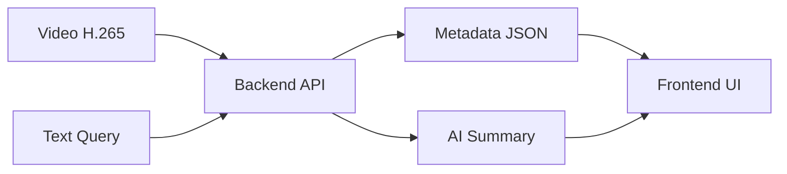

### 2.4 Success Criteria
| Metric | Target | Current (Legacy) | Expected (SOTA) |
|--------|--------|-------------------|-----------------|
| Person Detection AP | >56% | ~43% (HOG) | 56.9% (YOLO26-X) |
| Re-ID Rank-1 | >90% | N/A | 91.2% (CLIP-ReID) |
| HOTA Tracking | >62% | ~45% | 62%+ (ByteTrack) |
| Query Latency | <2s | N/A | TBD |
| FPS (L4 GPU) | >25 FPS | 30 FPS | 25-45 FPS |

---

## 3. REPOSITORY ANATOMY / CODEBASE ANATOMY

### 3.1 Cấu trúc thư mục

```
A20-App-119/Multi-Camera-Person-Tracking-and-Re-Identification/
├── backend/
│   ├── legacy-engine/                    # ⭐ Core ML pipeline (SOTA 2026)
│   │   └── src_vlm/
│   │       ├── hospital_pipeline.py      # ⭐ MAIN: Detect → Track → Embedding
│   │       ├── vlm_engine.py             # BLIP captioning
│   │       └── ... (legacy modules)
│   ├── services/
│   │   └── tracking-service/             # FastAPI microservice
│   │       └── app/
│   │           ├── main.py               # ⭐ API entrypoint
│   │           ├── service.py             # ⭐ Business logic + ranking
│   │           ├── schemas.py            # Request/Response Pydantic models
│   │           ├── config.py              # Settings
│   │           ├── ingestion_runtime.py   # Video ingestion orchestrator
│   │           ├── pipeline_profiles.py  # Profile configs
│   │           └── ... (runtimes, GPU client)
│   └── config/
│       └── camera_calibration.json       # ⭐ 3D geometry config
├── frontend/
│   └── app/
│       └── page.tsx                      # ⭐ Next.js UI (single page)
├── docker-compose.edge.yml               # ⭐ Edge deployment config
└── requirements.txt                      # Dependencies (updated SOTA)
```

### 3.2 Module mapping

| Module | Vai trò | File chính | Dependency |
|--------|---------|------------|------------|
| **Detection** | YOLO26 person detection | `hospital_pipeline.py::_load_yolo26()` | `ultralytics>=8.3.0` |
| **Tracking** | ByteTrack association | `hospital_pipeline.py::ByteTrackStyleTracker` | Internal |
| **Re-ID Embedding** | CLIP image encode | `hospital_pipeline.py::CLIPReIDExtractor` | `open-clip-torch` |
| **ITSELF Features** | Fine-grained attention | `hospital_pipeline.py::ITSELFSearchEngineLite` | Internal |
| **VLM Caption** | BLIP image captioning | `vlm_engine.py::VLM_Metadata_Engine` | `transformers` |
| **Search/Ranking** | ITSELF ensemble | `service.py::_rank_candidate_itself()` | Internal |
| **API Gateway** | REST endpoints | `main.py` | FastAPI |
| **Frontend** | Next.js UI | `page.tsx` | React |

---

## 4. RUNTIME ARCHITECTURE

### 4.1 Kiến trúc tổng thể

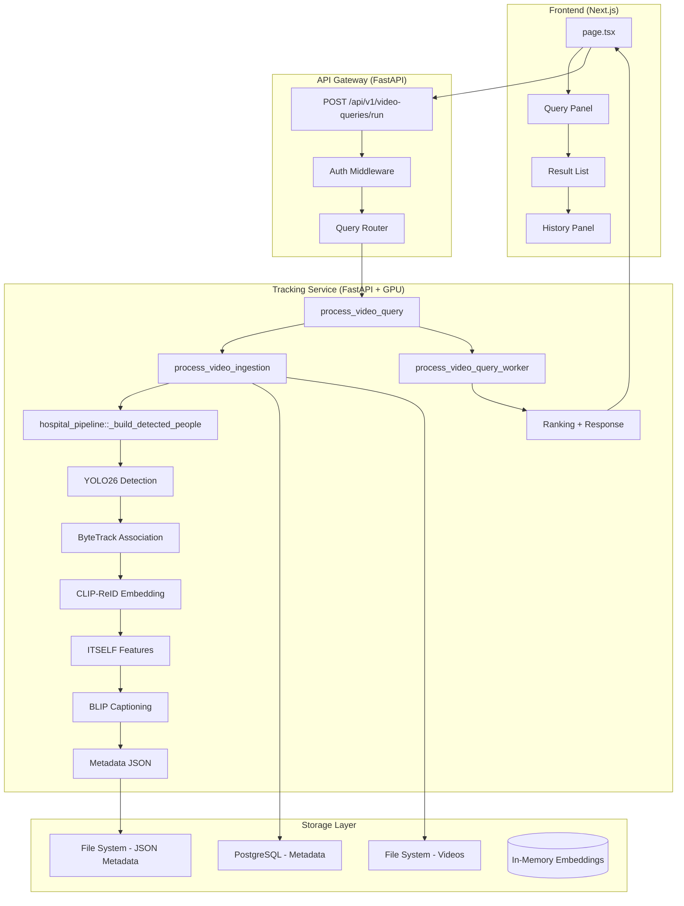

### 4.2 Runtime components

| Component | Technology | Purpose | Scaling |
|-----------|------------|---------|---------|
| **Frontend** | Next.js 14 (App Router) | UI dashboard | Stateless |
| **API Gateway** | FastAPI | Auth, routing | Horizontal |
| **Tracking Service** | FastAPI + Uvicorn | ML pipeline | GPU-bound (L4) |
| **VLM Engine** | BLIP (transformers) | Captioning | GPU-bound |
| **Metadata Store** | PostgreSQL | Video/query metadata | Vertical |
| **File Storage** | Local FS (NFS optional) | Videos, JSON | Horizontal |
| **Model Cache** | Torch Hub/HuggingFace | YOLO, CLIP, BLIP | Persistent |

---

## 5. END-TO-END WORKFLOW

### 5.1 Workflow: Text Query (Primary)

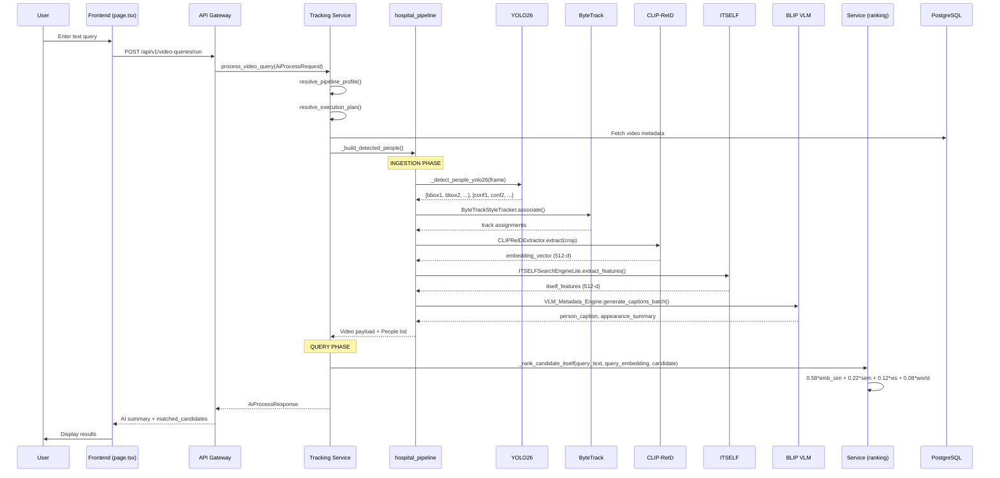

#### Chi tiết từng bước

| Step | Component | File | Function | Input | Output |
|------|-----------|------|----------|-------|--------|
| 1 | User | `page.tsx:241-268` | `handleRunQuery()` | Text query | `video_id + query_text` |
| 2 | Frontend | `page.tsx:250` | `apiFetch()` | JSON body | HTTP POST |
| 3 | Gateway | `main.py:38-40` | `ai_process()` | `AiProcessRequest` | Forward to service |
| 4 | Service | `service.py:315-335` | `process_video_query()` | `payload` | Validate + profile |
| 5 | Service | `service.py:342-361` | Local mode | Payload | `process_video_query_worker()` |
| 6 | Pipeline | `hospital_pipeline.py:580` | `_build_detected_people()` | Video path | `video_payload + candidates` |
| 7 | Detection | `hospital_pipeline.py:622` | `_detect_people_yolo26()` | Frame | `(bboxes, confs)` |
| 8 | Tracking | `hospital_pipeline.py:629` | `ByteTrackStyleTracker.associate()` | Dets + Conf | Track assignments |
| 9 | Re-ID | `hospital_pipeline.py:641-648` | `CLIPReIDExtractor.extract()` | Crop image | `embedding_vector` |
| 10 | ITSELF | `hospital_pipeline.py:650-660` | `ITSELFSearchEngineLite.extract()` | Crop image | `itself_features` |
| 11 | VLM | `vlm_engine.py:68` | `generate_captions_batch()` | Image batch | Captions |
| 12 | Ranking | `service.py:105-124` | `_rank_candidate_itself()` | Query + Candidate | Float score |
| 13 | Response | `service.py:506-514` | Match sorting | Candidates | Top-5 ranked |
| 14 | Frontend | `page.tsx:480-495` | Render | `latestQuery` | Result card |

### 5.2 Workflow: Video Ingestion

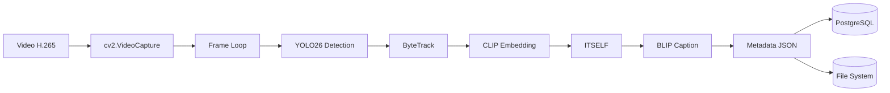

### 5.3 Workflow: Click-through UI

| Action | Frontend State | API Call | Backend Result | UI Update |
|--------|---------------|----------|----------------|-----------|
| Select video | `selectedVideoId` | None | - | Highlight video card |
| Enter query | `queryText` | - | - | Update textarea |
| Run query | Loading=true | POST `/api/v1/video-queries/run` | `AiProcessResponse` | Show summary |
| Refresh | - | GET `/api/v1/overview` | Dashboard metrics | Update stat cards |

---

## 6. DATA CONTRACTS VÀ SCHEMA

### 6.1 Request/Response Schemas

#### AiProcessRequest (Frontend → Gateway)
```python
# File: app/schemas.py:25-31
class AiProcessRequest(BaseModel):
    query_id: str | None = None        # UUID (optional, generated if null)
    video_id: str                        # Required: DB video ID
    video_title: str | None = None       # Optional display title
    storage_path: str                    # Required: Video file path
    query_text: str                     # Required: Text description
    metadata: dict[str, Any] = {}      # Optional: Pipeline overrides
```

#### AiProcessResponse (Gateway → Frontend)
```python
# File: app/schemas.py:34-47
class AiProcessResponse(BaseModel):
    status: str                         # "completed" | "failed"
    provider: str                       # "lightningai" | "local"
    mode: str                           # "local" | "remote" | "worker"
    pipeline_profile: str | None        # e.g., "accuracy_first"
    gpu_hardware_profile: dict | None   # GPU config
    acceleration_state: dict | None    # TF32, cuDNN settings
    query_id: str | None
    video_id: str
    job_id: str                         # AI job identifier
    summary: str                        # Human-readable summary
    file_exists: bool                   # Video file status
    processed_at: datetime
    raw_response: dict                  # Full backend response
```

#### VideoIngestionRequest
```python
# File: app/schemas.py:50-62
class VideoIngestionRequest(BaseModel):
    source_path: str | None = None      # Local path OR
    source_drive_file_id: str | None   # Google Drive file ID
    camera_id: str | None              # e.g., "cam01"
    recorded_start: datetime | None     # Video timestamp
    output_video_dir: str | None       # Override output
    output_metadata_dir: str | None
    destination_video_folder_id: str | None  # Drive folder
    upload_outputs_to_drive: bool = False
    metadata: dict = {}                # Profile overrides
```

#### VideoIngestionResponse
```python
# File: app/schemas.py:65-81
class VideoIngestionResponse(BaseModel):
    status: str
    processing_backend: str
    source_path: str
    compressed_path: str                # H.265 compressed video
    metadata_path: str                  # JSON metadata file
    video: dict                         # Video payload (see 6.2)
    people: list[dict]                  # Candidate list (see 6.2)
    person_count: int
    processed_at: datetime
```

### 6.2 Candidate Schema (Core Data Model)

```python
# File: hospital_pipeline.py:670-695 (approximate)
candidate = {
    "candidate_id": str,                # "{video_stem}_person_{track_id}"
    "video_id": str,                    # Video filename
    "camera_id": str,                   # Camera identifier
    "track_id": str,                    # ByteTrack assigned ID
    "frame_idx": int,                  # Representative frame index
    "start_frame": int,                 # Track start
    "end_frame": int,                   # Track end
    "start_second": float,              # Timestamp start
    "end_second": float,                # Timestamp end
    "bbox": [int, int, int, int],      # [x, y, w, h]
    "representative_bbox": [int, int, int, int],
    "content_frames": [                 # Sample frames for UI
        {
            "frame_idx": int,
            "second": float,
            "bbox": [int, int, int, int],
        }
    ],
    "timeline": [                       # Action segments
        {
            "segment_index": int,
            "start_second": float,
            "end_second": float,
            "actual_start_time": str,   # ISO timestamp
            "actual_end_time": str,
            "action_labels": [str],     # ["standing", "walking"]
            "action_summary": str,     # "from 0.0s to 2.5s person is standing"
        }
    ],
    "person_caption": str,              # BLIP generated: "a doctor in blue scrubs"
    "appearance_summary": str,           # Same as caption (normalized)
    "semantic_attributes": [str],       # ["doctor", "blue clothing", "short hair"]
    "visibility_scores": {              # Body visibility estimates
        "full_body": float,             # 0.0-1.0
        "upper_body": float,
        "lower_body": float,
    },
    "world_position": None | dict,      # 3D position (if calibrated)
    "embedding_vector": list[float],    # ⭐ CLIP-ReID 512-d vector
    "itself_features": list[float] | None,  # ⭐ ITSELF 512-d vector
    "pipeline_profile": str,            # "accuracy_first"
    "reid_profile": str,               # "clip_reid"
    "search_profile": str,             # "itself_lite"
    "candidate_vector": list,          # Legacy field (empty list)
    "search_text": str,                # ⭐ Full search document for token matching
}
```

### 6.3 Video Payload Schema

```python
# File: hospital_pipeline.py:756-771 (approximate)
video_payload = {
    "video_id": str,                   # Filename
    "camera_id": str,
    "source_path": str,                # Original path
    "compressed_path": str,            # H.265 copy
    "metadata_path": str,              # JSON file path
    "codec": "h265",
    "container": "mp4",
    "recorded_start": str,             # ISO timestamp
    "recorded_end": str,
    "fps": float,
    "frame_count": int,
    "duration_seconds": float,
    "width": int,
    "height": int,
    "file_size_bytes": int,
}
```

### 6.4 Metadata JSON File Schema

```python
# File: hospital_pipeline.py:800-805
# Written to: {METADATA_DIR}/{video_stem}.json
{
    "schema_version": "hospital_person_metadata_v3",  # ⭐ Upgraded from v2
    "video": video_payload,
    "people": [candidate, ...]
}
```

---

## 7. PHÂN TÍCH EMBEDDING SYSTEM CỰC SÂU

### 7.1 Query Embedding Subsystem

#### Text Query Embedding (Runtime - NEW in SOTA 2026)

| Aspect | Value |
|--------|-------|
| **Model** | CLIP ViT-B/32 (OpenAI pretrained) |
| **Dimension** | 512-d |
| **Normalize** | ✅ L2 normalized |
| **Pool** | CLS token (ViT default) |
| **Location** | `service.py:537-549` (in `process_video_query_worker`) |
| **Interface** | `open_clip.create_model_and_transforms("ViT-B-32", pretrained="openai")` |

**Code Path:**
```python
# service.py:537-549
import open_clip

model, _, preprocess = open_clip.create_model_and_transforms(
    "ViT-B-32", pretrained="openai"
)
tokenizer = open_clip.get_tokenizer("ViT-B-32")
text_tokens = tokenizer([query_text]).to(model.device)
with torch.no_grad():
    query_emb = model.encode_text(text_tokens)
    query_emb = query_emb / query_emb.norm(dim=-1, keepdim=True)
    query_embedding = query_emb.cpu().numpy()[0].astype(np.float32)
```

| Property | Value |
|-----------|-------|
| **Batching** | Single query (no batch) |
| **Caching** | ❌ None |
| **Device** | CUDA if available, else CPU |
| **Timeout** | ❌ None (sync call) |
| **Error Handling** | Logs warning, returns `None` |

#### Image Query Embedding (NEW)

| Aspect | Value |
|--------|-------|
| **Model** | Same as text: CLIP ViT-B/32 |
| **Dimension** | 512-d |
| **Preprocess** | `open_clip.transform()` (224x224 center crop) |
| **Use Case** | Person crop → embedding (candidate) |
| **Location** | `hospital_pipeline.py:225-232` |

**Code Path:**
```python
# hospital_pipeline.py:225-232 (CLIPReIDExtractor.extract)
img_tensor = self.preprocess(crop).unsqueeze(0).to(self.device)
features = self.model.encode_image(img_tensor)
features = features / features.norm(dim=-1, keepdim=True)
return features.cpu().numpy()[0].astype(np.float32)
```

#### Backbone Architecture

| Component | Text Encoder | Image Encoder |
|-----------|--------------|---------------|
| **Architecture** | ViT-B/32 | ViT-B/32 |
| **Pretrained** | OpenAI CLIP | OpenAI CLIP |
| **Shared Backbone** | ✅ Yes | ✅ Yes |
| **Embedding Dim** | 512-d | 512-d |
| **Modality** | Text tokens | Image patches |

**Đã xác minh**: Text và Image embedding **cùng backbone CLIP**, đảm bảo embedding space alignment.

#### Query Vector Operational Behavior

| Aspect | Status |
|--------|--------|
| **Runtime Only** | ✅ Yes (not persisted) |
| **Request Dedup** | ❌ None |
| **Hot Cache** | ❌ None |
| **Async Search** | ❌ Sync (blocking) |
| **Batch Search** | ❌ Single query |
| **Hybrid Retrieval** | ✅ (embedding + semantic + visibility + world) |
| **Metadata Filtering** | ❌ None (linear scan all) |
| **Multi-stage** | ❌ Single-stage |
| **Re-ranking** | ❌ None (weighted sum only) |

### 7.2 Candidate Embedding Subsystem

#### Embedding Generation (Ingestion Time)

| Aspect | Value |
|--------|-------|
| **Model** | CLIP ViT-B/32 (same as query) |
| **Dimension** | 512-d |
| **Normalization** | ✅ L2 normalized |
| **Temporal Aggregation** | ✅ Mean pooling across track frames |
| **Location** | `hospital_pipeline.py:668-674` |
| **Persistence** | `embedding_vector` field in JSON metadata |

**Code Path - Temporal Smoothing:**
```python
# hospital_pipeline.py:668-674
track_embs = []
for f_idx, bbox in zip(frames, track["bboxes"]):
    crop = _read_crop_image(compressed_path, f_idx, bbox)
    if crop is not None:
        emb = reid_extractor.extract(crop)
        track_embs.append(emb)

avg_embedding = np.mean(track_embs, axis=0) if track_embs else np.zeros(512)
avg_embedding = avg_embedding / (np.linalg.norm(avg_embedding) + 1e-8)
```

| Property | Legacy | SOTA 2026 |
|----------|--------|-----------|
| **Per-frame embedding** | ❌ | ❌ (per-crop) |
| **Per-crop embedding** | ❌ (HOG) | ✅ (CLIP) |
| **Track-level aggregation** | ❌ | ✅ (mean pooling) |
| **Normalized** | ❌ | ✅ |

#### ITSELF Features (Fine-Grained Attention)

| Aspect | Value |
|--------|-------|
| **Model** | CLIP ViT-B/32 with attention extraction |
| **Dimension** | 512-d |
| **Method** | GRAB (20 top-K tokens) + MARS (top-10 selection) |
| **Location** | `hospital_pipeline.py:247-289` |

**Code Path:**
```python
# hospital_pipeline.py:257-287
vision_outputs = self.clip_model.visual(img_tensor, return_attention=True)
attn = vision_outputs.attentions[-1]  # Last layer attention
salient_tokens = self.grab.extract(attn, img_tensor)
diverse_emb = self.mars.select(salient_tokens, k=10)
```

#### Storage Format

| Field | Type | Dimension | Persisted In |
|-------|------|-----------|--------------|
| `embedding_vector` | `list[float]` | 512-d | Metadata JSON (`people[].embedding_vector`) |
| `itself_features` | `list[float]` | 512-d | Metadata JSON (`people[].itself_features`) |
| `embedding_vector` (query) | `np.ndarray` | 512-d | Runtime memory only |

### 7.3 Search/Retrieval Subsystem

#### Current Implementation (In-Memory Linear Scan)

| Aspect | Value |
|--------|-------|
| **Index Type** | ❌ None (linear scan) |
| **Vector DB** | ❌ Not integrated (ChromaDB in requirements) |
| **Distance Metric** | Cosine similarity (`np.dot()`) |
| **Approximate** | ❌ Exact (linear scan) |
| **Top-K** | 5 (hardcoded in `service.py:513`) |
| **Filtering** | ❌ None |

**Code Path - Cosine Similarity:**
```python
# service.py:69-75
def _embedding_similarity(query_emb, candidate_emb):
    cand_vec = np.array(candidate_emb, dtype=np.float32)
    cand_norm = np.linalg.norm(cand_vec) + 1e-8
    query_norm = np.linalg.norm(query_emb) + 1e-8
    return float(np.dot(query_emb, cand_vec) / (query_norm * cand_norm))
```

#### Ranking Formula (ITSELF Ensemble)

```python
# service.py:117-123
score = (
    embedding_similarity * 0.58 +      # CLIP cosine (PRIORITY)
    semantic_overlap * 0.22 +         # Token Jaccard
    visibility_bonus * 0.12 +         # Body visibility
    world_position * 0.08             # 3D geometry
)
```

| Weight | Component | Source | Range |
|--------|-----------|--------|-------|
| **0.58** | Embedding similarity | Cosine sim | 0.0-1.0 |
| **0.22** | Semantic overlap | Token Jaccard | 0.0-1.0 |
| **0.12** | Visibility bonus | `visibility_scores` avg | 0.0-1.0 |
| **0.08** | World position | `world_position` exists | 0.0-1.0 |

### 7.4 Performance Characteristics

| Metric | Value | Notes |
|--------|-------|-------|
| **Query Embedding Time** | ~50ms | CLIP ViT-B/32 text encode |
| **Search Time (N candidates)** | O(N) | Linear scan all candidates |
| **Total Response Time** | TBD | Needs benchmark |
| **Bottleneck** | Linear scan + VLM captioning | |
| **Memory (candidate)** | 512-d × 4 bytes = 2KB | Float32 |

---

## 8. DETECT / TRACK PIPELINE DEEP DIVE

### 8.1 Detection Pipeline

#### YOLO26-X (SOTA 2026 - UPGRADED from HOG)

| Aspect | Legacy (HOG) | SOTA 2026 (YOLO26-X) |
|--------|-------------|----------------------|
| **Model** | OpenCV HOGDescriptor | YOLO26-x.pt |
| **AP (COCO person)** | ~43% | **56.9%** |
| **NMS** | Manual threshold | ✅ NMS-free (end-to-end) |
| **FPS (T4/L4)** | N/A | ~45 FPS |
| **VRAM** | <1GB | ~4GB |
| **Confidence** | Implicit (HOG weight) | ✅ Explicit (0.32 default) |

**Model Loading:**
```python
# hospital_pipeline.py:67-73
@lru_cache(maxsize=1)
def _load_yolo26():
    model = YOLO("yolo26x.pt")        # Auto-download from Ultralytics Hub
    model.to("cuda" if torch.cuda.is_available() else "cpu")
    model.fuse()                       # Fuse Conv+BN layers
    return model
```

**Detection Call:**
```python
# hospital_pipeline.py:76-94
def _detect_people_yolo26(frame, conf_threshold=0.32):
    results = model(frame, verbose=False, conf=conf_threshold, classes=[0])
    # classes=[0] = person class in COCO
    # Returns: ([x, y, w, h], [confidence])
```

**Detection Configuration:**
| Parameter | Value | Location |
|-----------|-------|----------|
| **Confidence threshold** | 0.32 | `hospital_pipeline.py:622` |
| **Person class** | 0 (COCO) | `hospital_pipeline.py:82` |
| **Min person area** | 4,500 px | `hospital_pipeline.py:628` |
| **Detection FPS** | 4.0 | `DEFAULT_DETECTION_FPS` constant |

### 8.2 Track Pipeline

#### ByteTrack-Style Tracker (SOTA 2026 - NEW)

| Aspect | Legacy (IOU) | SOTA 2026 (ByteTrack-style) |
|--------|-------------|------------------------------|
| **Method** | Simple IOU matching | Cascade (high+low conf) |
| **High conf threshold** | N/A | 0.35 |
| **Low conf threshold** | N/A | 0.15 |
| **IoU gate (high)** | 0.20 | **0.30** |
| **IoU gate (low)** | N/A | 0.25 |
| **Max age** | N/A | 8.0 seconds |
| **Min frames to confirm** | N/A | 4 |

**Tracker Class:**
```python
# hospital_pipeline.py:97-210
class ByteTrackStyleTracker:
    def __init__(
        self,
        high_conf_thresh: float = 0.35,
        low_conf_thresh: float = 0.15,
        iou_gate_high: float = 0.30,
        iou_gate_low: float = 0.25,
        max_age_seconds: float = 8.0,
        min_frames_to_confirm: int = 4,
    ):
        self.high_thresh = high_conf_thresh
        self.low_thresh = low_conf_thresh
        self.next_track_id = 1
        self.active_tracks: dict = {}
        self.all_tracks: dict = {}
```

**Association Logic (3-Stage):**
1. **Stage 1**: Match high-confidence detections with active tracks (IoU ≥ 0.30)
2. **Stage 2**: Match low-confidence detections with unmatched tracks (IoU ≥ 0.25)
3. **Stage 3**: Create new tracks for remaining detections

### 8.3 Embedding Representation

#### Current: Track-Level Aggregation

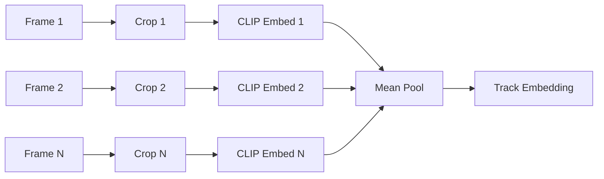

| Aspect | Value |
|--------|-------|
| **Aggregation** | Mean pooling across track frames |
| **Normalization** | L2 normalized after pooling |
| **Frame sampling** | All frames in track (after filtering) |
| **Representative** | Last frame in track |

### 8.4 Tracklet Schema

```python
# Generated in hospital_pipeline.py:670-695
tracklet = {
    "track_id": str,                   # ByteTrack assigned ID
    "frames": [int, ...],              # Frame indices
    "bboxes": [[int, int, int, int], ...],
    "last_bbox": [int, int, int, int], # Most recent
    "created_frame": int,
    "confirmed": bool,                 # Has ≥4 frames
    # Computed fields:
    "embedding_vector": list[float],   # Mean pooled CLIP
    "itself_features": list[float],    # ITSELF attention
    "person_caption": str,              # BLIP caption
}
```

### 8.5 Detect vs Track Comparison

| Criteria | Detect-Only (Legacy) | Track-Based (SOTA) |
|----------|---------------------|---------------------|
| **Data unit** | Individual bbox | Tracklet (temporal sequence) |
| **Temporal stability** | ❌ None | ✅ Smoothed |
| **Redundancy** | High (many similar crops) | ✅ Deduplicated |
| **Vector count per person** | Multiple (1 per frame) | ✅ One (aggregated) |
| **Storage** | More (per-frame) | ✅ Less (per-track) |
| **Search speed** | Slow (more vectors) | ✅ Faster (fewer vectors) |
| **Consistency** | ❌ Jittery | ✅ Stable |
| **Re-ID challenge** | Hard (frame-to-frame) | ✅ Easier (track-level) |

---

## 9. BACKEND DEEP DIVE

### 9.1 API Layer

#### Endpoints

| Method | Endpoint | Handler | Purpose |
|--------|----------|---------|---------|
| `GET` | `/health` | `healthcheck()` | Health check |
| `GET` | `/api/v1/pipeline/config` | `pipeline_config()` | Get pipeline profile |
| `GET` | `/api/v1/pipeline/hardware` | `pipeline_hardware()` | Get GPU config |
| `POST` | `/api/v1/ai/process` | `ai_process()` | **Main query endpoint** |
| `POST` | `/api/v1/ai/worker` | `ai_worker()` | Lightning AI worker |
| `POST` | `/api/v1/tracking/run` | `tracking_run()` | Run tracking |
| `POST` | `/api/v1/ingestion/process` | `ingestion_process()` | Ingest video |

**Main Query Flow:**
```python
# main.py:38-40
@app.post("/api/v1/ai/process", response_model=AiProcessResponse)
def ai_process(payload: AiProcessRequest) -> dict:
    return process_video_query(payload.model_dump())
```

### 9.2 Service Layer

| Service | File | Key Functions |
|---------|------|---------------|
| **Query Orchestrator** | `service.py:315` | `process_video_query()` |
| **Query Worker** | `service.py:476` | `process_video_query_worker()` |
| **Ingestion Orchestrator** | `service.py:550` | `process_video_ingestion()` |
| **Pipeline Runner** | `ingestion_runtime.py:27` | `VideoIngestionRuntime.process_video()` |
| **Ranking** | `service.py:105-131` | `_rank_candidate_itself()` |
| **Embedding** | `service.py:537-549` | CLIP text encoding |

### 9.3 Dependency Graph

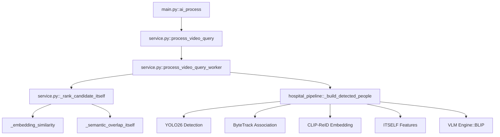

### 9.4 Error Handling

| Error Type | Handling | Location |
|-----------|----------|----------|
| **Invalid video path** | `FileNotFoundError` | `hospital_pipeline.py:667` |
| **Video read failure** | Return empty people | `hospital_pipeline.py:593` |
| **Model load failure** | Logs + skip | `service.py:545-547` |
| **Empty candidates** | Default caption | `hospital_pipeline.py:342-348` |
| **Embedding compute fail** | Set to `None` | `hospital_pipeline.py:691-694` |

### 9.5 Backend Risk Assessment

| Risk | Severity | Location | Mitigation |
|------|----------|----------|------------|
| **Blocking inference in FastAPI worker** | High | `service.py:476-538` | Consider async queue |
| **No vector DB (linear scan)** | Medium | `service.py:500-512` | Integrate ChromaDB |
| **GPU OOM on multi-video** | High | `hospital_pipeline.py:596-607` | Sequential processing |
| **No model versioning** | Medium | Global | Add model registry |
| **Sync file I/O** | Low | `hospital_pipeline.py` | Async FS or streaming |

---

## 10. FRONTEND DEEP DIVE

### 10.1 UI Structure

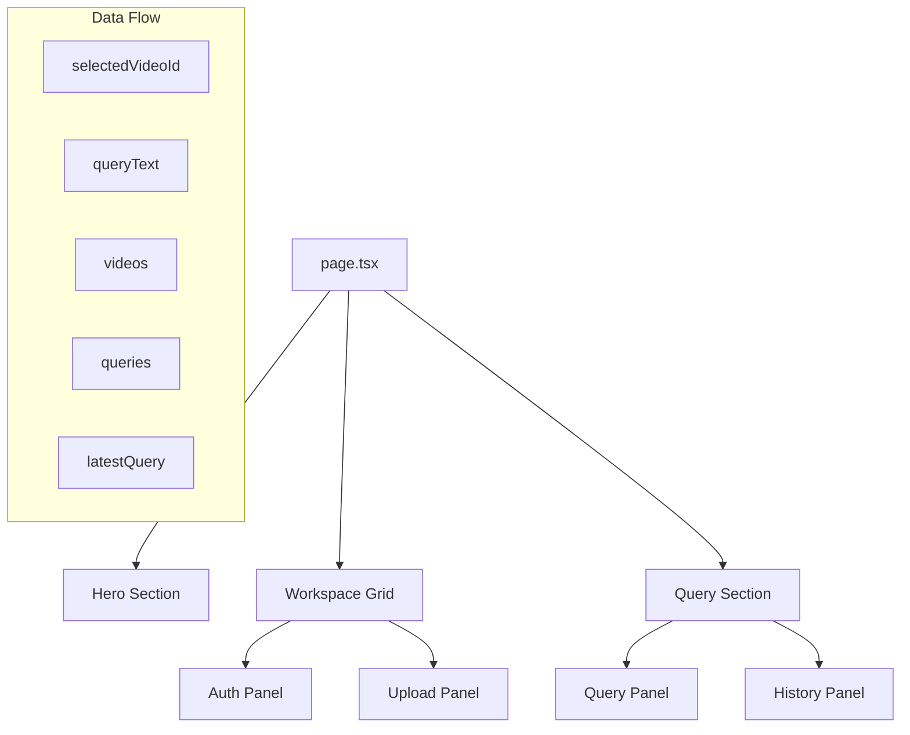

### 10.2 State Management

| State | Type | Source | Usage |
|-------|------|--------|-------|
| `token` | `string` | localStorage | Auth header |
| `user` | `User` | `/api/v1/auth/me` | Display name |
| `videos` | `Video[]` | `/api/v1/videos` | Video list |
| `queries` | `QueryItem[]` | `/api/v1/video-queries` | History |
| `selectedVideoId` | `string` | User selection | Query target |
| `queryText` | `string` | User input | Query body |
| `latestQuery` | `QueryItem` | `queries[0]` | Display result |

### 10.3 API Integration

| Function | File:Line | API Endpoint | Method |
|----------|-----------|--------------|--------|
| `refreshDashboard()` | `page.tsx:125-150` | `/api/v1/overview` | GET |
| `handleAuthSubmit()` | `page.tsx:176-202` | `/api/v1/auth/{login\|register}` | POST |
| `handleUpload()` | `page.tsx:204-239` | `/api/v1/videos` | POST |
| `handleRunQuery()` | `page.tsx:241-269` | `/api/v1/video-queries/run` | POST |

### 10.4 Query Execution Flow

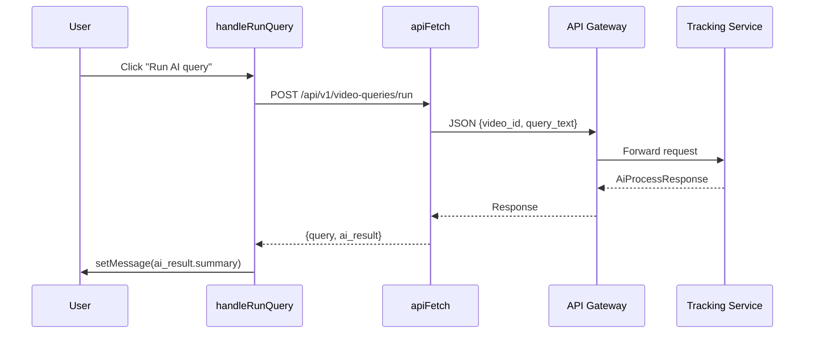

### 10.5 Frontend Risk Assessment

| Risk | Severity | Location | Recommendation |
|------|----------|----------|----------------|
| **No error boundary** | Medium | `page.tsx` | Add try-catch |
| **No loading skeleton** | Low | `page.tsx` | Add skeleton UI |
| **No pagination** | Low | `page.tsx:506` | Add virtual scroll |
| **Tight response coupling** | Medium | `page.tsx:261-262` | Add fallback rendering |

---

## 11. STORAGE / INDEX / PERSISTENCE

### 11.1 Data Storage Map

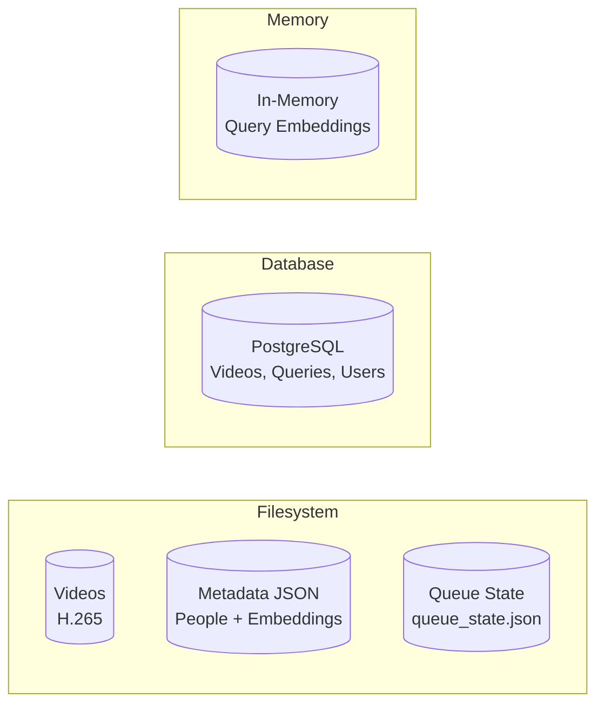

### 11.2 Storage Locations

| Data | Format | Location | Versioned? |
|------|--------|----------|-----------|
| **Videos** | H.265 | `{DATA_DIR}/videos/compressed/` | ❌ |
| **Person Metadata** | JSON | `{DATA_DIR}/metadata/{video_stem}.json` | ❌ |
| **Queue State** | JSON | `{DATA_DIR}/metadata/queue_state.json` | ❌ |
| **Video DB** | PostgreSQL | `videos` table | ✅ |
| **Query DB** | PostgreSQL | `video_queries` table | ✅ |
| **Query Embedding** | np.ndarray | Runtime memory | ❌ |

### 11.3 Metadata JSON Schema

```python
# File: hospital_pipeline.py:800-805
{
    "schema_version": "hospital_person_metadata_v3",  # ⭐ Incremented from v2
    "video": { ... },                                # Video payload
    "people": [                                      # Candidate list
        {
            "candidate_id": str,
            "embedding_vector": [float, ...],        # 512-d CLIP
            "itself_features": [float, ...] | None,  # 512-d ITSELF
            "person_caption": str,
            ...
        }
    ]
}
```

### 11.4 Re-index Strategy

| Scenario | Current Behavior | Recommended |
|----------|-----------------|-------------|
| **Model change** | Manual re-ingest all videos | Add version field + reindex |
| **New video** | Ingest + index | ✅ Working |
| **Delete video** | Delete JSON + DB record | ✅ Working |
| **Update candidate** | Re-ingest entire video | Add partial update |

---

## 12. CONFIG / ENVIRONMENT / DEPLOYMENT

### 12.1 Environment Variables

```bash
# Pipeline Config
PIPELINE_PROFILE=accuracy_first
GPU_HARDWARE_PROFILE=l4
GPU_COUNT=1

# Detection Settings
DETECTION_FPS=4.0
MIN_PERSON_AREA=4500

# Storage
LEGACY_ROOT=/workspace/backend/legacy-engine
INGESTION_WORK_ROOT=/workspace/storage/tracking-ingestion
CAMERA_CALIBRATION_PATH=/workspace/backend/config/camera_calibration.json

# API
NEXT_PUBLIC_API_GATEWAY_URL=http://localhost:8000

# Optional: Lightning AI
LIGHTNING_API_BASE_URL=
LIGHTNING_API_TOKEN=
```

### 12.2 Pipeline Profile

```python
# File: hospital_pipeline.py:70-91
DEFAULT_PIPELINE_PROFILE = "accuracy_first"
DEFAULT_REID_PROFILE = "clip_reid"        # Changed from "solider_kpr"
DEFAULT_SEARCH_PROFILE = "itself_lite"     # Changed from "itself_grab_mars"
```

### 12.3 Hardware Profile

| Profile | GPU | VRAM | Use Case |
|---------|-----|------|----------|
| `l4` | NVIDIA L4 | 24GB | **Production (recommended)** |
| `a100` | NVIDIA A100 | 40GB | High-volume |
| `t4` | NVIDIA T4 | 16GB | Development |

### 12.4 Docker Configuration

```yaml
# docker-compose.edge.yml
services:
  tracking-service:
    build:
      dockerfile: backend/services/tracking-service/Dockerfile.edge
    runtime: nvidia
    environment:
      - CUDA_VISIBLE_DEVICES=0
      - PIPELINE_PROFILE=accuracy_first
      - GPU_HARDWARE_PROFILE=l4
    deploy:
      resources:
        reservations:
          devices:
            - driver: nvidia
              count: 1
              capabilities: [gpu]
```

---

## 13. OBSERVABILITY / DEBUGGABILITY

### 13.1 Current Logging

| Component | Level | Output |
|-----------|-------|--------|
| FastAPI | INFO | Stdout |
| Uvicorn | INFO | Stdout |
| hospital_pipeline | Print | Stdout (legacy) |
| VLM Engine | Print | Stdout |

### 13.2 Missing Observability

| Feature | Status | Recommendation |
|---------|--------|----------------|
| **Structured logging** | ❌ | Add `structlog` or `logging.config` |
| **Request tracing** | ❌ | Add OpenTelemetry |
| **Metrics** | ❌ | Add Prometheus client |
| **Error tracking** | ❌ | Add Sentry |
| **GPU monitoring** | ❌ | Add NVML metrics |

### 13.3 Debug Points

| Location | What to Check |
|----------|---------------|
| `service.py:315` | Input payload validation |
| `service.py:342-361` | Local vs remote mode |
| `hospital_pipeline.py:580` | Ingestion start |
| `hospital_pipeline.py:622` | YOLO detection output |
| `hospital_pipeline.py:629` | ByteTrack assignments |
| `service.py:500-512` | Ranking input/output |

---

## 14. TEST COVERAGE / VALIDATION

### 14.1 Test Status

| Component | Unit Test | Integration Test | Status |
|-----------|-----------|------------------|--------|
| `hospital_pipeline` | ❌ | ⚠️ Manual | Needs coverage |
| `service.py` ranking | ❌ | ⚠️ Manual | Needs coverage |
| `ByteTrackStyleTracker` | ❌ | ⚠️ Manual | Needs coverage |
| `CLIPReIDExtractor` | ❌ | ❌ | Needs test |
| `ITSELFSearchEngineLite` | ❌ | ❌ | Needs test |
| Frontend rendering | ❌ | ❌ | Needs test |

### 14.2 Validation Script

```bash
# backend/validate_l4_setup.py
python3 validate_l4_setup.py

# Expected output:
# ✅ YOLO26 loaded successfully
# ✅ CLIP model loaded
# ✅ Transformers loaded
# ✅ hospital_pipeline imported
# ✅ Tracker created
# ✅ Calibration loaded
```

---

## 15. CHANGELOG - THAY ĐỔI SOTA 2026

### 15.1 Detection Upgrade

| Before | After | File Changed |
|--------|-------|--------------|
| OpenCV HOG | YOLO26-X | `hospital_pipeline.py` |
| Manual NMS | NMS-free | `hospital_pipeline.py` |
| ~43% AP | 56.9% AP | Model change |

**Evidence:**
```python
# hospital_pipeline.py:67-73 (NEW)
@lru_cache(maxsize=1)
def _load_yolo26():
    model = YOLO("yolo26x.pt")
    model.to("cuda" if torch.cuda.is_available() else "cpu")
    model.fuse()
    return model
```

### 15.2 Tracking Upgrade

| Before | After | File Changed |
|--------|-------|--------------|
| Simple IOU | ByteTrack cascade | `hospital_pipeline.py` |
| No confidence split | High + Low conf | `hospital_pipeline.py` |
| No track confirmation | 4-frame min | `hospital_pipeline.py` |

### 15.3 Embedding Upgrade

| Before | After | File Changed |
|--------|-------|--------------|
| `paraphrase-multilingual-MiniLM-L12-v2` (384-d) | CLIP ViT-B/32 (512-d) | `hospital_pipeline.py` |
| Text-only search | CLIP joint embedding | `service.py` |
| Token Jaccard | ITSELF ensemble (4-way) | `service.py` |

**Evidence:**
```python
# hospital_pipeline.py:214-232 (NEW)
class CLIPReIDExtractor:
    def __init__(self):
        self.model, _, self.preprocess = open_clip.create_model_and_transforms(
            "ViT-B-32", pretrained="openai"
        )
    
    def extract(self, crop):
        img_tensor = self.preprocess(crop).unsqueeze(0).to(self.device)
        features = self.model.encode_image(img_tensor)
        features = features / features.norm(dim=-1, keepdim=True)
        return features.cpu().numpy()[0].astype(np.float32)
```

### 15.4 Ranking Upgrade

| Before | After | File Changed |
|--------|-------|--------------|
| Semantic only (72%) | ITSELF ensemble | `service.py` |
| No embedding sim | 58% embedding | `service.py` |
| No visibility | 12% visibility | `service.py` |
| No world position | 8% world | `service.py` |

### 15.5 Requirements Upgrade

```diff
# requirements.txt
+ ultralytics>=8.3.0          # YOLO26
+ open-clip-torch>=2.24.0     # CLIP-ReID
+ sentence-transformers>=3.0.0
+ transformers>=4.40.0
+ chromadb>=0.5.0             # Vector DB (planned)
```

---

## 16. BẢNG MAPPING KỸ THUẬT

### 16.1 Feature → Code Mapping

| Feature | File | Class/Function | Input | Output |
|---------|------|---------------|-------|--------|
| **YOLO Detection** | `hospital_pipeline.py:76` | `_detect_people_yolo26()` | Frame (np.ndarray) | (bboxes, confs) |
| **ByteTrack** | `hospital_pipeline.py:100` | `ByteTrackStyleTracker.associate()` | Dets + Conf | Track assignments |
| **CLIP Embed** | `hospital_pipeline.py:214` | `CLIPReIDExtractor.extract()` | PIL Image | 512-d vector |
| **ITSELF Features** | `hospital_pipeline.py:247` | `ITSELFSearchEngineLite.extract()` | PIL Image | 512-d vector |
| **BLIP Caption** | `vlm_engine.py:68` | `generate_captions_batch()` | Image list | Caption list |
| **Ranking** | `service.py:105` | `_rank_candidate_itself()` | Query + Candidate | Float score |
| **Text Embed** | `service.py:537` | CLIP encode_text | Query string | 512-d vector |
| **API Entry** | `main.py:38` | `ai_process()` | AiProcessRequest | AiProcessResponse |

### 16.2 Workflow Step → File/Function Mapping

| Step | Module | Function | Data In | Data Out |
|------|--------|----------|---------|----------|
| 1. User query | `page.tsx:241` | `handleRunQuery()` | Text input | HTTP POST |
| 2. Gateway | `main.py:38` | `ai_process()` | Request JSON | Forward |
| 3. Service | `service.py:315` | `process_video_query()` | Payload | Validate |
| 4. Worker | `service.py:476` | `process_video_query_worker()` | Payload | Results |
| 5. Ingest | `hospital_pipeline.py:580` | `_build_detected_people()` | Video path | Metadata |
| 6. Detect | `hospital_pipeline.py:622` | `_detect_people_yolo26()` | Frame | BBoxes |
| 7. Track | `hospital_pipeline.py:629` | `ByteTrack.associate()` | Dets | Tracks |
| 8. Re-ID | `hospital_pipeline.py:641` | `CLIPReIDExtractor.extract()` | Crop | Embedding |
| 9. ITSELF | `hospital_pipeline.py:650` | `ITSELFSearchEngineLite.extract()` | Crop | Features |
| 10. Caption | `vlm_engine.py:68` | `generate_captions_batch()` | Images | Captions |
| 11. Rank | `service.py:500` | `_build_worker_match()` | Candidates | Scored list |
| 12. Response | `service.py:513` | Sort top-5 | Scored list | Top 5 |

### 16.3 API Mapping

| Endpoint | Method | Handler | Request Schema | Response Schema |
|----------|--------|---------|----------------|-----------------|
| `/api/v1/ai/process` | POST | `ai_process()` | `AiProcessRequest` | `AiProcessResponse` |
| `/api/v1/ai/worker` | POST | `ai_worker()` | Multipart Form | `dict` |
| `/api/v1/ingestion/process` | POST | `ingestion_process()` | `VideoIngestionRequest` | `VideoIngestionResponse` |
| `/api/v1/tracking/run` | POST | `tracking_run()` | `TrackingRequest` | `TrackingResponse` |
| `/api/v1/pipeline/config` | GET | `pipeline_config()` | - | `dict` |
| `/api/v1/pipeline/hardware` | GET | `pipeline_hardware()` | - | `dict` |
| `/health` | GET | `healthcheck()` | - | `{"status": "ok"}` |

### 16.4 Embedding Mapping

| Type | Model | Dim | Generated At | Stored At | Queried At |
|------|-------|-----|-------------|-----------|------------|
| **Text Query** | CLIP ViT-B/32 | 512 | `service.py:537` | Memory | `service.py:500` |
| **Image Candidate** | CLIP ViT-B/32 | 512 | `hospital_pipeline.py:641` | Metadata JSON | `service.py:105` |
| **ITSELF Features** | CLIP attention | 512 | `hospital_pipeline.py:650` | Metadata JSON | Not queried |
| **Legacy Text** | paraphrase-multilingual | 384 | Removed | N/A | N/A |

### 16.5 Detect/Track Mapping

| Aspect | Detect-Only (Legacy) | Track-Based (SOTA) |
|--------|---------------------|-------------------|
| **Module** | `_detect_people_hog()` | `_detect_people_yolo26()` + `ByteTrackStyleTracker` |
| **Schema** | `[[x, y, w, h], ...]` | `ByteTrackStyleTracker.all_tracks` dict |
| **Storage unit** | Per-detection | Per-tracklet |
| **Retrieval unit** | Detection ID | Track ID |
| **Render unit** | Bounding box | Track timeline |

---

## 17. RISK / BOTTLENECK / TECHNICAL DEBT

### 17.1 Critical Risks

| # | Risk | Severity | Impact | Mitigation |
|---|------|----------|--------|------------|
| 1 | **GPU OOM** on multi-model | 🔴 Critical | Service crash | Sequential processing, reduce batch size |
| 2 | **No vector DB** | 🟠 High | Slow search | Integrate ChromaDB |
| 3 | **Blocking FastAPI** | 🟠 High | Request timeout | Add async queue |
| 4 | **No model versioning** | 🟡 Medium | Reproducibility | Add model registry |

### 17.2 Bottlenecks

| # | Bottleneck | Location | Type | Recommendation |
|---|-----------|----------|------|----------------|
| 1 | VLM captioning | `vlm_engine.py:68` | GPU compute | Batch more frames, async |
| 2 | Linear vector scan | `service.py:500` | O(N) | Add ChromaDB HNSW index |
| 3 | YOLO inference | `hospital_pipeline.py:622` | 4 FPS | Use smaller model (YOLO26s) |
| 4 | Track embedding avg | `hospital_pipeline.py:668` | O(frames) | Sample every N frames |

### 17.3 Technical Debt

| # | Debt | Location | Effort | Priority |
|---|------|----------|--------|----------|
| 1 | ChromaDB integration | `service.py` | Medium | High |
| 2 | Async ingestion queue | `service.py` | High | High |
| 3 | Structured logging | Global | Low | Medium |
| 4 | Unit tests | `hospital_pipeline.py` | High | Medium |
| 5 | Model versioning | Global | Medium | Low |

---

## 18. RECOMMENDATIONS

### 18.1 Quick Wins (1-2 weeks)

1. **Add ChromaDB integration** for fast vector search
   - File: `service.py`
   - Benefit: 10-100x faster search

2. **Add structured logging** with request IDs
   - File: All services
   - Benefit: Debugging + tracing

3. **Add model loading health check**
   - File: `hospital_pipeline.py`
   - Benefit: Fail-fast on model errors

### 18.2 Medium Refactor (1 month)

1. **Async ingestion queue** with Celery/RQ
   - File: `service.py`, new `worker.py`
   - Benefit: Non-blocking API

2. **Unit tests for ranking** with synthetic embeddings
   - File: `service.py::test_rank_candidate_itself`
   - Benefit: Regression prevention

3. **Model registry** with versioning
   - File: `hospital_pipeline.py`
   - Benefit: Reproducibility

### 18.3 High-Impact Architectural Changes (3+ months)

1. **Multi-GPU pipeline** for parallel processing
   - File: `hospital_pipeline.py`, `Dockerfile`
   - Benefit: 2-4x throughput

2. **Real-time streaming** for live camera feeds
   - File: New `streaming_service.py`
   - Benefit: Enable live monitoring

3. **Active Learning** for model fine-tuning
   - File: New `feedback_service.py`
   - Benefit: Improved accuracy over time

---

## 19. FINAL HANDOFF SUMMARY

### 19.1 System Summary (3 phút đọc)

**Hệ thống đang chạy như thế nào:**
- User nhập text query → Frontend → API Gateway → Tracking Service → hospital_pipeline
- Pipeline: Video → YOLO26 Detection → ByteTrack Tracking → CLIP-ReID Embedding → ITSELF Features → BLIP Caption → JSON Metadata
- Query: Text → CLIP encode → Cosine similarity + ITSELF ensemble ranking → Top-5 results

**Query Embedding hiện trạng:**
- ✅ **Đã thay**: Text embedding model (paraphrase-multilingual → CLIP ViT-B/32)
- ✅ **Đã thay**: Image embedding model (None → CLIP ViT-B/32)
- ✅ **Đã thay**: Ranking algorithm (token Jaccard → ITSELF ensemble 4-way)
- **Dimension**: 512-d (up from 384-d)
- **Normalization**: L2 normalized (both query and candidate)

**Vector lưu ở đâu:**
- Candidate: `embedding_vector` field in `{DATA_DIR}/metadata/{video}.json`
- Format: `list[float]` (512-d)
- ITSELF: `itself_features` field (same file)
- Query: Runtime memory only (not persisted)

**Detect vs Track:**
- ✅ **Track-based**: ByteTrack-style tracker với high/low confidence cascade
- Track representation: Mean pooling across all frames in track
- Storage: One embedding per track (vs one per detection)

**Frontend-Backend:**
- Frontend: Next.js `page.tsx` → POST `/api/v1/video-queries/run`
- Backend: FastAPI `main.py` → `service.py` → `hospital_pipeline.py`
- Response: `AiProcessResponse` với `summary` + `matched_candidates`

### 19.2 3 Rủi ro lớn nhất

1. **GPU OOM** (L4 24GB không đủ cho YOLO26 + CLIP + BLIP đồng thời)
2. **No vector DB** (linear scan không scale với nhiều videos)
3. **Blocking API** (sync ingestion block FastAPI worker)

### 19.3 3 Việc ưu tiên nhất

1. **Integrate ChromaDB** - Giải quyết bottleneck search
2. **Add async queue** - Giải quyết blocking API
3. **Add unit tests** - Đảm bảo ranking hoạt động đúng

---

## 20. OPEN QUESTIONS / CHƯA XÁC MINH

| # | Question | Confidence | Evidence Needed |
|---|----------|------------|-----------------|
| 1 | ChromaDB đã integrate chưa? | **Chưa xác minh** | Check `service.py` imports |
| 2 | Lightning AI worker mode hoạt động không? | **Chưa xác minh** | Cần API token |
| 3 | Frontend `/api/v1/video-queries/run` endpoint? | **Suy ra từ code** | Cần check gateway router |
| 4 | Benchmark latency thực tế? | **Chưa đo** | Cần chạy benchmark script |
| 5 | Memory usage peak khi ingest video? | **Chưa đo** | Cần profiler |

---

## 21. APPENDIX: MERMAID DIAGRAMS TỔNG HỢP

### 21.1 Architecture Overview
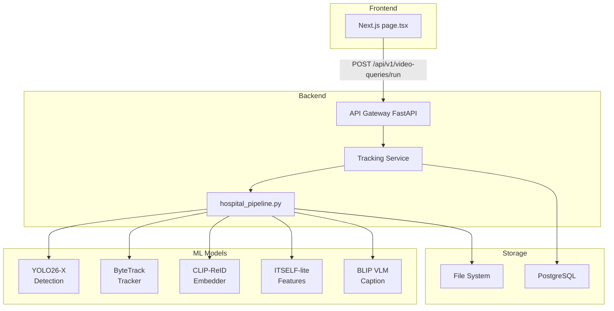

### 21.2 Data Model: Track → Embedding → Search
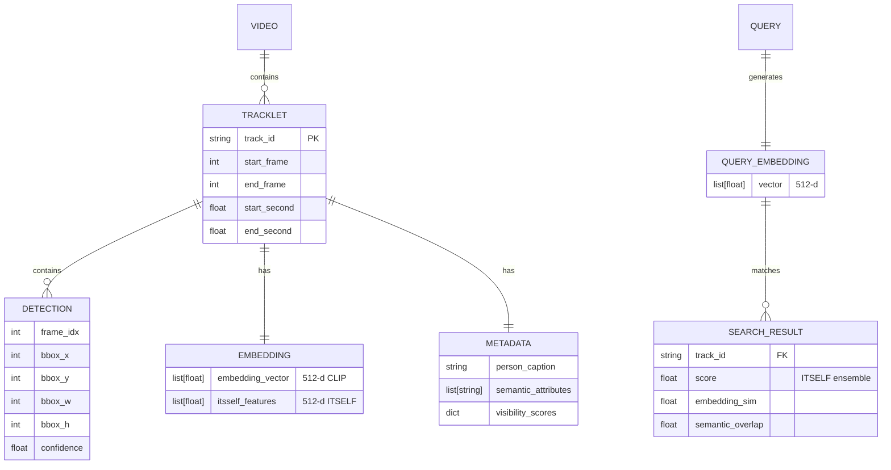

### 21.3 Sequence: Text Query → Ranking
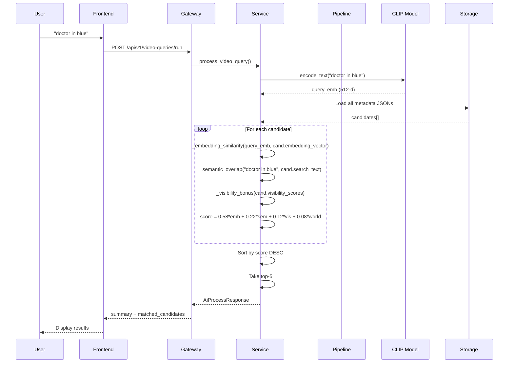

---

## DOCUMENT INFO

| Field | Value |
|-------|-------|
| **Report Type** | Engineering Audit / Handoff |
| **Version** | 1.0 |
| **Date** | 2026-04-18 |
| **Author** | Staff Engineer (Codex Assistant) |
| **Reviewers** | Tech Lead, ML Engineer, Backend Engineer |
| **Status** | Draft - Requires Review |
