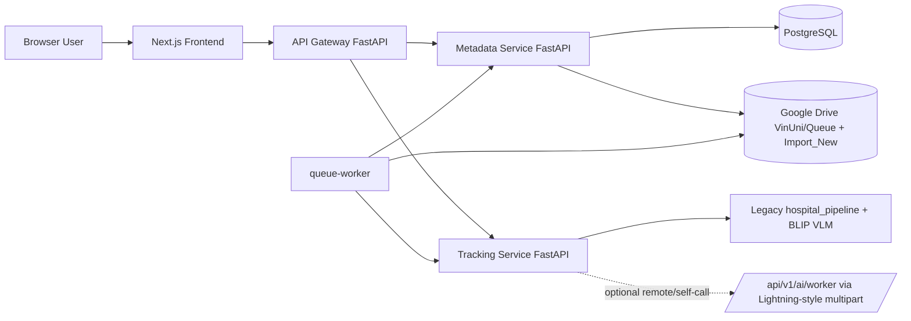
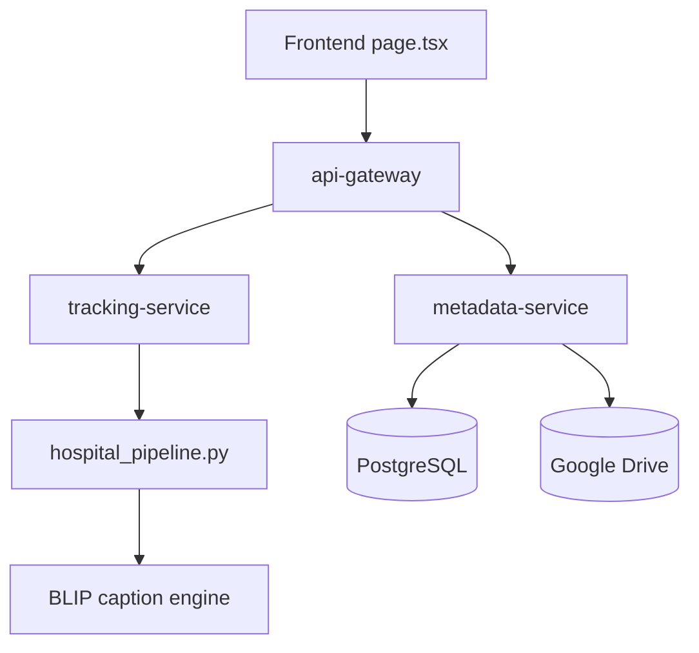
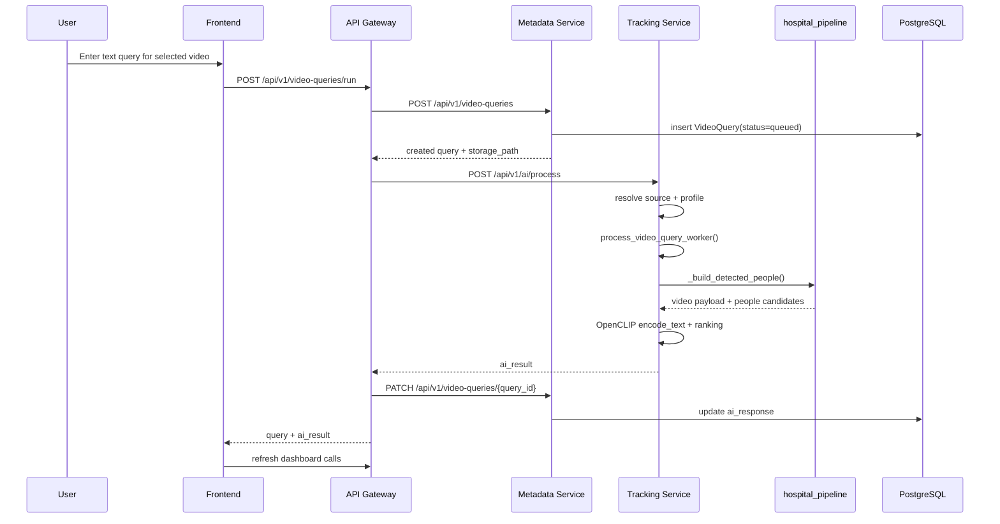
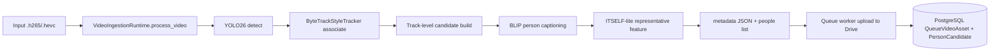
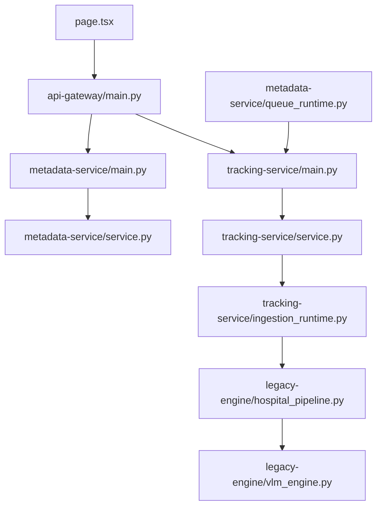
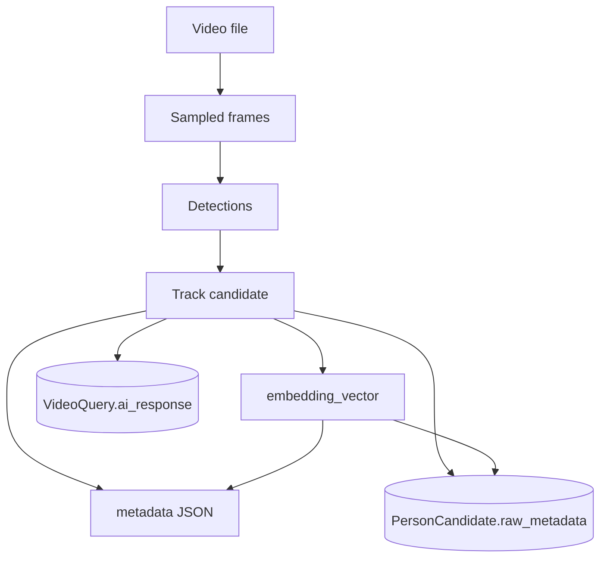

# MCPT Website + VLM Text Query Engineering Code Report

## 0. Metadata Report

- Project: `Multi-Camera-Person-Tracking-and-Re-Identification`
- Repo path analyzed: `Multi-Camera-Person-Tracking-and-Re-Identification/`
- Branch snapshot: `hiep`
- Commit snapshot: `24adf83086829216a9ebfdcd8b19703d4d09a5d0`
- Analysis date: `2026-04-18`
- Scope:
  - Frontend website
  - API gateway
  - Metadata service
  - Tracking service
  - Legacy VLM / ingest pipeline reused by tracking service
  - Queue / Google Drive / PostgreSQL integration
- Method:
  - Direct code inspection of current HEAD
  - Focused git history inspection for the last ~10 days
  - Historic file inspection for deleted vector search code
- Evidence labels used in this report:
  - `Verified from code`: directly opened at HEAD or a specific historical commit
  - `Inferred from call flow`: not asserted in one file, but strongly implied by the current call chain
  - `Not directly verified`: no direct runtime proof in code/logs
  - `Needs additional check`: likely important, but requires runtime validation or sample data
- Analysis limits:
  - No live service execution or dataset run was performed during this report
  - No runtime logs, latency traces, or production DB contents were available
  - Some "accuracy-first" profile claims are descriptive metadata, not guaranteed runtime behavior

## 1. Executive Technical Summary

### 1.1 System in one page

This codebase is a microservice website for video management plus VLM-assisted text query, but the live code path is not a classic global vector-search website yet. The current website flow is:

1. Frontend submits a text query for one selected video.
2. `api-gateway` creates a query row in PostgreSQL through `metadata-service`.
3. `api-gateway` calls `tracking-service /api/v1/ai/process`.
4. `tracking-service` either:
   - runs locally, or
   - self-calls / remotely calls `tracking-service /api/v1/ai/worker` through LightningAI-style multipart upload.
5. The worker re-ingests that single video, rebuilds person candidates from the video, embeds the query text, ranks candidates, and returns matched candidates + matched segments.

`Verified from code`: `frontend/app/page.tsx:108,125,176,204,241`, `backend/services/api-gateway/app/main.py:167`, `backend/services/tracking-service/app/main.py:39,44`, `backend/services/tracking-service/app/service.py:406,567`.

### 1.2 Current answer to the three central questions

#### Q1. Has the query embedding model changed?

Yes, effectively for the active website query path.

- Historical query vector search used `sentence-transformers` via `VectorSearchEngine` and `DEFAULT_TEXT_MODEL = "paraphrase-multilingual-MiniLM-L12-v2"` in the now-deleted `backend/legacy-engine/src_vlm/vector_search.py` at historical commits `18d0e8c`, `407cb98`, `d145cb7`.
- Current website query path computes text query embeddings with OpenCLIP `ViT-B-32` in `backend/services/tracking-service/app/service.py:604-608`.
- The historic `vector_search.py` file was removed in commit `d904f92`.

Verdict:

- `Verified from code`: the active website query path no longer uses the old ChromaDB + SentenceTransformer flow.
- `Verified from code`: the active query path now uses OpenCLIP text encoding.
- `Verified from git history`: the old vector-search module existed and was deleted recently.

#### Q2. What is the current query vector behavior?

For the website text query flow, query vectors are runtime-only.

- Text query is encoded on demand in `tracking-service/app/service.py:604-608`.
- The vector is normalized and converted to `float32`.
- It is not cached.
- It is not persisted as a dedicated vector record.
- It is not searched against a standalone vector DB in the active website flow.
- It is used to score the candidates produced from the same video ingestion request.

The system still persists candidate metadata, including `embedding_vector`, inside JSON metadata files and in PostgreSQL `PersonCandidate.raw_metadata`, but not in a dedicated vector index used by the active web query path.

#### Q3. Has the system moved from detect-based to track-based?

The ingest pipeline is now hybrid detect-then-track, and the retrieval/storage unit is primarily track-level.

- Detection: YOLO26 person detections in `hospital_pipeline.py:76,623`.
- Tracking: custom `ByteTrackStyleTracker` in `hospital_pipeline.py:100`.
- Retrieval/storage unit: one candidate per confirmed track, built in `_build_detected_people()` in `hospital_pipeline.py:571`, with `track_id`, `timeline`, `content_frames`, `start_frame`, `end_frame`, and `embedding_vector`.

However, the current tracker is still simplified:

- Association uses IoU + confidence stages.
- ReID embeddings are computed during detection, but are not fed into `ByteTrackStyleTracker.associate()`.
- This is track-based output, but not a full appearance-assisted multi-object tracker.

### 1.3 What the website actually exposes today

The website is a control-plane UI, not yet a rich visual retrieval UI.

- It supports auth, video registration/upload, selecting one video, running one text query, and seeing query history.
- It does not expose image query.
- It does not render bbox overlays, frame thumbnails, tracklets, or temporal previews from matched candidates.

`Verified from code`: `frontend/app/page.tsx` only renders auth, video cards, a textarea for text query, latest query summary, and history.

### 1.4 Most important bottlenecks and risks

1. The website query path is "ingest-on-query", not "pre-index and search".
   - Every query reprocesses the selected video through the ingest pipeline.
2. The query embedding model is instantiated per request in `process_video_query_worker()`.
   - No cache, no singleton, no warm pool.
3. The current tracking association ignores ReID features during matching.
   - ReID is computed, but not used to associate detections to tracks.
4. There is no active vector DB in the website path.
   - ChromaDB remains in dependencies and an old compose file, but not in the live website call path.
5. Several docs/configs are stale.
   - `TRACKING_USE_MOCK` still appears in docs and compose env, but current config no longer defines it.
6. Some operational endpoints are unauthenticated.
   - `/api/v1/candidates`, `/api/v1/queue/*`, and import endpoints in `metadata-service` have no auth dependency.

### 1.5 Most notable changes in the last ~10 days

`Verified from git log`:

- `24adf83`: replaced older HOG / ground-truth bootstrap style logic with YOLO26 + ByteTrack-style tracking in `hospital_pipeline.py`.
- `d904f92`: removed `backend/legacy-engine/src_vlm/vector_search.py` and other legacy components.
- `adf118b`: added Lightning self-call worker routing and production deployment changes.
- `00977ec`: removed old queue logic from `tracking-service`; queue is now centered in `metadata-service`.

## Table of Contents

1. [Executive Technical Summary](#1-executive-technical-summary)
2. [Problem and System Scope](#2-problem-and-system-scope)
3. [Repository Anatomy / Codebase Anatomy](#3-repository-anatomy--codebase-anatomy)
4. [Runtime Architecture](#4-runtime-architecture)
5. [End-to-End Workflow](#5-end-to-end-workflow)
6. [Data Contracts and Schema](#6-data-contracts-and-schema)
7. [Embedding System Deep Dive](#7-embedding-system-deep-dive)
8. [Detect / Track Pipeline Deep Dive](#8-detect--track-pipeline-deep-dive)
9. [Backend Deep Dive](#9-backend-deep-dive)
10. [Frontend Deep Dive](#10-frontend-deep-dive)
11. [Storage / Index / Persistence](#11-storage--index--persistence)
12. [Config / Environment / Deployment / Runtime Dependencies](#12-config--environment--deployment--runtime-dependencies)
13. [Observability / Debuggability](#13-observability--debuggability)
14. [Test Coverage / Validation](#14-test-coverage--validation)
15. [Changelog / Changes in the Last 9-10 Days](#15-changelog--changes-in-the-last-9-10-days)
16. [Required Technical Mapping Tables](#16-required-technical-mapping-tables)
17. [Risk / Bottleneck / Technical Debt](#17-risk--bottleneck--technical-debt)
18. [Practical Recommendations](#18-practical-recommendations)
19. [Final Handoff Summary](#19-final-handoff-summary)
20. [Open Questions / Not Yet Verified](#20-open-questions--not-yet-verified)

## 2. Problem and System Scope

### 2.1 Product problem

The intended product is a website where users can manage videos and run VLM-assisted text queries over video content, returning person-centric retrieval results.

### 2.2 Actual current scope

`Verified from code`:

- User uploads or registers a video reference through `metadata-service` via the frontend.
- User runs a text query against one selected video.
- Backend stores query history and AI response in PostgreSQL.
- Queue worker manages a Google Drive-backed queue of `.h265/.hevc` videos and metadata under `VinUni/Queue` and `VinUni/Import_New`.

### 2.3 User actions

- Register / login: `frontend/app/page.tsx:176`, `api-gateway/app/main.py:64,74`, `metadata-service/app/main.py:49,59`
- Add video: `frontend/app/page.tsx:204`, `api-gateway/app/main.py:96`, `metadata-service/app/main.py:93`
- Run text query: `frontend/app/page.tsx:241`, `api-gateway/app/main.py:167`, `tracking-service/app/main.py:39`
- Inspect history: `frontend/app/page.tsx:502`

### 2.4 Inputs and outputs

- Input:
  - text query string
  - selected video id / `storage_path`
  - `.h265/.hevc` queue videos for ingestion
- Output:
  - query summary for UI
  - matched candidates and segments inside AI response payload
  - metadata JSON for queue items
  - Google Drive links persisted in PostgreSQL for queue outputs

### 2.5 Role of VLM, retrieval, and detect/track

- VLM role:
  - BLIP-based caption generation during ingest in `legacy-engine/src_vlm/vlm_engine.py:17,68`
- Retrieval role:
  - current active website flow ranks track candidates within a just-ingested video
- Detect role:
  - YOLO26 person detection
- Track role:
  - custom ByteTrack-style grouping of detections into tracks

## 3. Repository Anatomy / Codebase Anatomy

| Area | Role | Key files | Important entrypoints | Coupling / risk |
| --- | --- | --- | --- | --- |
| `frontend/` | End-user website | `frontend/app/page.tsx` | Next.js page component | Tight contract coupling to gateway response shape |
| `backend/services/api-gateway/` | HTTP facade for frontend | `app/main.py`, `app/config.py` | FastAPI app | Thin proxy, but hardwires current orchestration order |
| `backend/services/metadata-service/` | Auth, video registry, query history, queue DB state | `app/main.py`, `app/service.py`, `app/models.py`, `app/queue_runtime.py` | FastAPI app + queue worker | Holds both user CRUD and queue orchestration |
| `backend/services/tracking-service/` | Query orchestration, worker endpoint, ingestion wrapper, Lightning client | `app/main.py`, `app/service.py`, `app/ingestion_runtime.py`, `app/gpu_client.py` | FastAPI app | Mixes active runtime logic with profile metadata and partially stale settings/docs |
| `backend/legacy-engine/` | Actual ingest-time detection, track building, captioning | `src_vlm/hospital_pipeline.py`, `src_vlm/vlm_engine.py` | imported by tracking-service | Legacy module is now production-critical |
| `infra/` | Postgres init, nginx, VPS scripts | `infra/postgres/init/*`, `infra/nginx/search-engine.conf.template`, `infra/vps/*` | shell scripts | Production deploy scripts assume current topology |
| `docker-compose.yml` | Default stack | top-level compose | `docker compose up` | Tracking service is optional; remote tracking URL is common in production |
| `docker-compose.edge.yml` | Edge GPU stack | alternate compose | `docker-compose.edge.yml` | Still advertises `CHROMA_DB_PATH`, but active website path no longer uses Chroma |

### 3.1 High-value files for new engineers

- Frontend:
  - `frontend/app/page.tsx`
- Gateway:
  - `backend/services/api-gateway/app/main.py`
- Metadata and DB:
  - `backend/services/metadata-service/app/main.py`
  - `backend/services/metadata-service/app/service.py`
  - `backend/services/metadata-service/app/models.py`
- Queue / Drive:
  - `backend/services/metadata-service/app/queue_runtime.py`
  - `backend/services/metadata-service/app/queue_worker.py`
- Query and ingest runtime:
  - `backend/services/tracking-service/app/service.py`
  - `backend/services/tracking-service/app/ingestion_runtime.py`
  - `backend/services/tracking-service/app/gpu_client.py`
- Actual detect-track-caption logic:
  - `backend/legacy-engine/src_vlm/hospital_pipeline.py`
  - `backend/legacy-engine/src_vlm/vlm_engine.py`

## 4. Runtime Architecture

### 4.1 Current runtime architecture

### 4.2 Practical architecture notes

- Frontend calls only `api-gateway`.
- `api-gateway` is orchestration glue, not a business-logic service.
- `metadata-service` is the persistence layer for users, videos, queries, queue assets, and candidates.
- `tracking-service` is the query/ingest execution layer.
- `legacy-engine` is not just legacy reference code; it contains the actual ingest pipeline used in production code paths.

### 4.3 Frontend / backend / model / storage interaction

## 5. End-to-End Workflow

### 5.1 Workflow: text query

#### 5.1.1 Step-by-step flow

1. User types text in the query textarea in `frontend/app/page.tsx:457`.
2. `handleRunQuery()` sends `POST /api/v1/video-queries/run` through `apiFetch()` in `frontend/app/page.tsx:241`.
3. `api-gateway` handler `run_video_query()` receives the request in `backend/services/api-gateway/app/main.py:167`.
4. Gateway first creates a persisted query row by calling `metadata-service /api/v1/video-queries`.
5. Metadata service `create_query()` validates that the selected video belongs to the current user in `backend/services/metadata-service/app/main.py:146`.
6. Gateway builds `ai_payload` containing `query_id`, `video_id`, `storage_path`, and `query_text` in `api-gateway/app/main.py:170-178`.
7. Gateway calls `tracking-service /api/v1/ai/process` in `api-gateway/app/main.py:179`.
8. `tracking-service` `ai_process()` delegates to `process_video_query()` in `tracking-service/app/main.py:39`.
9. `process_video_query()`:
   - resolves pipeline profile and execution plan
   - resolves local path or downloads URL
   - enforces `.h265/.hevc` if using remote worker path
   - either runs local worker or calls Lightning/self-call worker
10. `process_video_query_worker()` re-ingests the same video through `process_video_ingestion()` in `tracking-service/app/service.py:567`.
11. `process_video_ingestion()` calls `VideoIngestionRuntime.process_video()` in `tracking-service/app/service.py:664` and `tracking-service/app/ingestion_runtime.py:172`.
12. `VideoIngestionRuntime.process_video()` calls `hospital_pipeline._build_detected_people()` in `tracking-service/app/ingestion_runtime.py:219`.
13. `hospital_pipeline._build_detected_people()` runs:
   - YOLO26 detect
   - ByteTrack-style association
   - BLIP captioning
   - ITSELF-lite candidate feature extraction
   - metadata JSON write
14. Back in `process_video_query_worker()`, the worker computes query text embedding using OpenCLIP ViT-B/32 in `tracking-service/app/service.py:604-608`.
15. Worker ranks the just-ingested `people` list and returns `matched_candidates` and `matched_segments`.
16. Gateway patches the original query row with `status`, `ai_job_id`, and `ai_response` in `api-gateway/app/main.py:180-189`.
17. Frontend refreshes dashboard and renders only summary text and history entries.

#### 5.1.2 Sequence diagram

#### 5.1.3 Workflow step -> code mapping

| Step | Module | Function | Input | Output |
| --- | --- | --- | --- | --- |
| Frontend request | `frontend/app/page.tsx` | `handleRunQuery()` | `selectedVideoId`, `queryText` | JSON POST |
| Gateway orchestration | `api-gateway/app/main.py` | `run_video_query()` | user payload | persisted query + AI call |
| Query persistence | `metadata-service/app/main.py` | `create_query()` | `VideoQueryCreateRequest` | `VideoQueryResponse` |
| Query execution entry | `tracking-service/app/main.py` | `ai_process()` | `AiProcessRequest` | `AiProcessResponse` |
| Worker execution | `tracking-service/app/service.py` | `process_video_query_worker()` | source path + query text | ranked matches |
| Ingestion | `tracking-service/app/service.py` | `process_video_ingestion()` | source video | metadata + people |
| Detect/track build | `legacy-engine/src_vlm/hospital_pipeline.py` | `_build_detected_people()` | compressed video | track candidates |
| Query embedding | `tracking-service/app/service.py` | OpenCLIP block at `604-608` | query text | normalized vector |
| Result persistence | `api-gateway/app/main.py` | `_patch_json(...)` in `run_video_query()` | AI result | updated query row |

### 5.2 Workflow: image query

Status: `Verified from code` as not implemented in the active website stack.

Evidence:

- No image-upload query UI in `frontend/app/page.tsx`
- No image-query request schema in `tracking-service/app/schemas.py`
- No image-query route in `api-gateway/app/main.py`, `metadata-service/app/main.py`, or `tracking-service/app/main.py`

Conclusion:

- Image query is currently unsupported in the website path.
- Any image-to-image or image-to-text retrieval described in profile metadata is not wired into the active web product.

### 5.3 Workflow: ingest video -> detect -> track -> metadata -> queue

#### 5.3.1 Active ingestion / queue flow

1. Queue worker polls `VinUni/Import_New` in Google Drive through `QueueSyncService.list_import_files()` in `metadata-service/app/queue_runtime.py:229`.
2. Supported inputs are only `.h265` / `.hevc` in `queue_runtime.py:24,233`.
3. Worker downloads each file locally in `_download_drive_file()` and `process_import_queue()` in `queue_runtime.py:178,364`.
4. Worker calls `tracking-service /api/v1/ingestion/process` via `_request_tracking_processing()` in `queue_runtime.py:192`.
5. `VideoIngestionRuntime.process_video()`:
   - resolves source
   - copies source as managed compressed video if already `.h265/.hevc`
   - calls `hospital_pipeline._build_detected_people()`
   - writes metadata JSON
6. Queue worker uploads output video and metadata to:
   - `VinUni/Queue/.h265`
   - `VinUni/Queue/Metadata`
7. Queue worker updates:
   - `QueueVideoAsset`
   - `PersonCandidate`
8. FIFO eviction deletes oldest queue items from:
   - Google Drive
   - local cache
   - PostgreSQL rows

#### 5.3.2 Ingest pipeline diagram

### 5.4 Workflow: UI click-through

Current UI click-through is shallow.

- Video card click changes `selectedVideoId` only in `frontend/app/page.tsx`.
- Query results do not route to a detail page.
- There is no frame preview page, no object detail view, no track timeline preview, and no playback state.

`Verified from code`: single-page UI in `frontend/app/page.tsx` with local `useState` only.

## 6. Data Contracts and Schema

### 6.1 Search request / response contracts

#### 6.1.1 Frontend -> Gateway run query request

| Field | Type | Required | Meaning | Producer | Consumer |
| --- | --- | --- | --- | --- | --- |
| `video_id` | `string` | yes | selected user video id | frontend | api-gateway / metadata-service |
| `query_text` | `string` | yes | natural-language query | frontend | tracking-service |

Source: `frontend/app/page.tsx:250`, `metadata-service/app/schemas.py:47`

#### 6.1.2 Tracking service AI request

Schema: `tracking-service/app/schemas.py:25`

| Field | Type | Required | Meaning |
| --- | --- | --- | --- |
| `query_id` | `string \| null` | no | persisted query row id |
| `video_id` | `string` | yes | public video id |
| `video_title` | `string \| null` | no | display title |
| `storage_path` | `string` | yes | local path or URL |
| `query_text` | `string` | yes | text query |
| `metadata` | `dict` | yes, default `{}` | orchestration metadata |

#### 6.1.3 Tracking service AI response

Schema: `tracking-service/app/schemas.py:34`

| Field | Type | Required | Meaning |
| --- | --- | --- | --- |
| `status` | `string` | yes | completed / failed |
| `provider` | `string` | yes | `local` or `lightningai` |
| `mode` | `string` | yes | local / remote / worker / remote_error |
| `pipeline_profile` | `string \| null` | no | selected profile |
| `gpu_hardware_profile` | `dict \| null` | no | hardware profile metadata |
| `acceleration_state` | `dict \| null` | no | torch runtime flags |
| `query_id` | `string \| null` | no | persisted query id |
| `video_id` | `string` | yes | selected video id |
| `job_id` | `string` | yes | processing job id |
| `summary` | `string` | yes | UI summary |
| `file_exists` | `bool` | yes | whether input/output file was resolved |
| `processed_at` | `datetime` | yes | completion time |
| `raw_response` | `dict` | yes | full worker/remote payload |

### 6.2 Ingestion request / response contracts

#### 6.2.1 Ingestion request

Schema: `tracking-service/app/schemas.py:50`

Important fields:

- `source_path`
- `source_drive_file_id`
- `source_filename`
- `camera_id`
- `recorded_start`
- `output_video_dir`
- `output_metadata_dir`
- `output_basename`
- `destination_video_folder_id`
- `destination_metadata_folder_id`
- `upload_outputs_to_drive`
- `metadata`

#### 6.2.2 Ingestion response

Schema: `tracking-service/app/schemas.py:65`

Important fields:

- `compressed_path`
- `metadata_path`
- `drive_video_link`
- `drive_metadata_link`
- `video`
- `people`
- `person_count`

### 6.3 Track candidate schema

This is not declared as a standalone Pydantic model; it is built in `hospital_pipeline._build_detected_people()` and later stored in metadata JSON and `PersonCandidate.raw_metadata`.

Core fields:

| Field | Type | Source | Consumer |
| --- | --- | --- | --- |
| `candidate_id` | `string` | `_build_detected_people()` | metadata JSON, PostgreSQL |
| `video_id` | `string` | `_build_detected_people()` | DB, worker response |
| `camera_id` | `string` | `_build_detected_people()` | DB, UI summary |
| `track_id` | `string` | tracker output | DB, ranking summary |
| `frame_idx` | `int` | representative frame | ranking sort, manifest |
| `start_frame` / `end_frame` | `int` | track aggregation | metadata |
| `start_second` / `end_second` | `float` | derived from FPS | metadata |
| `bbox` | `list[int]` | representative bbox | track manifest |
| `representative_bbox` | `list[int]` | same | downstream crop / visualization |
| `content_frames` | `list[dict]` | sampled along track | future UI / debug |
| `timeline` | `list[dict]` | `_segment_track_timeline()` | matched segments |
| `person_caption` | `string` | BLIP captioning | search text |
| `appearance_summary` | `string` | caption copy | search text |
| `semantic_attributes` | `list[str]` | text post-process | ranking |
| `visibility_scores` | `dict` | hardcoded defaults | ranking |
| `world_position` | `dict \| null` | currently `None` | ranking placeholder |
| `embedding_vector` | `list[float]` | track average, later overwritten by ITSELF-lite | ranking, storage |
| `candidate_vector` | `list[float]` | currently empty placeholder | legacy vector-search contract |

Source: `legacy-engine/src_vlm/hospital_pipeline.py:690-716,739`

### 6.4 Queue video schema

Schema: `metadata-service/app/models.py:105` and `metadata-service/app/schemas.py:113`

Key queue fields:

- `available_link_video`
- `available_link_metadata`
- `drive_video_file_id`
- `drive_metadata_file_id`
- `queue_position`
- `raw_video_metadata`

### 6.5 Search response vs frontend render mismatch

Mismatch:

- Backend worker returns rich `matched_candidates` and `matched_segments`.
- Frontend only renders `ai_response.summary`.

Evidence:

- Worker response: `tracking-service/app/service.py:627-645`
- Frontend render: `frontend/app/page.tsx:483-516`

Conclusion:

- Backend already exposes richer result structure than the website consumes.

## 7. Embedding System Deep Dive

### 7.1 Core answer: has the query embedding model been replaced?

#### 7.1.1 Current active model

Current active website query embedding model:

- OpenCLIP `ViT-B-32`
- loaded in `backend/services/tracking-service/app/service.py:604`
- tokenizer loaded at `service.py:605`
- text encoding executed at `service.py:608`

The query vector is normalized before conversion to numpy:

- `query_emb = query_emb / query_emb.norm(dim=-1, keepdim=True)`
- then `query_embedding = query_emb.cpu().numpy()[0].astype(np.float32)`

`Verified from code`.

#### 7.1.2 Historical model

Historical text vector search model:

- `DEFAULT_TEXT_MODEL = "paraphrase-multilingual-MiniLM-L12-v2"`
- loaded via `SentenceTransformer` inside `_load_sentence_model()`
- used by deleted `VectorSearchEngine` in historical `backend/legacy-engine/src_vlm/vector_search.py`

`Verified from historical code` at commits `18d0e8c`, `407cb98`, `d145cb7`.

#### 7.1.3 Was the replacement completed end-to-end?

No, the migration is only partially complete.

- The old vector-search module was removed.
- The current website query path uses OpenCLIP.
- But the active system does not replace the old vector DB architecture with a new persistent vector index.
- Instead, it moved to runtime ingest-and-rank for the selected video.

So the replacement is:

- `Verified from code`: model usage changed in the live path
- `Verified from code`: architecture also changed from persisted vector search to per-query ingest
- `Needs additional check`: whether any external service still depends on the old vector DB contract out of band

#### 7.1.4 Why it changed

`Inferred from code + git history`:

- Commit history shows a move toward an "accuracy-first" pipeline with YOLO26, ByteTrack, CLIP-ReID, and ITSELF-style ranking metadata.
- The old ChromaDB module was deleted while new OpenCLIP-based ranking was added to `tracking-service`.

#### 7.1.5 Impact of the change

| Dimension | Old path | Current path | Assessment |
| --- | --- | --- | --- |
| Query embedding model | SentenceTransformer MiniLM | OpenCLIP text encoder | changed |
| Retrieval architecture | persisted ChromaDB query | ingest-on-query ranking | changed more than just model |
| Global search scope | metadata collection | one selected video per query | narrower operational scope |
| Likely latency | lower after indexing | higher per request | worse for repeated queries |
| Likely memory | moderate persistent index | repeated model load + ingest pipeline | higher per request |
| Likely retrieval quality | text-text semantic similarity | text-to-image / text-to-candidate alignment | potentially stronger on visual semantics |

Benchmarks/logs:

- `Not directly verified`: no before/after benchmark logs found.
- `Verified from code`: `backend/validate_l4_setup.py` contains aspirational performance targets, not measured production benchmarks.

Fallback / compatibility logic:

- `Verified from code`: no compatibility layer keeps both old and new query systems active in the website path.
- `Verified from code`: `candidate_vector` remains as a placeholder field, but current active ranking uses `embedding_vector`.

### 7.2 Query embedding subsystem

#### 7.2.1 Text query embedding

| Question | Current answer |
| --- | --- |
| Query text received from | frontend textarea -> gateway -> tracking-service |
| Preprocess | OpenCLIP tokenizer |
| Tokenize where | `tracking-service/app/service.py:605` |
| Model call | `model.encode_text(text_tokens)` at `service.py:608` |
| Output dimension | `Inferred`: intended 512-d because OpenCLIP ViT-B/32 text/image space is shared; no explicit assert in code |
| Output dtype | `float32` after `.astype(np.float32)` |
| Normalize | yes, L2 normalization in `service.py:608` |
| Cache query embeddings | no |
| Persist query embeddings | no |
| Search metric | cosine-style dot product after normalization via `_embedding_similarity()` at `service.py:45-51` |
| Search module | worker ranking in `service.py:567+` |
| Top-k | top 5 candidates, top 10 segments |
| Threshold/filter | no explicit score threshold; semantic overlap affects ranking |
| Reranking | yes, one-stage weighted ensemble in `_rank_candidate_itself()` |

Operational notes:

- Model load happens inside `process_video_query_worker()`, not a singleton.
- This is a major latency and throughput issue for multi-user traffic.

#### 7.2.2 Image query embedding

Current status: not implemented for end users.

However, stored candidate visual embeddings come from image crops:

- Track average embedding via `CLIPReIDExtractor.extract()` in `hospital_pipeline.py:228-246`
- Later overwritten by ITSELF-lite representative crop feature at `hospital_pipeline.py:739`

Common embedding space:

- `Inferred from code`: yes, intended to be a shared OpenCLIP-aligned space, because:
  - query text uses OpenCLIP `ViT-B-32`
  - candidate image features use OpenCLIP `ViT-B-32`
- `Needs additional check`: `ITSELFSearchEngineLite.extract_features()` does not explicitly assert final feature dimensionality in the attention-path branch.

#### 7.2.3 Query vector operational behavior

| Behavior | Current state |
| --- | --- |
| Runtime only | yes |
| Request dedup | no |
| Hot cache | no |
| Async search | no, synchronous request path |
| Batch search | no |
| Hybrid retrieval | only lightweight lexical overlap in ranking, no vector+metadata DB hybrid |
| Metadata filtering | no structured filter stage in active worker path |
| Multi-stage retrieval | no dedicated candidate-generation stage beyond ingesting one video |

### 7.3 Stored embedding subsystem

#### 7.3.1 Where stored embeddings live now

Current persisted candidate embeddings are stored in:

1. Metadata JSON files written by `_write_video_metadata()` in `hospital_pipeline.py:854`
2. PostgreSQL `PersonCandidate.raw_metadata` in `metadata-service/app/models.py:82` via `upsert_person_candidates()` in `metadata-service/app/service.py:483`

There is no dedicated embedding column or vector-native index in current PostgreSQL models.

#### 7.3.2 Offline vs online

- Candidate embeddings: generated during ingest
- Query embeddings: generated online per query

#### 7.3.3 Reindex / re-embed strategy

- `Verified from code`: no active reindex pipeline exists in the current website path.
- Historical `VectorSearchEngine.rebuild_from_metadata_dir()` existed only in deleted `vector_search.py`.

### 7.4 Search / retrieval subsystem

#### 7.4.1 Current active search path

Active website path:

- not Chroma
- not Qdrant
- not SQL vector search
- not metadata-service `search_candidates()`

It is local in-memory ranking over the just-produced `people` list inside `process_video_query_worker()`.

#### 7.4.2 Ranking function

`_rank_candidate_itself()` at `tracking-service/app/service.py:92` combines:

- embedding similarity
- semantic overlap
- visibility bonus
- world-position bonus

Weights:

- embedding `0.58`
- semantic `0.22`
- visibility `0.12`
- world `0.08`

Important caveat:

- `world_position` is currently `None` for candidates built in `_build_detected_people()`
- therefore world bonus is effectively inactive in the main ingest path

#### 7.4.3 Stored DB candidate search endpoint

`metadata-service/app/service.py:259` `search_candidates()` is not vector search.

It does:

- `ILIKE` on `search_text`
- `camera_id`
- `video_id`
- `human_key`
- `track_id`

This endpoint is a text filter over PostgreSQL rows, not semantic embedding retrieval.

### 7.5 Benchmark / performance / tradeoff

Observed from code:

- No latency instrumentation exists in the active services.
- No benchmark report exists in repo for before/after embedding model changes.
- `validate_l4_setup.py` contains target numbers, but not measured runtime telemetry.

Likely bottlenecks:

1. Per-query video ingest
2. Per-query OpenCLIP text model load
3. Per-ingest BLIP captioning
4. No retrieval cache
5. Single selected video scope per query

## 8. Detect / Track Pipeline Deep Dive

### 8.1 Detect pipeline

#### 8.1.1 Detector used

- `YOLO("yolo26x.pt")` in `hospital_pipeline.py:70`
- detection function `_detect_people_yolo26()` at `hospital_pipeline.py:76`
- person class only: `classes=[0]`
- confidence threshold `0.32`

#### 8.1.2 Postprocess

- bbox area filtering against `DEFAULT_MIN_PERSON_AREA`
- no explicit NMS code in this file

### 8.2 Track pipeline

#### 8.2.1 Tracker used

- `ByteTrackStyleTracker` in `hospital_pipeline.py:100`

#### 8.2.2 Association logic

- high-confidence match first
- then low-confidence match
- both stages based on IoU against `last_bbox`
- thresholds:
  - `high_conf_thresh=0.35`
  - `low_conf_thresh=0.15`
  - `iou_gate_high=0.30`
  - `iou_gate_low=0.25`
  - `min_frames_to_confirm=4`

#### 8.2.3 ReID in tracking

Critical finding:

- ReID embeddings are computed during detection loop.
- They are not passed into `ByteTrackStyleTracker.associate()`.
- Tracker association is geometry/confidence based only.

Therefore:

- `Verified from code`: the pipeline is track-based in output unit
- `Verified from code`: the tracker is not using appearance embeddings to associate detections

### 8.3 Candidate / track representation

Each output candidate is effectively a tracklet summary:

- multiple frames
- multiple bboxes
- representative frame
- content frame samples
- timeline segments
- one stored embedding vector

Embedding generation path:

1. Per-bbox CLIP-ReID embedding extracted
2. Average pooled over sampled crops in the track
3. Then `embedding_vector` is overwritten by ITSELF-lite representative feature if extraction succeeds

This means the final persisted embedding is not the temporal average in the common success path; it is the representative-crop ITSELF-lite feature.

### 8.4 Detect vs track verdict

#### 8.4.1 Current state

| Layer | Current state |
| --- | --- |
| Detection | active |
| Tracking | active |
| Output storage unit | track-level candidate |
| Query result unit | matched track candidates + matched segments |
| Frontend render unit | query/job summary only |
| Storage/index organization | PostgreSQL rows and metadata JSON keyed by candidate/track |

#### 8.4.2 Are we fully track-based?

Not fully, in the architectural sense.

- The ingest output is track-centric.
- But the web experience does not expose tracklet-native UI.
- The tracker is simplified and does not use appearance features for association.
- The retrieval path is still "reingest one video and rank candidates", not "query a persistent tracklet index".

Verdict:

- Current system is best described as `hybrid detect-then-track ingest with track-level candidate storage, but not yet a fully productized tracklet retrieval system`.

### 8.5 Detect vs track comparison table

| Dimension | Detect-level | Current track-level implementation |
| --- | --- | --- |
| Data unit | one bbox instance | one confirmed track candidate |
| Temporal stability | low | medium |
| Vector count | high | lower |
| Storage cost | higher | lower |
| Ingest cost | lower per frame | higher due aggregation |
| Search speed | slower if all detections indexed | potentially better |
| Dedup ability | weak | stronger |
| Object-over-time representation | poor | good |
| UI suitability | poor for summary UX | better, but UI not implemented |
| Implementation complexity | simpler | higher |
| Current weakness | redundancy | tracker is still IoU-only |

### 8.6 Detect-based vs track-based retrieval diagram

## 9. Backend Deep Dive

### 9.1 API layer

| Service | Endpoint | Method | Handler | Auth | Notes |
| --- | --- | --- | --- | --- | --- |
| api-gateway | `/api/v1/overview` | GET | `overview()` | no | combines metadata + tracking config |
| api-gateway | `/api/v1/videos` | POST | `create_video()` | forwarded | multipart proxy |
| api-gateway | `/api/v1/video-queries/run` | POST | `run_video_query()` | forwarded | main website workflow |
| api-gateway | `/api/v1/queue/bootstrap` | POST | `queue_bootstrap()` | no | admin-like, currently open |
| metadata-service | `/api/v1/auth/*` | POST/GET | auth handlers | mixed | standard JWT issuance |
| metadata-service | `/api/v1/videos` | POST/GET | video CRUD | yes | user video library |
| metadata-service | `/api/v1/video-queries` | POST/GET/PATCH | query CRUD | yes | query history |
| metadata-service | `/api/v1/candidates` | GET | `list_candidates()` | no | SQL ILIKE search |
| metadata-service | `/api/v1/queue/videos` | GET | `queue_videos()` | no | queue DB state |
| tracking-service | `/api/v1/ai/process` | POST | `ai_process()` | no explicit auth | query execution |
| tracking-service | `/api/v1/ai/worker` | POST | `ai_worker()` | no explicit auth | worker/self-call endpoint |
| tracking-service | `/api/v1/ingestion/process` | POST | `ingestion_process()` | no explicit auth | ingest runtime |
| tracking-service | `/api/v1/tracking/run` | POST | `tracking_run()` | no explicit auth | clip generation, not full tracker |

### 9.2 Service layer

| Concern | Main module | Key functions |
| --- | --- | --- |
| Gateway orchestration | `api-gateway/app/main.py` | `run_video_query()` |
| Query persistence | `metadata-service/app/service.py` | `create_video_query()`, `update_video_query()` |
| Queue orchestration | `metadata-service/app/queue_runtime.py` | `_request_tracking_processing()`, `_append_processed_result()`, `process_import_queue()` |
| Ingestion runtime | `tracking-service/app/ingestion_runtime.py` | `process_video()` |
| Query worker | `tracking-service/app/service.py` | `process_video_query_worker()` |
| Detect / track build | `legacy-engine/src_vlm/hospital_pipeline.py` | `_build_detected_people()` |
| Captioning | `legacy-engine/src_vlm/vlm_engine.py` | `generate_captions_batch()` |

### 9.3 Dependency graph

### 9.4 Error handling

- Gateway wraps downstream `httpx` exceptions into `502` or passthrough HTTP status.
- Metadata queue endpoints rollback the DB session on exception.
- Tracking service remote mode returns `remote_error` with summary on failure.
- Query worker has minimal structured error taxonomy.
- No retry policy exists for most downstream HTTP calls except queue polling retry by loop.

### 9.5 Backend risks

1. `tracking-service/app/service.py` contains duplicate helper definitions and dead code after an early `return` around `_summarize_matches()` (`service.py:190` and `237`).
2. `metadata-service/app/service.py` Google Drive import branch uses `MediaIoBaseDownload` without importing it in that file.
3. Public/admin-ish endpoints are not protected.
4. `run_tracking()` does not perform tracking inference despite the endpoint name.

## 10. Frontend Deep Dive

### 10.1 UI structure

Single page app in `frontend/app/page.tsx` with these panels:

- Hero / overview metrics
- Auth panel
- Video upload / reference panel
- Query panel
- History panel

### 10.2 State flow

Local state only, via `useState`:

- auth mode
- JWT token
- current user
- overview metrics
- video list
- query list
- selected video id
- current text query
- upload form state
- loading / message / error

No global store, no router-level state, no derived memoized query-result model.

### 10.3 API integration

Main client functions:

- `apiFetch()` at `page.tsx:108`
- `refreshDashboard()` at `page.tsx:125`
- `handleAuthSubmit()` at `page.tsx:176`
- `handleUpload()` at `page.tsx:204`
- `handleRunQuery()` at `page.tsx:241`

### 10.4 Rendering logic

Current render output includes:

- overview cards
- selected video list
- query textarea
- latest query summary
- query history cards

Not rendered:

- matched candidates
- matched segments timeline
- bbox overlays
- object crops
- frame previews
- tracklet timeline widgets

### 10.5 Frontend risks

1. Strong dependence on summary string instead of a typed result model.
2. No rendering for rich candidate payload already available from backend.
3. JWT stored in `localStorage`.
4. No cancellation or debounce for query requests.
5. Single-page file is already becoming a control-center monolith.

## 11. Storage / Index / Persistence

### 11.1 Where data lives

| Data | Current storage |
| --- | --- |
| User / query / video metadata | PostgreSQL |
| Uploaded user videos | local volume path in `VIDEO_STORAGE_ROOT` |
| Queue source / outputs | Google Drive + local queue cache |
| Candidate metadata | JSON files + PostgreSQL JSONB |
| Candidate embeddings | inside metadata JSON / `PersonCandidate.raw_metadata.embedding_vector` |
| Query results | `VideoQuery.ai_response` JSONB |
| Vector DB | not active in current website path |

### 11.2 Persistence model diagram

### 11.3 Versioning

Current explicit versioning:

- metadata schema version: `hospital_person_metadata_v3`

Missing or weak versioning:

- no explicit query embedding model version stored with query result
- no explicit embedding dimension field
- `candidate_vector` exists as a compatibility placeholder but is empty in active ingest path

### 11.4 Delete / update strategy

- Queue FIFO deletes Drive files + local cache + DB rows in `_append_processed_result()`
- `delete_queue_video_asset()` also removes related `PersonCandidate` rows
- No formal re-embed migration framework exists

## 12. Config / Environment / Deployment / Runtime Dependencies

### 12.1 Important config controlling embedding / retrieval

From `tracking-service/app/config.py`:

- `PIPELINE_PROFILE`
- `GPU_HARDWARE_PROFILE`
- `LIGHTNING_API_BASE_URL`
- `LIGHTNING_API_ENDPOINT`
- `LIGHTNING_API_TOKEN`
- `GOOGLE_DRIVE_ENABLED`
- `GOOGLE_DRIVE_CREDENTIALS_FILE`

From `metadata-service/app/config.py`:

- `TRACKING_SERVICE_URL`
- `QUEUE_LOCAL_ROOT`
- `QUEUE_MAX_SIZE`
- `GOOGLE_DRIVE_VINUNI_FOLDER_ID`
- folder naming env vars for `VinUni/Queue/.h265/Metadata/Import_New`

### 12.2 Services required for the system to function

Minimum practical production stack:

- `frontend`
- `api-gateway`
- `metadata-service`
- `postgres`
- `queue-worker`
- one reachable `tracking-service` endpoint, local or remote

### 12.3 Deployment topology

Recommended production topology in repo:

- VPS runs frontend + gateway + metadata + queue-worker + postgres
- tracking-service can be remote on Lightning GPU
- nginx proxies:
  - `/` to frontend
  - `/api/` to gateway

### 12.4 Config drift and stale docs

Important drift:

- `docker-compose.yml` still passes `TRACKING_USE_MOCK`
- `.env.example` still documents `TRACKING_USE_MOCK`
- `README.md` still references mock mode and `.mp4` conversion language
- current `tracking-service/app/config.py` no longer defines `tracking_use_mock`

This is `Verified from code` and should be treated as documentation debt.

## 13. Observability / Debuggability

### 13.1 What exists

- `/health` endpoints on all main services
- ad hoc logging in queue runtime and GPU client
- query history persisted in DB
- metadata JSON artifacts persisted for offline inspection

### 13.2 What is missing

- no metrics endpoint
- no tracing
- no request IDs propagated end-to-end
- no explicit latency spans for:
  - source resolution
  - detection
  - tracking
  - captioning
  - query embedding
  - ranking

### 13.3 Hard-to-debug areas

1. `tracking-service/app/service.py` mixes orchestration, ranking, embedding, and I/O.
2. `legacy-engine/hospital_pipeline.py` contains production-critical logic under a "legacy" location.
3. Lightning self-call vs remote-call mode is not clearly separated by contract.
4. Missing vector DB means debugging retrieval quality requires replaying full ingest/query flows.

## 14. Test Coverage / Validation

### 14.1 Tests present

`Verified from code search`: no meaningful service-level test suite was found under a standard `tests/` layout for the active website stack.

### 14.2 Validation scripts present

- `backend/validate_l4_setup.py` validates environment readiness for model imports and config presence.

### 14.3 Gaps

- no unit tests for gateway orchestration
- no integration tests for text query workflow
- no tests for queue FIFO semantics
- no tests for candidate ranking correctness
- no tests for frontend rendering of AI payloads

## 15. Changelog / Changes in the Last 9-10 Days

### 15.1 Query embedding related

- `d904f92` deleted the historical `vector_search.py` module.
- `adf118b` and current `tracking-service/app/service.py` rely on OpenCLIP text embedding inside the worker path.

Confidence: `Verified from code + git history`

### 15.2 Speed / runtime related

- `407cb98` introduced hardware profiles, execution plans, and pipeline profiles.
- `adf118b` added remote/self-call worker handling.

Confidence: `Verified from git history`

### 15.3 Detect / track related

- `24adf83` is the most behaviorally important change:
  - older HOG-based / ground-truth-heavy path replaced with YOLO26 + ByteTrack-style tracking
  - metadata schema bumped to `hospital_person_metadata_v3`

Confidence: `Verified from git diff`

### 15.4 Frontend / backend contract related

- `4c84ba1` reworked `frontend/app/page.tsx` for auth + query control-center UX.
- Frontend now depends on `overview`, `videos`, and `video-queries` endpoints from the gateway.

### 15.5 Refactor-only vs behavior-changing

| Change | Type |
| --- | --- |
| remove `vector_search.py` | behavior-changing |
| YOLO26 + ByteTrack integration | behavior-changing |
| self-call `/api/v1/ai/worker` support | behavior-changing |
| deployment/nginx/VPS scripts | deployment-only |
| queue logic moved out of tracking-service | architecture-changing |

## 16. Required Technical Mapping Tables

### 16.1 Feature -> code mapping

| Feature | File | Class / function | Input | Output | Role |
| --- | --- | --- | --- | --- | --- |
| Auth UI | `frontend/app/page.tsx` | `handleAuthSubmit()` | email/password | JWT + user | user login/register |
| Video add | `metadata-service/app/main.py` | `create_video()` | upload or URL | `VideoResponse` | video registry |
| Query history | `metadata-service/app/main.py` | `create_query()`, `patch_query()` | query payload / AI result | `VideoQueryResponse` | persistence |
| Text query execution | `tracking-service/app/service.py` | `process_video_query()` | query payload | `AiProcessResponse` | main orchestrator |
| Worker ranking | `tracking-service/app/service.py` | `process_video_query_worker()` | source video + query text | ranked matches | active retrieval logic |
| Ingestion | `tracking-service/app/ingestion_runtime.py` | `process_video()` | source video | video metadata + people | ingest runtime |
| Detect / track | `legacy-engine/src_vlm/hospital_pipeline.py` | `_build_detected_people()` | compressed video | track candidates | core vision pipeline |
| Queue sync | `metadata-service/app/queue_runtime.py` | `process_import_queue()` | Drive files | queue outputs + DB updates | Drive queue worker |

### 16.2 Workflow step -> file / function mapping

| Workflow step | Module | Function | Data in | Data out |
| --- | --- | --- | --- | --- |
| Fetch dashboard | frontend | `refreshDashboard()` | token | overview/videos/queries |
| Persist query row | metadata service | `create_video_query()` | user + video + text | DB row |
| Call AI service | gateway | `run_video_query()` | created query | AI payload |
| Resolve source | tracking service | `_resolve_query_source_path()` | path or URL | local `Path` |
| Remote-safe endpoint mapping | tracking service | `LightningAIClient._normalize_endpoint()` | endpoint | `/api/v1/ai/worker` |
| Build candidates | legacy engine | `_build_detected_people()` | video | `people[]` |
| Rank matches | tracking service | `_build_worker_match()`, `_rank_candidate_itself()` | candidate + query vector | scored match |
| Store queue links | metadata service | `upsert_queue_video_asset()` | Drive links + metadata | DB row |

### 16.3 API mapping

| Endpoint | Request | Response | Backend handler | Frontend caller |
| --- | --- | --- | --- | --- |
| `/api/v1/overview` | none | metadata + AI config | `api-gateway/app/main.py:56` | `page.tsx:127,161` |
| `/api/v1/auth/login` | email/password | token + user | gateway -> metadata | `page.tsx:176` |
| `/api/v1/videos` | multipart form | `VideoResponse` | gateway -> metadata | `page.tsx:204` |
| `/api/v1/video-queries/run` | `video_id`, `query_text` | query + AI result | `api-gateway/app/main.py:167` | `page.tsx:241` |
| `/api/v1/ai/process` | `AiProcessRequest` | `AiProcessResponse` | `tracking-service/app/main.py:39` | gateway/internal |
| `/api/v1/ai/worker` | multipart file + form fields | worker dict | `tracking-service/app/main.py:44` | Lightning/self-call |
| `/api/v1/ingestion/process` | `VideoIngestionRequest` | `VideoIngestionResponse` | `tracking-service/app/main.py:85` | queue runtime |

### 16.4 Embedding mapping

| Embedding type | Model | Dimension | Generated where | Stored where | Queried where |
| --- | --- | --- | --- | --- | --- |
| Historical text query | SentenceTransformer `paraphrase-multilingual-MiniLM-L12-v2` | `Not directly verified in current repo state` | deleted `vector_search.py` | historical ChromaDB | historical `VectorSearchEngine.search_candidates()` |
| Current text query | OpenCLIP `ViT-B-32` text encoder | `Inferred 512` | `tracking-service/app/service.py:604-608` | not persisted | active worker ranking |
| Track average image embedding | OpenCLIP `ViT-B-32` image encoder | `Verified 512` from comment | `hospital_pipeline.py:228-246` | candidate dict / JSON / JSONB | overwritten in common path |
| Final candidate embedding | ITSELF-lite feature on representative crop | `Needs additional check` | `hospital_pipeline.py:739` | `embedding_vector` in JSON / JSONB | active worker ranking |
| `candidate_vector` placeholder | legacy text vector field | empty in active path | none | JSON / JSONB | not used |

### 16.5 Detect / Track mapping

| Mode | Module | Schema unit | Storage unit | Retrieval unit | Render unit |
| --- | --- | --- | --- | --- | --- |
| Detect | `hospital_pipeline._detect_people_yolo26()` | bbox | transient only | none directly | not rendered |
| Track | `ByteTrackStyleTracker` + `_build_detected_people()` | track candidate | metadata JSON + `PersonCandidate` | active website query result | only summary text in current UI |

## 17. Risk / Bottleneck / Technical Debt

### 17.1 Architectural bottlenecks

1. Query path is per-video reingestion.
2. No persistent vector index for active web retrieval.
3. Query embedding model loads per request.
4. "Legacy" folder contains production-critical logic.

### 17.2 High-coupling areas

1. Frontend depends on gateway summary-oriented response.
2. Gateway hardcodes orchestration order and payload shape.
3. Tracking service depends on internal structure of `hospital_pipeline` outputs.
4. Metadata service stores raw candidate dicts without a strict versioned schema object.

### 17.3 Contract fragility

1. `matched_candidates` exists but frontend ignores it.
2. `candidate_vector` remains in schema but is inactive.
3. Docs still mention `.mp4` conversion and `TRACKING_USE_MOCK`.

### 17.4 Detect -> track migration difficulty

Hardest parts:

- making tracker association truly appearance-aware
- moving from ingest-on-query to persistent tracklet index
- exposing tracklet-native UI
- versioning embeddings during model changes

## 18. Practical Recommendations

### 18.1 Quick wins

1. Remove stale `TRACKING_USE_MOCK` docs/envs and align README with `.h265/.hevc` only flow.
2. Cache OpenCLIP query model/tokenizer as a process singleton in `tracking-service/app/service.py`.
3. Delete duplicate helper blocks and dead code in `tracking-service/app/service.py`.
4. Protect queue and candidate import endpoints with auth/admin checks.
5. Surface `matched_candidates` and `matched_segments` in the frontend UI.

### 18.2 Medium refactors

1. Move production `hospital_pipeline` code out of `legacy-engine` into a clearly owned module.
2. Define a formal `TrackCandidate` schema model shared across ingest/query/DB/UI.
3. Split `tracking-service/app/service.py` into:
   - request orchestration
   - query embedding
   - ranking
   - remote client
4. Add structured logging with request/query/job ids.

### 18.3 High-impact architectural changes

1. Reintroduce a real persistent vector retrieval layer for track candidates.
   - Store embeddings once at ingest.
   - Query the index instead of reingesting the whole video per search.
2. Make track association use appearance features, not only IoU/confidence.
3. Build a real tracklet UI:
   - representative frame
   - timeline
   - segment preview
   - click-through to video time range
4. Add embedding versioning and re-embed tooling.

## 19. Final Handoff Summary

The system currently runs as a website-backed microservice stack where the frontend talks to an API gateway, the gateway persists query history in `metadata-service`, and `tracking-service` executes text-query jobs by reingesting a selected video and ranking track-level person candidates. The actual detect/track/caption logic lives in `backend/legacy-engine/src_vlm/hospital_pipeline.py`, not in a standalone modern inference package.

Query embedding has changed in the active website path: the old ChromaDB + SentenceTransformer path was removed, and the live query worker now embeds text with OpenCLIP `ViT-B-32`. However, this did not evolve into a persistent vector-search architecture. Instead, the system shifted to per-query video ingest and in-memory ranking. Stored embeddings live in metadata JSON and PostgreSQL JSONB, not in an actively queried vector index.

The ingest pipeline is no longer detect-only. It is detect-then-track, and the stored/retrieved unit is a track candidate. That said, the tracker is still simplified: detection association is IoU-based and does not use ReID features, even though those embeddings are computed. The frontend is also not tracklet-native yet; it only renders query summaries and history.

The three biggest risks for a new team are:

1. no persistent vector retrieval layer in the active query path
2. production-critical logic hidden inside a "legacy" module
3. stale contracts/docs/configs that no longer reflect the running code

The three highest-priority actions for a takeover team are:

1. stabilize and cache the current query/ingest runtime, then remove stale code/config drift
2. separate and version the track candidate schema plus embedding lifecycle
3. move from ingest-on-query to persistent tracklet indexing and retrieval

## 20. Open Questions / Not Yet Verified

1. Exact final dimensionality of `ITSELFSearchEngineLite.extract_features()` in the attention-path branch is not asserted in code.
2. Whether Lightning production actually runs the same code path or a divergent deployed artifact was not runtime-verified.
3. Whether any out-of-band consumer still depends on the removed ChromaDB path is unknown.
4. Whether Google Drive permissions in production are sufficient for delete/update/public-link flows requires runtime validation.
5. No direct latency, throughput, or GPU memory numbers were available from live logs.
