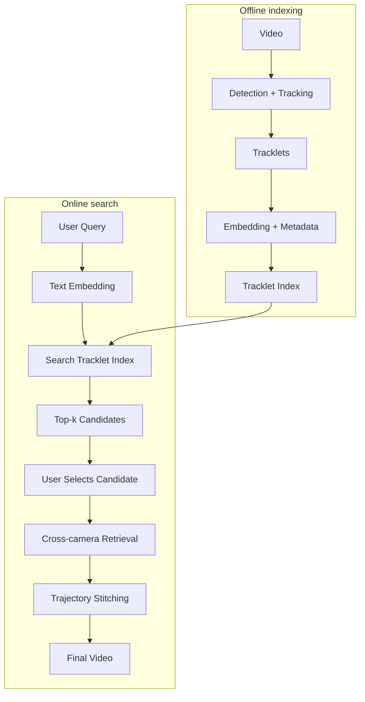
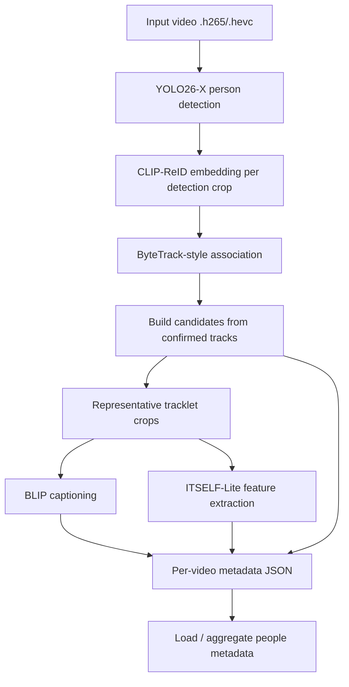

# CCTV Person Search Engine - AI20K-243

**Tagline:** Tìm người trong hệ thống camera bệnh viện bằng mô tả tự nhiên, dựa trên tracklet, metadata và xác nhận của người vận hành.

---

## 1. Tổng quan bài toán

Bệnh viện có nhiều khu vực cần giám sát như sảnh chính, hành lang, khoa khám bệnh, khu chờ, thang máy, bãi xe và lối ra vào. Với quy mô khoảng `50 camera`, lượng video sinh ra mỗi ngày rất lớn. Khi cần tìm một bệnh nhân, người nhà, nhân viên hoặc một đối tượng cụ thể, người vận hành thường phải xem lại nhiều camera thủ công, rất tốn thời gian và dễ bỏ sót.

Ví dụ truy vấn người dùng:

- `Người đàn ông đeo ba lô đi qua hành lang tầng 2`
- `Người mặc áo xanh, quần đen xuất hiện gần khu cấp cứu`
- `Người đội mũ đi từ sảnh chính sang khu thang máy`

Hệ thống hướng tới bài toán `tracklet-centric person search`: video được xử lý trước để phát hiện người, tracking thành tracklet, sinh embedding và metadata. Khi người dùng nhập truy vấn, hệ thống tìm các tracklet phù hợp, cho người dùng chọn candidate đúng, rồi dùng candidate đó để truy hồi sâu hơn trên nhiều camera.

---

## 2. Hiện tại đã làm được đến đâu

Pipeline hiện tại đã xây được phần nền cho xử lý video và tạo tracklet/metadata. Phần này tương ứng với nửa trái của pipeline dự tính: `Video -> Detection + Tracking -> Tracklets -> Embedding + Metadata`.

### Đã có

- `YOLO26-X` để detect người trong từng frame.
- `ByteTrack-style tracker` để nối detection thành tracklet trong từng video.
- `CLIP-ReID embedding` cho crop người, sau đó lấy embedding trung bình theo tracklet.
- `BLIP` nhận đầu vào là **tracklet crops** để sinh caption / appearance summary.
- `ITSELF-Lite features` cho crop đại diện.
- Metadata output dạng JSON, gồm `video_id`, `camera_id`, `track_id`, `bbox`, `content_frames`, `embedding_vector`, `person_caption`.

### Chưa hoàn thiện

- Chưa có `global_id` duy nhất cho cùng một người qua nhiều video/camera.
- `track_id` hiện reset theo từng video, nên chỉ có ý nghĩa local.
- Chưa có search tracklet index hoàn chỉnh từ user query.
- Chưa có cross-camera re-identification thực sự.
- Chưa có trajectory stitching để nối các lần xuất hiện thành hành trình cuối cùng.
- Chưa có final video / evidence timeline hoàn chỉnh.

---

## 3. Pipeline dự tính



### Diễn giải

1. Video từ hệ thống camera bệnh viện được xử lý để detect và track người.
2. Mỗi tracklet có crop đại diện, embedding, caption và metadata.
3. Các tracklet được lưu vào tracklet index.
4. Người dùng nhập query, hệ thống encode query thành text embedding.
5. Search tracklet index trả về `top-k candidates`.
6. Người dùng chọn candidate đúng.
7. Hệ thống dùng candidate đã chọn để truy hồi qua các camera/video khác.
8. Các kết quả được stitch thành trajectory và xuất final video / evidence timeline.

---

## 4. Pipeline hiện tại



Điểm quan trọng: VLM không nhận toàn bộ video và cũng không nhận frame thô. VLM nhận **ảnh crop người từ tracklet đã confirm**, giúp caption tập trung vào appearance của đối tượng.

---

## 5. Công nghệ sử dụng

### Frontend

- `React`
- `Next.js` hoặc scaffold web tương đương
- `TypeScript`
- `Tailwind CSS`

### Backend

- `FastAPI`
- `Pydantic`
- `Uvicorn`

### AI / CV Pipeline

- `YOLO26-X` cho person detection
- `ByteTrack-style tracker` cho tracking per-video
- `CLIP-ReID` cho embedding crop người
- `BLIP` cho caption / appearance summary từ tracklet crops
- `ITSELF-Lite` cho feature bổ sung

### Storage / Indexing

- Metadata JSON trong giai đoạn hiện tại
- Tracklet index / vector index cho bước search
- `FAISS` hoặc vector index tương đương cho retrieval
- `PostgreSQL` hoặc database tương đương cho metadata khi xử lý quy mô bệnh viện
- Local filesystem hoặc storage nội bộ cho video, crop, thumbnail, clip preview và evidence export

---

## 6. Tính năng MVP

### MVP hiện tại / gần nhất

- Xử lý video theo lô.
- Detect người trong video.
- Tracking thành tracklet trong từng video.
- Sinh crop đại diện, embedding và metadata cho mỗi tracklet.
- Sinh caption từ tracklet crops.
- Lưu metadata để phục vụ bước search.

### MVP cần hoàn thiện tiếp

- Tạo tracklet index có thể search bằng text embedding.
- Trả về `top-k candidates` cho truy vấn của người dùng.
- Cho phép người dùng chọn candidate đúng.
- Dùng candidate đã chọn để cross-camera retrieval.
- Stitch các tracklet liên quan thành trajectory / final video.

---

## 7. Hướng dẫn cài đặt local

### Clone repo

```bash
git clone <link-repo>
cd <repo>
```

### Cài đặt môi trường

```bash
bash scripts/setup_hooks.sh
python -m venv .venv
.venv\Scripts\activate
pip install -r requirements.txt
```

### Cấu hình

Tạo file `.env` từ `.env.example` và điền các API key cần thiết nếu có.

```bash
cp .env.example .env
```

### Chạy thử

Với scaffold hiện có, có thể chạy:

```bash
python -m src.agent
```

---

## 8. Thành viên nhóm

- `Cao Diệu Ly` - Leader, PM, AI Research
- `Dương Văn Hiệp` - AI Research / Data, AI Engineer
- `Bùi Văn Đạt` - Backend, Frontend
