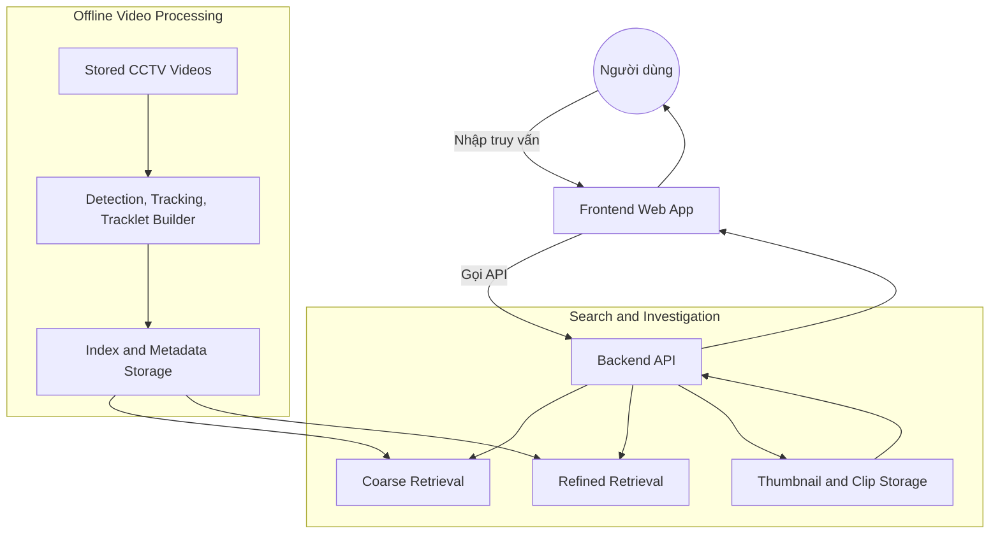

# CCTV Person Search Engine - AI20K-243

**Tagline:** Tìm người trong video giám sát bằng mô tả tự nhiên, nhanh hơn và trực quan hơn.

---

## 1. Tổng quan bài toán (Problem Statement)

### Vấn đề

Các hệ thống camera giám sát (CCTV) tạo ra khối lượng video rất lớn mỗi ngày, nhưng khi cần tìm một người hoặc một sự kiện cụ thể, người vận hành vẫn phải xem lại video thủ công trong thời gian dài. Cách làm này chậm, tốn công, khó mở rộng và dễ bỏ sót thời điểm quan trọng.

Ví dụ, khi người dùng cần tìm:

- `Người đàn ông đeo ba lô`
- `Người mặc áo xanh, quần đen, xuất hiện khoảng 10 giờ sáng`
- `Người đội mũ đi qua khu vực quầy thu ngân`

thì việc tua lại video theo cách thủ công là rất kém hiệu quả.

### Giải pháp

Hệ thống đề xuất một cách tiếp cận `Semantic Video Search` cho video CCTV. Người dùng nhập truy vấn bằng ngôn ngữ tự nhiên, hệ thống sẽ:

1. phân tích truy vấn
2. tìm các `candidate tracks` phù hợp nhất
3. hiển thị frame đại diện và clip preview
4. cho phép người dùng chọn đúng đối tượng
5. tiếp tục truy hồi tinh chỉnh để dựng lại timeline xuất hiện

AI được sử dụng vì bài toán này không thể giải quyết tốt bằng rule-based code truyền thống. Mô tả của người dùng thường mơ hồ, đa dạng và có tính ngữ nghĩa, ví dụ màu sắc trang phục, vật mang theo, thời gian xuất hiện hoặc khu vực xuất hiện. Các mô hình như `CLIP/SigLIP`, `ReID`, `YOLO`, `BoxMOT` giúp hệ thống hiểu truy vấn mở và liên kết chúng với nội dung hình ảnh trong video.

### Đối tượng người dùng

- Chủ shop
- Bảo vệ tòa nhà
- Quản lý cửa hàng
- Người vận hành hệ thống camera

---

## 2. Kiến trúc hệ thống (System Architecture)

### Sơ đồ tổng quát



### Luồng xử lý chính

1. Video CCTV được nhập từ local storage, thẻ nhớ hoặc NVR export, sau đó hệ thống chạy pipeline offline để phát hiện người, tracking và xây dựng tracklet.
2. Từ các tracklet, hệ thống tạo metadata, thumbnail, clip preview và embedding để lập chỉ mục tìm kiếm.
3. Người dùng nhập truy vấn tự nhiên trên giao diện web, backend thực hiện coarse retrieval để trả về `top-k candidate tracks`.
4. Người dùng chọn đúng ứng viên, sau đó hệ thống chạy refined retrieval và dựng lại timeline kết quả.

👉 Chi tiết xem tại: [ARCHITECTURE.md](./ARCHITECTURE.md)

---

## 3. Công nghệ sử dụng (Tech Stack)

### Frontend

- `Next.js`
- `React`
- `TypeScript`
- `Tailwind CSS`

### Backend

- `FastAPI`
- `Pydantic`
- `Uvicorn`

### AI Engine

- `CLIP` hoặc `SigLIP` cho coarse retrieval
- `ReID model` cho identity refinement
- `YOLO` cho person detection
- `BoxMOT` cho multi-object tracking

### Database / Vector DB

- `FAISS` cho vector retrieval
- `MySQL`, `SQLite` hoặc `PostgreSQL` cho metadata
- local filesystem cho video, thumbnail, clip preview và evidence export

---

## 4. Tính năng sản phẩm (Product Features - MVP Scope)

### Tính năng cốt lõi (Core)

- Tìm kiếm người trong video bằng mô tả ngôn ngữ tự nhiên
- Lọc theo camera, ngày và khoảng thời gian
- Trả về `top-k candidate tracks` cùng frame đại diện và clip preview
- Cho phép người dùng chọn đúng ứng viên cần tìm
- Truy hồi tinh chỉnh từ crop đã chọn để dựng lại timeline xuất hiện

### Tính năng mở rộng (Nice-to-have)

- Hỗ trợ thuộc tính chi tiết hơn như màu áo, màu quần, mũ, túi
- Hỗ trợ truy vấn trên nhiều camera với timeline mở rộng
- Hỗ trợ export evidence clip
- Hỗ trợ lớp phân tích truy vấn bằng LLM như một thành phần tùy chọn

---

## 5. Hướng dẫn cài đặt (Local Setup)

### Clone repo

```bash
git clone <link-repo>
cd <repo>
```

### Cài đặt môi trường

```bash
bash scripts/setup_hooks.sh
python -m venv .venv
.venv\Scripts\activate
pip install -r requirements.txt
```

### Cấu hình

Tạo file `.env` từ `.env.example` và điền các API key cần thiết nếu có.

```bash
cp .env.example .env
```

### Chạy thử

Hiện tại repo đang ở giai đoạn MVP và phần AI core / backend sẽ được chạy tùy theo module triển khai thực tế. Với scaffold hiện có, có thể chạy bằng:

```bash
python -m src.agent
```

---

## 6. Thành viên nhóm (Team Members)

- `[Cao Diệu Ly]` - `[Leader, PM, AI Research]`
- `[Dương Văn Hiệp]` - `[AI Research/ Data, AI Engineer]`
<<<<<<< HEAD
- `[Bùi Văn Đạt]` - `[BE, FE]`

=======
- `[Bùi Văn Đạt]` - `[BE, FE]`
>>>>>>> 89c5e69 (feat: Update README and JOURNAL with project details and weekly progress)
