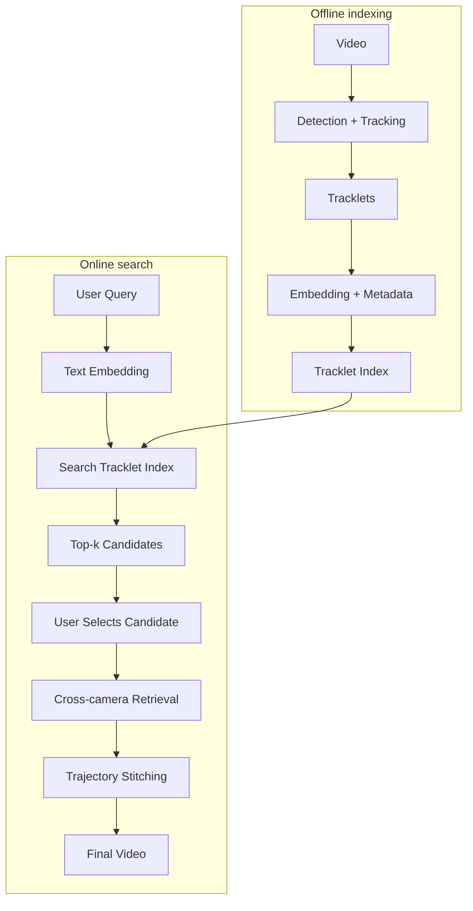
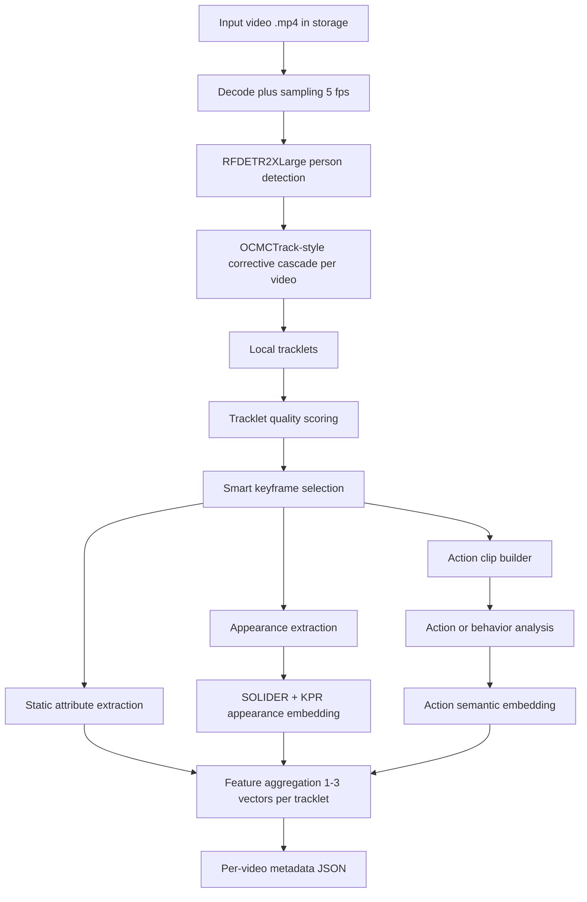

# CCTV Person Search Engine - AI20K-243

**Tagline:** Tìm người trong hệ thống camera bệnh viện bằng mô tả tự nhiên, dựa trên tracklet, metadata và xác nhận của người vận hành.

## Docker (stack modular)

Từ thư mục gốc của repository:

```bash
docker compose -f infra/docker-compose.yml --env-file infra/env/backend.env up --build
```

Chi tiết: [infra/README.md](infra/README.md) · kiến trúc module: [docs/KIEN_TRUC_MODULAR_VI.md](docs/KIEN_TRUC_MODULAR_VI.md). Trước khi đưa lên môi trường production, hãy cấu hình `infra/env/backend.env`, `infra/env/ai.env`, và `infra/env/frontend.env` cho phù hợp.

---

## 1. Tổng quan bài toán

Bệnh viện có nhiều khu vực cần giám sát như sảnh chính, hành lang, khoa khám bệnh, khu chờ, thang máy, bãi xe và lối ra vào. Với quy mô khoảng `50 camera`, lượng video sinh ra mỗi ngày rất lớn. Khi cần tìm một bệnh nhân, người nhà, nhân viên hoặc một đối tượng cụ thể, người vận hành thường phải xem lại nhiều camera thủ công, rất tốn thời gian và dễ bỏ sót.

Ví dụ truy vấn người dùng:

- `Người đàn ông đeo ba lô đi qua hành lang tầng 2`
- `Người mặc áo xanh, quần đen xuất hiện gần khu cấp cứu`
- `Người đội mũ đi từ sảnh chính sang khu thang máy`

Hệ thống hướng tới bài toán `tracklet-centric person search`: video được xử lý trước để phát hiện người, tracking thành tracklet, sinh embedding và metadata. Khi người dùng nhập truy vấn, hệ thống tìm các tracklet phù hợp, cho người dùng chọn candidate đúng, rồi dùng candidate đó để truy hồi sâu hơn trên nhiều camera.

---

## 2. Hiện tại đã làm được đến đâu

Pipeline hiện tại được chốt theo luồng ingest sau `move.py`: `storage/*.mp4 -> decode + sampling 5 fps -> detection + tracking per-video -> local tracklets -> tracklet quality scoring -> unified tracklet feature pipeline`.

### Đã có

- `RF-DETR 2x-large` là detector duy nhất được phép dùng.
- `OCMCTrack-style corrective cascade` là tracker duy nhất được phép dùng.
- `SOLIDER + KPR` là ReID stack duy nhất được phép dùng.
- `ITSELF` là semantic search stack duy nhất được phép dùng.
- `TrackEval HOTA` là chuẩn đánh giá tracking chính.
- Metadata output dạng JSON, gồm tối thiểu `video_id`, `camera_id`, `track_id`, `bbox`, `embedding_vector`, `appearance_summary`, `timeline`, `action_semantic_embedding`, và contract ingest đã áp dụng.

### Chưa hoàn thiện

- Chưa có `global_id` duy nhất cho cùng một người qua nhiều video/camera.
- `track_id` hiện reset theo từng video, nên chỉ có ý nghĩa local.
- Chưa có search tracklet index hoàn chỉnh từ user query.
- Chưa có cross-camera re-identification thực sự.
- Chưa có trajectory stitching để nối các lần xuất hiện thành hành trình cuối cùng.
- Chưa có final video / evidence timeline hoàn chỉnh.

---

## 3. Pipeline dự tính



### Diễn giải

1. Video `.mp4` sau `move.py` được phát hiện trong `storage/cam_xx/yyyy-mm-dd/`.
2. Runtime strict decode video và sample cố định về `5 fps`.
3. `RFDETR2XLarge` detect người, sau đó tracker chạy theo từng video 10 phút độc lập.
4. Hệ thống sinh local tracklets và chạy `tracklet quality scoring` để loại tracklet mờ, thiếu thông tin, hoặc confidence thấp.
5. Sau quality scoring, một pipeline feature thống nhất chạy cho cả `attribute`, `appearance`, và `action`.
6. Pipeline này dùng cùng một quyết định frame selection, sau đó sinh thuộc tính tĩnh, đặc trưng ngoại hình, action clip, action analysis, semantic embedding, rồi feature aggregation cho tracklet.
7. Các tracklet hợp lệ được lưu vào tracklet index.
8. Người dùng nhập query, hệ thống search tracklet index, chọn candidate, rồi truy hồi sâu hơn qua nhiều camera.

---

## 4. Pipeline hiện tại



Điểm quan trọng: pipeline active chỉ có một luồng hậu `storage/`. Video luôn được sample về `5 fps`, tracking chạy độc lập theo từng video 10 phút, và chỉ tracklet vượt qua quality scoring mới đi tiếp vào pipeline feature thống nhất cho metadata/search.

---

## 5. Công nghệ sử dụng

### Frontend

- `React`
- `Next.js` hoặc scaffold web tương đương
- `TypeScript`
- `Tailwind CSS`

### Backend

- `FastAPI`
- `Pydantic`
- `Uvicorn`

### AI / CV Pipeline

- `RFDETR2XLarge` (`rfdetr-2xlarge`) cho person detection
- `OCMCTrack-style corrective cascade` cho tracking per-video
- `SOLIDER + KPR` cho embedding crop người
- `ITSELF` cho semantic search / fine-grained retrieval
- `TrackEval HOTA` cho evaluation

### Storage / Indexing

- Metadata JSON trong giai đoạn hiện tại
- Tracklet index / vector index cho bước search
- `FAISS` hoặc vector index tương đương cho retrieval
- `PostgreSQL` hoặc database tương đương cho metadata khi xử lý quy mô bệnh viện
- Local filesystem hoặc storage nội bộ cho video, crop, thumbnail, clip preview và evidence export

---

## 6. Tính năng MVP

### MVP hiện tại / gần nhất

- Xử lý video theo lô.
- Detect người trong video.
- Tracking thành tracklet trong từng video.
- Sinh crop đại diện, embedding và metadata cho mỗi tracklet.
- Sinh caption từ tracklet crops.
- Lưu metadata để phục vụ bước search.

### MVP cần hoàn thiện tiếp

- Tạo tracklet index có thể search bằng text embedding.
- Trả về `top-k candidates` cho truy vấn của người dùng.
- Cho phép người dùng chọn candidate đúng.
- Dùng candidate đã chọn để cross-camera retrieval.
- Stitch các tracklet liên quan thành trajectory / final video.

---

## 7. Hướng dẫn cài đặt local

### Clone repo

```bash
git clone <link-repo>
cd <repo>
```

### Cài đặt môi trường

```bash
bash scripts/setup_hooks.sh
python -m venv .venv
.venv\Scripts\activate
pip install -r requirements.txt
```

### Cấu hình

Tạo file `.env` từ `.env.example` và điền các API key cần thiết nếu có.

```bash
cp .env.example .env
```

### Chạy thử

Với scaffold hiện có, có thể chạy:

```bash
python -m src.agent
```

---

## 8. Thành viên nhóm

- `Cao Diệu Ly` - Leader, PM, AI Research
- `Dương Văn Hiệp` - AI Research / Data, AI Engineer
- `Bùi Văn Đạt` - Backend, Frontend
